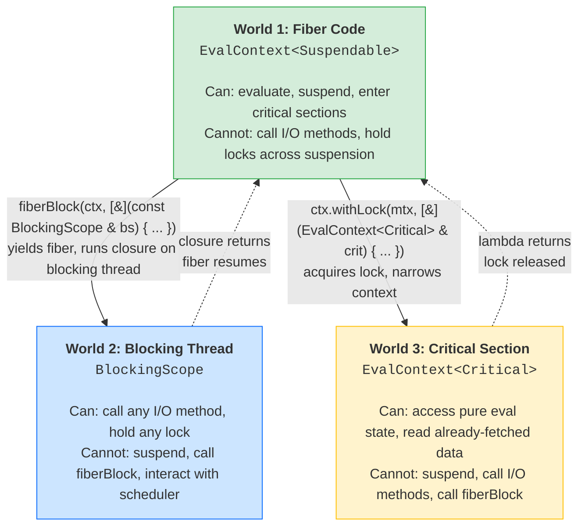
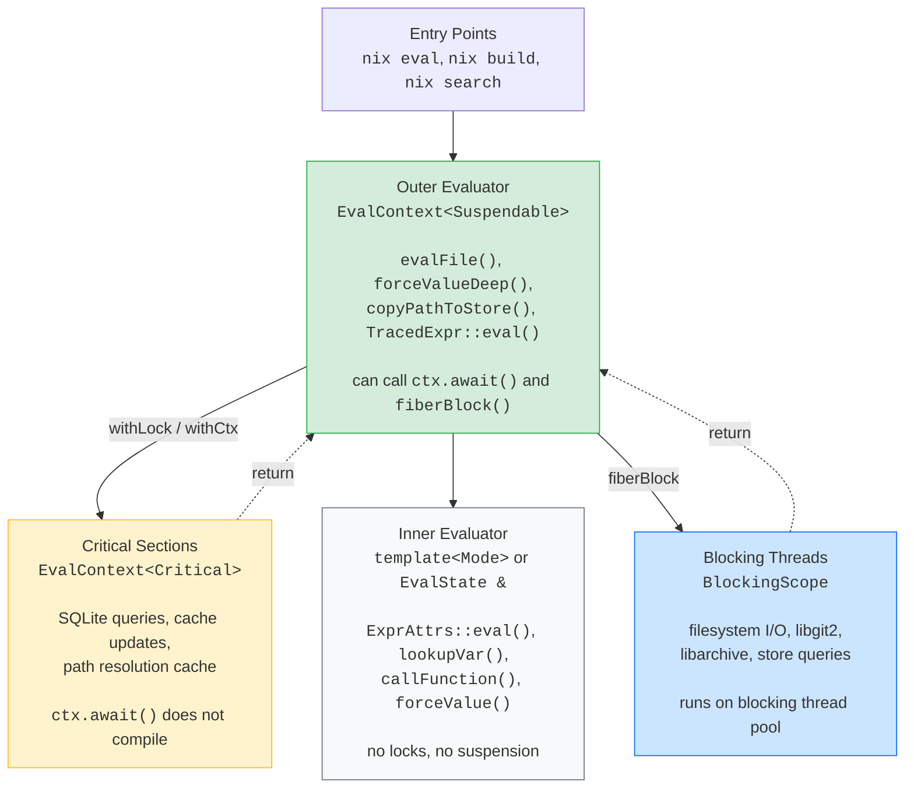

# Type-Safe Fiber Concurrency: The Three-World System

> **Status — aspirational design.** This document describes the type-coloring
> model that motivated the current eval-trace implementation. Several named
> constructs (`BlockingScope`, `fiberBlock`, `fiberAwait`, `FiberMutex`,
> `UnsafeBlockingScope`, `LockLevel<N>`, `TrackedLockGuard`, `Guarded::withCtx`)
> are not realized in source. What shipped is a narrower subset under
> different names:
>
> | This doc | In source |
> | --- | --- |
> | `EvalContext<Suspendable>` / `EvalContext<Critical>` | same names, `src/libexpr/include/nix/expr/eval-trace/eval-context.hh` |
> | `BlockingScope` | `Proof<BlockingTag>` (`src/libexpr/eval-trace/fiber/blocking-scope.hh`, GDP-based) |
> | `fiberBlock` | `coroBlock` (same file) |
> | `fiberAwait` | `EvalContext::syncAwait` |
> | `FiberMutex`, `Guarded<T>::withCtx`, lock ordering | not implemented — `Guarded<T>` defaults to `std::mutex` |
>
> For the shipped vocabulary see `src/libexpr/eval-trace/CLAUDE.md` and
> `doc/eval-trace/{design,implementation}.md`. This doc is retained for the
> deadlock-reasoning narrative.

Design document for compile-time prevention of fiber-mutex deadlocks
and blocking-on-fiber-thread bugs in the Nix evaluator.

## Table of Contents

1. [Problem Statement](#1-problem-statement)
2. [Prior Art](#2-prior-art)
3. [The Three-World System](#3-the-three-world-system)
4. [World 1 — Fiber Code: `EvalContext` Coloring](#4-world-1--fiber-code-evalcontext-coloring)
5. [World 2 — Blocking Threads: The `BlockingScope` Token](#5-world-2--blocking-threads-the-blockingscope-token)
6. [World 3 — Critical Sections: `Guarded<T>` and `withLock`](#6-world-3--critical-sections-guardedt-and-withlock)
7. [Opaque Third-Party Blocking](#7-opaque-third-party-blocking)
8. [Lock Ordering](#8-lock-ordering)
9. [Composition with Existing Type-Safety Patterns](#9-composition-with-existing-type-safety-patterns)
10. [Complementary Mechanisms](#10-complementary-mechanisms)
11. [Mapping to the Evaluator](#11-mapping-to-the-evaluator)
12. [Migration Strategy](#12-migration-strategy)
13. [Escape Hatches and Limitations](#13-escape-hatches-and-limitations)
14. [Alternatives Considered](#14-alternatives-considered)
15. [Open Questions](#15-open-questions)

---

## 1. Problem Statement

### 1.1 The Deadlock

When making the evaluator concurrent with stackful coroutines
(boost::coroutines2), a fundamental conflict exists between OS mutexes
and fiber suspension:

```
Thread T (eval thread):

  evalFile(path, v)
    → forceValue(v)
      → forceThunkValue(v)
        → TracedExpr::eval()
          → backend->verify()
            → fiberAwait(...)    ← FIBER SUSPENDS
                                    Thread T enters scheduler drain loop
```

Today this works because the hot evaluation path holds no OS mutexes.
But as the evaluator becomes concurrent, new synchronization must be
added for shared mutable state (path resolution caches, identity maps,
profiling counters). If any of that new synchronization uses OS
mutexes, the following scenario becomes possible:

```
Thread T (eval thread), hypothetical:

  prim_import()
    → resolveLookupPath()
      → withLock(pathCacheMutex)  ← acquires mutex
        → evalFile(resolvedPath)
          → forceValue(v)
            → TracedExpr::eval()
              → fiberAwait(...)   ← FIBER SUSPENDS while holding mutex
```

The carrier thread is now in the scheduler's drain loop, waiting for
an I/O completion signal from a worker thread. But it still holds the
mutex acquired several frames up. If another fiber (run by the same
scheduler during the drain loop) needs that mutex, the system
deadlocks.

The same problem applies to existing mutexes that are already on paths
reachable from `fiberAwait`: the SQLite trace store's `Sync<State>`,
the local store's path info cache, etc.

### 1.2 The Hard Variant: Locks Inside Third-Party Code

The hypothetical above has a visible `withLock` call. In practice, the
harder and more common case is a lock acquired **inside a third-party
data structure or library**, invisible at the call site:

```
Thread T (eval thread):

  forceValue(v)                                 // no lock visible here
    → TracedExpr::eval()
      → registerTracedValueIdentity(key, te)    // no lock visible here
        → identityMap.insert_or_visit(...)       // ACQUIRES INTERNAL LOCK
          → callback visits existing entry
            → te->getResolvedTarget()
              → cache->getOrEvaluateRoot()
                → rootLoader(state)
                  → forceValue(v2)              // forcing INSIDE the lock
                    → TracedExpr::eval()
                      → fiberAwait(...)         // SUSPENDS while holding
                                                //   the data structure's
                                                //   internal lock
```

The caller of `identityMap.insert_or_visit()` has no idea that:

1. A lock is being held inside the data structure.
2. The visitor callback executes under that lock.
3. The callback's call chain eventually reaches a suspension point.

This is the core challenge. The lock and the suspension point are
separated by an arbitrary number of stack frames, and the lock is not
even visible at the API boundary. This pattern is especially dangerous
with visitor-based APIs like
`boost::concurrent_flat_map::insert_or_visit()`, where the visitor
lambda runs under an internal bucket lock.

The same problem extends beyond data structures to all third-party
blocking: filesystem syscalls (`open`, `stat`, `read`), SQLite
queries (`sqlite3_step`), DNS resolution (`getaddrinfo`), libgit2,
libarchive, and any library that holds internal locks or performs
synchronous I/O. The evaluator interacts with all of these.

### 1.3 Why Stackful Coroutines Make This Even Harder

With C++20 stackless coroutines, `co_await` is syntactically visible
at each suspension point. Static analysis (clang-tidy's
`cppcoreguidelines-no-suspend-with-lock`[^clang-suspend]) can flag a
`lock_guard` in scope at a `co_await`. The compiler can see the
problem because it builds the coroutine state machine as a struct and
knows every live variable at each suspension point.

With stackful coroutines, `fiberAwait()` is a regular function call.
The compiler has no idea it suspends. A function 15 frames up might
hold a lock. No single function sees both the lock acquisition and the
suspension point.

### 1.4 The Evaluator's Synchronization Landscape

The evaluator's hot inner loop (thunk forcing, attr lookup, env
traversal) currently holds no locks — no `std::mutex` exists in
`forceValue`, `lookupVar`, `ExprAttrs::eval`, etc. The mutexes are at
the **boundaries** where evaluation meets external systems:

| Boundary | Current State | Risk |
|----------|--------------|------|
| SQLite trace store | `Sync<State>` mutex | Held during verification queries on paths reachable from `fiberAwait` |
| Local store path cache | `SharedSync<LRUCache>` | Held during path lookups triggered by primops |
| Position table | `Sync<map>` | Held during error reporting |
| Lookup path resolution | Unsynchronized `unordered_flat_map` | Will need a lock under concurrency |
| TraceRuntime identity maps | Unsynchronized `unordered_flat_map`s | Will need a lock under concurrency |
| Profiling counters | Unsynchronized `Counter`s | Will need atomics or a lock under concurrency |

Every new lock is a potential deadlock if the code path can reach
`fiberAwait`. And existing locks (SQLite, path cache) are already on
paths reachable from the fiber scheduler.

### 1.5 The Goal

Two compile-time guarantees, enforced by the type system with zero
runtime cost:

1. **No suspension while holding a lock.** Locks acquired through the
   project's locking APIs narrow the `EvalContext` to `Critical` mode,
   which cannot suspend. Violation is a compile error.

2. **No blocking I/O on the fiber thread.** I/O methods require a
   `BlockingScope` GDP (Ghosts of Departed Proofs[^gdp]) token that can
   only be constructed inside `fiberBlock`, which runs on a dedicated
   blocking thread pool. Fiber
   code cannot call I/O methods directly — the compiler rejects it
   because no `BlockingScope` is available.

Together, these ensure that the fiber's carrier thread is never
blocked by either project-controlled locks or third-party I/O.

---

## 2. Prior Art

| Runtime | Mechanism | Enforcement | Limitation |
|---------|-----------|-------------|------------|
| **Rust** | `MutexGuard: !Send` — future holding guard can't be spawned on multi-threaded runtime[^tokio-shared] | Compile-time | Stackless only; compiler builds state machine |
| **Java Loom** | Virtual thread "pins" to carrier in `synchronized`; JVM emits `jdk.VirtualThreadPinned` Java Flight Recorder (JFR) event[^loom-pinning] | Runtime detection | Not prevented — just diagnosed. Fix: use `ReentrantLock` |
| **Kotlin (compiler)** | Compiler error: `suspend` inside `synchronized` block[^kotlin-sync] | Compile-time (partial) | Holes via inline functions; stackless only |
| **Clang Thread Safety Analysis (TSA)** | `CAPABILITY`, `GUARDED_BY`, `REQUIRES`, `EXCLUDES`, negative capabilities `REQUIRES(!mu)`[^clang-tsa] | Compile-time (opt-in) | `EXCLUDES` not transitive; experimental; no fiber concept |
| **Zig** | `Io` parameter makes functions agnostic to blocking/evented mode[^zig-async] | Compile-time coloring | Solves function coloring, not the mutex problem |
| **Tokio** | `spawn_blocking(f)` offloads to dedicated blocking thread pool[^spawn-blocking] | API convention | No compile-time enforcement that blocking calls go through it[^clippy-blocking] |
| **Kotlin (dispatcher)** | `withContext(Dispatchers.IO)` shifts coroutine to IO thread pool[^kotlin-io] | API convention | Same — not enforced by compiler |
| **Scala Ox** | `IO` capability — methods declare `(using IO)`, compiler rejects I/O without it[^ox-io] | Compile-time | Requires Scala 3 implicit parameters; not available in C++ |
| **Go** | Runtime M:N scheduling; sysmon detaches P from M on syscall block; SIGURG for CPU-bound preemption[^go-preempt] | Runtime (transparent) | No explicit API; no type-level enforcement |

Bob Nystrom's "What Color is Your Function?"[^what-color] describes the
fundamental tension: async and sync functions are two incompatible
worlds. Our design embraces this coloring deliberately[^hartzell-color]
— the "color" (phantom type parameter) is the proof that the invariant
holds. The viral propagation is the enforcement mechanism.

**Key insight from this survey**: every production runtime that handles
opaque third-party blocking uses the same fundamental pattern — offload
blocking work to a dedicated thread. Rust (`spawn_blocking`), Kotlin
(`Dispatchers.IO`), Go (M:N scheduling), Java (carrier thread
expansion), Node.js (libuv thread pool). The type-system question is
how to **enforce** that all blocking calls go through the bridge.
Scala Ox's `IO` capability[^ox-io] comes closest; our `BlockingScope`
GDP token is the C++ equivalent.

---

## 3. The Three-World System

The design creates three execution contexts with distinct capabilities.
Two mechanisms — phantom-typed `EvalContext<Mode>` and the
`BlockingScope` GDP (Ghosts of Departed Proofs[^gdp]) token — partition
code into worlds where different operations are permitted. The type
system enforces the boundaries at compile time.



### 3.1 How the Worlds Are Enforced

Each world is defined by which capability tokens are available:

| | `EvalContext<Suspendable>` | `EvalContext<Critical>` | `BlockingScope` |
|---|:---:|:---:|:---:|
| **World 1: Fiber** | yes | — | — |
| **World 2: Blocking** | — | — | yes |
| **World 3: Critical** | — | yes | — |

The transitions between worlds are the enforcement points:

- **`fiberBlock`** (World 1 → World 2): Requires `Suspendable`
  (so it can't be called from World 3). Creates `BlockingScope`
  inside the closure. Yields the fiber, runs the closure on a blocking
  thread.

- **`withLock`** (World 1 → World 3): Acquires the lock, narrows
  `EvalContext<Suspendable>` to `EvalContext<Critical>` (nulls out
  scheduler/ioc pointers). The body cannot suspend or call `fiberBlock`.

- **Return** (World 2 → World 1, World 3 → World 1): The closure
  or lambda returns. `BlockingScope` is destroyed (stack-local).
  Lock is released. Control returns to World 1.

**Widening is impossible through the API.** There is no conversion from
`Critical` to `Suspendable`, and no way to construct `BlockingScope`
outside `fiberBlock`. A `fiberBlock` closure can capture `EvalContext`
from the enclosing scope, but calling `ctx.await(...)` from the
blocking thread asserts at runtime (`FiberScheduler::currentEntry()`
returns null). All escape hatches are documented in
[section 13](#13-escape-hatches-and-limitations).

### 3.2 What This Is Not

This is **not** an effect system. C++ cannot track effects through the
type system the way Haskell or Scala can. The tokens are simple
phantom-typed parameters — they don't compose, infer, or propagate
automatically. Every function in the chain must explicitly declare
which tokens it requires. This is deliberate: the explicitness is what
makes it enforceable by a human reviewer and by the compiler.

This is **not** a universal concurrency framework. It solves two
specific problems: (1) preventing fiber suspension while holding a
lock, and (2) preventing blocking I/O on the fiber thread. It doesn't
prevent data races, doesn't enforce lock ordering (that's
[section 8](#8-lock-ordering)), and doesn't replace proper concurrent
data structure design.

### 3.3 What This Gives You

1. **Compile-time guarantees**: For migrated code, no execution path
   holds a lock at a suspension point, and no execution path calls
   blocking I/O on the fiber thread. Violations are compiler errors.
2. **Zero runtime cost**: The phantom type parameters are erased.
   No vtable, no branching, no overhead.
3. **Incremental adoption**: Functions that don't interact with locks,
   suspension, or I/O can be templated over `Mode` or remain unchanged.
4. **Composability**: Session types, GDP continuations, typestate, and
   phantom tags all compose with the three-world system
   ([section 9](#9-composition-with-existing-type-safety-patterns)).

---

## 4. World 1 — Fiber Code: `EvalContext` Coloring

### 4.1 Mode Tags

```cpp
namespace nix::fiber {

/// Phantom type tag: may suspend the current fiber.
struct Suspendable {};

/// Phantom type tag: must NOT suspend. Used inside critical sections.
struct Critical {};

} // namespace nix::fiber
```

### 4.2 `EvalContext<Mode>`

```cpp
namespace nix::fiber {

template<typename Mode>
class EvalContext {
    EvalState & state_;
    FiberScheduler * scheduler_;
    boost::asio::io_context * ioc_;

public:
    /// Public constructor. For Suspendable contexts, provide scheduler
    /// and ioc. For Critical contexts, prefer constructing via
    /// critical() or withLock() — direct construction bypasses the
    /// narrowing discipline but is permitted for backward-compat
    /// bridging ([section 12.2](#122-backward-compatibility)).
    EvalContext(EvalState & state,
                FiberScheduler * scheduler = nullptr,
                boost::asio::io_context * ioc = nullptr)
        : state_(state), scheduler_(scheduler), ioc_(ioc) {}

    EvalState & state() { return state_; }
    const EvalState & state() const { return state_; }

    // ── Suspension (Suspendable only) ───────────────────────

    template<typename T>
    T await(boost::asio::awaitable<T> coro)
        requires std::same_as<Mode, Suspendable>
    {
        assert(scheduler_ && "await called without a FiberScheduler");
        assert(ioc_ && "await called without an io_context");
        return fiberAwait<T>(*scheduler_, *ioc_, std::move(coro));
    }

    bool hasFiberSupport() const
        requires std::same_as<Mode, Suspendable>
    {
        return scheduler_ != nullptr && ioc_ != nullptr;
    }

    // ── Narrowing (Suspendable → Critical) ──────────────────

    /// Nulls out scheduler/ioc as defense-in-depth.
    EvalContext<Critical> critical() const
        requires std::same_as<Mode, Suspendable>
    {
        return EvalContext<Critical>(state_, nullptr, nullptr);
    }

    // ── Critical sections ───────────────────────────────────

    template<typename Mutex, typename F>
    auto withLock(Mutex & mtx, F && body)
        -> std::invoke_result_t<F, EvalContext<Critical> &>
    {
        std::lock_guard guard(mtx);
        if constexpr (std::same_as<Mode, Critical>) {
            return std::forward<F>(body)(*this);
        } else {
            auto crit = critical();
            return std::forward<F>(body)(crit);
        }
    }

    /// Variant for Sync<T> — provides data access alongside the
    /// Critical context. WriteLock is non-movable, passed by reference.
    template<typename T, typename F>
    auto withSync(Sync<T> & sync, F && body)
        -> std::invoke_result_t<F, EvalContext<Critical> &,
                                typename Sync<T>::WriteLock &>
    {
        auto lock = sync.lock();
        if constexpr (std::same_as<Mode, Critical>) {
            return std::forward<F>(body)(*this, lock);
        } else {
            auto crit = critical();
            return std::forward<F>(body)(crit, lock);
        }
    }

private:
    template<typename> friend class EvalContext;
};

} // namespace nix::fiber
```

### 4.3 Mode-Generic Functions

Functions that neither suspend nor hold locks can be templated:

```cpp
template<typename Mode>
PosIdx mkPos(EvalContext<Mode> & ctx, uint32_t line, uint32_t col)
{
    return ctx.state().positions.add(line, col);
}
```

---

## 5. World 2 — Blocking Threads: The `BlockingScope` Token

### 5.1 The Problem `EvalContext` Coloring Cannot Solve

`EvalContext` coloring prevents suspension while holding a
project-controlled lock. But the evaluator also interacts with
third-party code that holds its own internal locks — filesystem
syscalls, SQLite, libgit2, `boost::concurrent_flat_map` visitor
callbacks. These locks are invisible to the type system.

Every production concurrent runtime solves this the same
way[^spawn-blocking] [^ryhl-blocking] [^kotlin-io]: **offload blocking
work to a dedicated thread, yield the lightweight thread, resume when
complete.** The type-system question is how to enforce that all
blocking calls go through this bridge.

### 5.2 Why Naive Wrapping Doesn't Work

One might try wrapping `concurrent_flat_map` to narrow the
`EvalContext` before calling the visitor:

```cpp
template<typename K, typename V>
class FiberSafeMap {
    boost::concurrent_flat_map<K, V> inner_;
public:
    template<typename Mode, typename VisitFn>
    bool insert_or_visit(EvalContext<Mode> & ctx,
                         const K & key, VisitFn && on_visit)
    {
        // We'd like to pass EvalContext<Critical> to the visitor.
        // But the lock is acquired INSIDE concurrent_flat_map,
        // not before this call. We can't narrow the context to
        // match a lock scope we don't control.
        //
        // Narrowing before the call would be wrong — it would
        // make the entire function Critical even though we're not
        // holding any lock yet.
    }
};
```

This doesn't work because the lock is acquired inside
`concurrent_flat_map`, not before it. There is no point in the call
chain where we can narrow the context to match the lock's scope.
The lock acquisition and the context narrowing are on different sides
of the API boundary.

This is the fundamental limitation of context coloring for third-party
locks: **you can only narrow at locks you control**.

### 5.3 `BlockingScope`: The GDP Solution

The solution applies the GDP continuation pattern[^gdp] (already used
for `VerifiedFileProof` in the eval-trace subsystem) to I/O
capability. Every blocking I/O method requires a `BlockingScope` token.
The token can only be constructed inside `fiberBlock`, which runs the
closure on a blocking thread pool. This is the C++ analog of Scala
Ox's `IO` capability[^ox-io].

```cpp
namespace nix::fiber {

/// Proof that the current code is running on a blocking thread.
///
/// GDP pattern: cannot be constructed, copied, or moved by anyone
/// except fiberBlock. Any I/O function that might block requires
/// this token — calling it without one is a compile error.
class BlockingScope {
    struct Key {};
    explicit BlockingScope(Key) {}

    BlockingScope(const BlockingScope &) = delete;
    BlockingScope(BlockingScope &&) = delete;
    BlockingScope & operator=(const BlockingScope &) = delete;
    BlockingScope & operator=(BlockingScope &&) = delete;

    template<typename F>
    friend auto fiberBlock(EvalContext<Suspendable> &, F &&)
        -> std::invoke_result_t<F, const BlockingScope &>;

    friend class UnsafeBlockingScope;

public:
    ~BlockingScope() = default;
};

/// Offload blocking work to a dedicated thread pool. The closure
/// receives a BlockingScope token. The fiber yields and resumes
/// when the closure returns.
template<typename F>
auto fiberBlock(EvalContext<Suspendable> & ctx, F && f)
    -> std::invoke_result_t<F, const BlockingScope &>
{
    using R = std::invoke_result_t<F, const BlockingScope &>;

    auto * entry = FiberScheduler::currentEntry();
    assert(entry && "fiberBlock called outside a managed fiber");

    std::conditional_t<std::is_void_v<R>, char, std::optional<R>>
        result{};
    std::exception_ptr exception;

    // Capture scheduler pointer before posting — FiberScheduler::current()
    // is a thread_local that won't be set on the blocking thread.
    auto * sched = FiberScheduler::current();
    assert(sched && "fiberBlock called outside a managed fiber");

    // blockingPool() returns the dedicated blocking thread pool
    // (separate from the asio io_context worker threads).
    blockingPool().post([&, sched] {
        BlockingScope scope(BlockingScope::Key{});
        try {
            if constexpr (std::is_void_v<R>)
                f(scope);
            else
                result.emplace(f(scope));
        } catch (...) {
            exception = std::current_exception();
        }
        entry->ready.store(true, std::memory_order_release);
        sched->signal();
    });

    FiberScheduler::yield();

    if (exception)
        std::rethrow_exception(exception);
    if constexpr (!std::is_void_v<R>)
        return std::move(*result);
}

/// Escape hatch for non-fiber code (CLI, daemon, tests).
class UnsafeBlockingScope {
    BlockingScope scope_{BlockingScope::Key{}};
public:
    const BlockingScope & get() const { return scope_; }
};

} // namespace nix::fiber
```

### 5.4 I/O Interfaces Require `BlockingScope`

```cpp
class SourceAccessor {
public:
    virtual std::string readFile(const BlockingScope & bs,
                                 const CanonPath & path) = 0;
    virtual std::optional<Stat> maybeLstat(const BlockingScope & bs,
                                           const CanonPath & path) = 0;
};

class Store {
public:
    virtual bool isValidPath(const BlockingScope & bs,
                             const StorePath & path) = 0;
    virtual ref<const ValidPathInfo>
    queryPathInfo(const BlockingScope & bs,
                  const StorePath & path) = 0;
};
```

### 5.5 Usage Examples

```cpp
// prim_readFile — I/O primop
void prim_readFile(EvalContext<Suspendable> & ctx, PosIdx pos,
                   Value ** args, Value & v)
{
    auto path = ctx.state().coerceToPath(pos, *args[0], context);

    // path.readFile() requires BlockingScope — compile error without:
    //   path.readFile(???)  ← no BlockingScope available

    auto content = fiberBlock(ctx,
        [&](const BlockingScope & bs) {
            return path.readFile(bs);  // compiles: has BlockingScope
        });

    v.mkString(content);
}

// evalFile — read source, then evaluate
void EvalState::evalFile(EvalContext<Suspendable> & ctx,
                         const SourcePath & path, Value & v)
{
    auto source = fiberBlock(ctx,
        [&](const BlockingScope & bs) {
            return path.readFile(bs);
        });

    // Parse and evaluate — back on fiber, pure computation
    auto * expr = parse(source.data(), source.size(), ...);
    expr->eval(ctx.state(), baseEnv, v);
}
```

---

## 6. World 3 — Critical Sections: `Guarded<T>` and `withLock`

### 6.1 `Guarded<T, Mutex>`

Binds data to its protecting mutex. Data is inaccessible without
holding the lock. Extends the `safe` library[^safe-lib] pattern with
`EvalContext` integration.

```cpp
template<typename T, typename Mutex = fiber::FiberMutex>
class Guarded {
    mutable Mutex mutex_;
    T data_;

public:
    template<typename... Args>
    explicit Guarded(Args &&... args)
        : data_(std::forward<Args>(args)...) {}

    Guarded(const Guarded &) = delete;
    Guarded & operator=(const Guarded &) = delete;

    class [[nodiscard]] Access {
        std::unique_lock<Mutex> lock_;
        T & data_;
        friend class Guarded;
        Access(Mutex & m, T & d) : lock_(m), data_(d) {}
    public:
        Access(const Access &) = delete;
        Access(Access &&) = delete;
        T & operator*() { return data_; }
        T * operator->() { return &data_; }
        const T & operator*() const { return data_; }
        const T * operator->() const { return &data_; }
    };

    [[nodiscard]] Access lock() { return Access(mutex_, data_); }

    template<typename F>
    auto withLock(F && f) -> std::invoke_result_t<F, T &>
    {
        std::lock_guard guard(mutex_);
        return std::forward<F>(f)(data_);
    }

    template<typename F>
    auto withLock(F && f) const -> std::invoke_result_t<F, const T &>
    {
        std::lock_guard guard(mutex_);
        return std::forward<F>(f)(data_);
    }

    /// Lock and narrow EvalContext to Critical. The body receives
    /// both the Critical context and the data.
    template<typename Mode, typename F>
    auto withCtx(EvalContext<Mode> & ctx, F && f)
        -> std::invoke_result_t<F, EvalContext<Critical> &, T &>
    {
        std::lock_guard guard(mutex_);
        if constexpr (std::same_as<Mode, Critical>) {
            return std::forward<F>(f)(ctx, data_);
        } else {
            auto crit = ctx.critical();
            return std::forward<F>(f)(crit, data_);
        }
    }

    template<typename Mode, typename F>
    auto withCtx(EvalContext<Mode> & ctx, F && f) const
        -> std::invoke_result_t<F, EvalContext<Critical> &, const T &>
    {
        std::lock_guard guard(mutex_);
        if constexpr (std::same_as<Mode, Critical>) {
            return std::forward<F>(f)(ctx, data_);
        } else {
            auto crit = ctx.critical();
            return std::forward<F>(f)(crit, data_);
        }
    }
};
```

### 6.2 Usage Pattern

```cpp
class EvalState {
    Guarded<boost::unordered_flat_map<
        std::string, std::optional<SourcePath>,
        StringViewHash, std::equal_to<>>>
    lookupPathResolved_;

public:
    std::optional<SourcePath>
    resolveLookupPath(EvalContext<Suspendable> & ctx,
                      const std::string & path)
    {
        // Check cache — body cannot suspend (Critical context).
        auto cached = lookupPathResolved_.withCtx(ctx,
            [&](EvalContext<Critical> &, auto & cache)
                -> std::optional<std::optional<SourcePath>>
            {
                auto it = cache.find(path);
                if (it != cache.end()) return it->second;
                return std::nullopt;
            });

        if (cached) return *cached;

        // Cache miss — resolve (may do I/O → fiberBlock)
        auto resolved = doResolve(ctx, path);

        // Insert result under lock
        lookupPathResolved_.withCtx(ctx,
            [&](EvalContext<Critical> &, auto & cache) {
                cache.emplace(path, resolved);
            });

        return resolved;
    }
};
```

---

## 7. Opaque Third-Party Blocking

### 7.1 The Taxonomy

| External System | Blocking Mechanism | Evaluator Entry Points |
|----------------|-------------------|----------------------|
| Filesystem (POSIX) | Kernel inode/directory locks | `prim_readFile`, `prim_pathExists`, `evalFile`, `SourceAccessor::readFile` |
| SQLite | Page cache lock, WAL lock | `TraceStore::verify`, `TraceStore::record`, local store `queryPathInfo` |
| libcurl / HTTP | Multi-handle locks, DNS, TLS | `filetransfer.cc`, `fetchurl`, fetcher subsystem |
| DNS resolution | NSS/resolver locks | Indirect via libcurl, store URIs |
| Boehm GC | Allocator lock, stop-the-world | `allocValue`, `allocEnv`, `allocBindings` — every allocation |
| boost::asio | `io_context` mutex, strand locks | Fiber scheduler, async services |
| libgit2 | Internal git locks | `GitInputScheme` |
| libarchive | Internal extraction state | `unpackTarfile`, NAR operations |
| `concurrent_flat_map` | Per-bucket lock in visitor callbacks | Identity maps, interning, caches |

### 7.2 How `BlockingScope` Addresses Each

| System | Fiber-Safe Pattern |
|--------|-------------------|
| Filesystem | `fiberBlock(ctx, [&](const auto & bs) { path.readFile(bs); })` |
| SQLite | `coroBlock` -> `BlockingThreadPool` from the verification orchestrator |
| libcurl | Already async (curl multi-handle + asio), no change needed |
| Boehm GC | **No change.** Sub-microsecond allocator locks, no I/O. |
| `concurrent_flat_map` | Replace with `Guarded<unordered_flat_map>` + `withCtx` ([section 6](#6-world-3--critical-sections-guardedt-and-withlock)), or restrict visitor callbacks to trivial operations (see below) |
| DNS resolution | libcurl async DNS (c-ares); ensure c-ares is enabled |
| libgit2 | `fiberBlock(ctx, [&](const auto & bs) { git_clone(...); })` |
| libarchive | `fiberBlock(ctx, [&](const auto & bs) { archive_read(...); })` |

### 7.3 `concurrent_flat_map`: Additional Strategies

When replacing `concurrent_flat_map` with `Guarded<unordered_flat_map>`
is not feasible (e.g., data shared between fibers and non-fiber worker
threads), two additional strategies apply:

**Restrict visitor callbacks to trivial operations.** By convention,
visitor callbacks must not call `forceValue`, eval, or I/O — only
read/write the map entry and return. Complex operations should be
deferred:

```cpp
// Bad: complex logic inside the visitor
identityMap.insert_or_visit(key,
    [&](auto & entry) {
        entry.resolvedTarget = te->getResolvedTarget();  // may suspend!
    });

// Good: extract first, update later
std::optional<ValueIdentity> existing;
identityMap.visit(key, [&](auto & entry) {
    existing = entry;  // trivial copy, no eval
});
if (existing) {
    auto resolved = te->getResolvedTarget();  // outside visitor, safe
    identityMap.insert_or_assign(key, resolved);
}
```

This is a **convention**, not a compile-time guarantee. Context
coloring cannot enforce it because the lock is inside boost.

**Don't use `concurrent_flat_map` in fiber code at all.** If fibers
share a single carrier thread (cooperative scheduling, no true
concurrency between fibers), a plain `unordered_flat_map` with no lock
works. For multi-carrier-thread configurations, use
`Guarded<unordered_flat_map, FiberMutex>` instead. Reserve `concurrent_flat_map` for data shared
between the eval thread and worker threads, accessed via strand-based
services.

---

## 8. Lock Ordering

### 8.1 The Orthogonal Problem

The three-world system prevents **suspension-while-locked** (via
`EvalContext` coloring) and **blocking-on-fiber-thread** (via
`BlockingScope`). But it does not prevent **lock-ordering deadlocks**
— the classic ABBA scenario where Thread 1 locks A then B, and
Thread 2 locks B then A.

As the evaluator acquires more locks under concurrency (path caches,
identity maps, profiling state), lock-ordering deadlocks become a real
risk. This is a separate axis of safety from the fiber-suspension
problem.

### 8.2 Type-Level Lock Ordering

The `undeadlock` library[^undeadlock] demonstrates compile-time lock
ordering in Rust using three components:

1. **`After<T>` trait**: A partial ordering on types. `B: After<A>`
   means B must be locked after A. Must be irreflexive (no
   self-locking), antisymmetric (no circular ordering), and
   transitive (if C is after B, and B is after A, then C is after A).

2. **`LockToken<'a, T>`**: A capability token representing "the last
   lock acquired was of type T." Each lock operation consumes a token
   and produces a new one for the acquired lock's type.

3. **`OrderedMutex<T>`**: A mutex that can only be locked given a
   `LockToken<X>` where `T: After<X>`. Compile error if the ordering
   is violated.

### 8.3 C++ Adaptation

C++ can approximate this using template parameters on `withLock`.
This is an **extension** of the `EvalContext<Mode>` from
[section 4](#4-world-1--fiber-code-evalcontext-coloring), adding a
second template parameter. The base design uses `EvalContext<Mode>`;
the lock-ordering extension uses `EvalContext<Mode, Level>`:

```cpp
template<unsigned N>
struct LockLevel {
    static constexpr unsigned level = N;
};

template<typename T, typename U>
concept After = (T::level > U::level);

using NoLocks = LockLevel<0>;         // initial state
using PathCacheLevel = LockLevel<1>;
using IdentityMapLevel = LockLevel<2>;
using StoreStateLevel = LockLevel<3>;

/// Extended EvalContext with lock-level tracking.
template<typename Mode, typename Level = NoLocks>
class EvalContext {
    // ... same members as section 4 ...

    /// Lock a mutex at the given level. The level must be After
    /// the current level. Returns a context with the new level.
    template<typename MutexLevel, typename Mutex, typename F>
    auto withLock(Mutex & mtx, F && body)
        -> std::invoke_result_t<F, EvalContext<Critical, MutexLevel> &>
        requires After<MutexLevel, Level>
    {
        std::lock_guard guard(mtx);
        EvalContext<Critical, MutexLevel> inner(state_, nullptr, nullptr);
        return std::forward<F>(body)(inner);
    }
};
```

With this extension, attempting to lock a `PathCacheLevel` mutex while
holding a `StoreStateLevel` lock is a compile error:
`After<PathCacheLevel, StoreStateLevel>` evaluates to `(1 > 3)` which
is false.

### 8.4 Practical Considerations

**Token threading is viral.** Every function that participates in lock
ordering must carry the level parameter. This is the same virality cost
as the Mode parameter — and with two phantom parameters
(`Mode` + `Level`), the template signatures become heavier:

```cpp
template<typename Mode, typename Level>
void someFunction(EvalContext<Mode, Level> & ctx, ...);
```

**Transitivity is automatic** with the `LockLevel<N>` encoding.
Since `After` is defined as `T::level > U::level`, transitivity holds
by the transitivity of `>` on unsigned integers. Rust's `undeadlock`
needs an `order!` macro because Rust traits don't express transitivity
directly[^undeadlock]; the C++ integer-based approach avoids this
entirely.

**Interaction with the three-world system.** Lock ordering is
orthogonal to suspension prevention. A function can be
`Suspendable` and at `NoLocks` (no lock currently held):

```cpp
void resolveWithCache(EvalContext<Suspendable, NoLocks> & ctx, ...) {
    // Lock the path cache (NoLocks → PathCacheLevel)
    pathCache.withLock<PathCacheLevel>(ctx,
        [&](EvalContext<Critical, PathCacheLevel> & crit) {
            // Cannot suspend (Critical)
            // Cannot lock NoLocks (After<NoLocks, PathCacheLevel> fails)
            // CAN lock IdentityMapLevel or StoreStateLevel
        });
    // Back to Suspendable, NoLocks
    ctx.await(someCoroutine);  // OK — no locks held
}
```

### 8.5 When to Adopt

Lock ordering adds a second phantom parameter to every function in the
concurrent call chain. This is justified when multiple locks coexist
and ordering violations are a real risk. For the initial concurrency
work (where most shared state uses blocking-pool services or single
`Guarded` wrappers), the simpler two-world system
(Suspendable/Critical without levels) may be sufficient. Lock ordering
can be added incrementally as the number of concurrent locks grows.

---

## 9. Composition with Existing Type-Safety Patterns

The eval-trace subsystem uses five type-safety patterns. The
three-world system adds two new axes (suspension capability, I/O
capability) and lock ordering adds a third (lock level). All compose
independently.

| Pattern | Axis | Enforces | Composes? |
|---------|------|----------|-----------|
| Typestate (`DepResolution`) | Operation ordering | Cache check before subsumption before computation | Yes — orthogonal |
| GDP continuation (`VerifiedFileProof`) | Precondition proof | File verified before populate | Yes — additional parameter |
| Phantom types (`Tagged<Tag, T>`) | Value domain | No cross-domain confusion | Yes — orthogonal |
| Session types (`Chan<S, Tx, Rx>`) | Protocol ordering | Send before Recv, etc. | Yes — different layer (worker threads) |
| Singleton dispatch | Variant coverage | All DepDataSource variants handled | Yes — orthogonal |
| **Context coloring** (`EvalContext<Mode>`) | **Suspension capability** | **No suspension while locked** | **New axis** |
| **Blocking scope** (`BlockingScope`) | **I/O capability** | **No I/O on fiber thread** | **New axis** |
| **Lock ordering** (`LockLevel<N>`) | **Lock acquisition order** | **No ABBA deadlocks** | **New axis** |

### 9.1 GDP Composition Example

A function can require multiple GDP proofs simultaneously:

```cpp
void prePopulateVerifiedDepHash(
    const VerifiedFileProof & proof,  // GDP: file is verified
    EvalContext<Critical> & ctx,      // coloring: no suspension
    VerificationSession & session,
    const Dep::Key & key,
    DepHashValue hash)
{
    session.cacheDepHash(key, hash);
}
```

---

## 10. Complementary Mechanisms

### 10.1 FiberMutex

A mutex that cooperates with the fiber scheduler. On contention inside
a fiber, it yields the fiber instead of blocking the carrier thread.
Outside a fiber, it delegates to a real `std::mutex`:

```cpp
class FiberMutex {
    std::mutex mtx_;
    bool held_ = false;          // guarded by mtx_
    // ... waiter queue for fiber wakeup ...

public:
    void lock() {
        std::unique_lock lk(mtx_);
        if (FiberScheduler::insideTask()) {
            // Fiber path: if held, register as waiter and yield.
            // On resume, re-check.
            while (held_) {
                lk.unlock();
                // ... register waiter + FiberScheduler::yield() ...
                lk.lock();
            }
        } else {
            // Non-fiber path: block on the real mutex until available.
            while (held_) {
                lk.unlock();
                std::this_thread::yield();
                lk.lock();
            }
        }
        held_ = true;
    }

    void unlock() {
        {
            std::lock_guard lk(mtx_);
            held_ = false;
        }
        // ... wake one waiting fiber if any ...
    }

    bool try_lock();  // non-blocking attempt
};
```

FiberMutex and context coloring solve different problems:

| | FiberMutex | Context Coloring |
|---|---|---|
| **Problem** | Carrier thread blocks on contention | Lock held across suspension |
| **Mechanism** | Yield fiber on contention | Type error if await + lock coexist |
| **Enforcement** | Runtime | Compile-time |

Using FiberMutex alone does not prevent holding a lock across
`fiberAwait` — if Fiber A holds a FiberMutex and suspends, another
fiber waiting for the same FiberMutex yields and waits. If Fiber A's
completion depends on that other fiber, you get a **logical deadlock**
— no thread is stuck, but no fiber can progress.

Both are needed: FiberMutex prevents carrier-thread blocking,
context coloring prevents lock-across-suspension.

### 10.2 Runtime Safety Net

Debug-mode tracking catches violations that escape the type system
(unmigrated code, lambda capture escape hatches):

```cpp
#ifndef NDEBUG
inline thread_local int osLocksHeld_ = 0;
#endif

template<typename Mutex>
class TrackedLockGuard {
    std::lock_guard<Mutex> guard_;
public:
    explicit TrackedLockGuard(Mutex & m) : guard_(m) {
#ifndef NDEBUG
        ++osLocksHeld_;
#endif
    }
    ~TrackedLockGuard() {
#ifndef NDEBUG
        --osLocksHeld_;
#endif
    }
};

// In fiberAwait:
assert(osLocksHeld_ == 0 && "fiberAwait called while holding OS lock");
```

This is the Java Loom `-Djdk.tracePinnedThreads`[^loom-pinning]
equivalent for C++.

---

## 11. Mapping to the Evaluator

### 11.1 Call Graph Coloring



### 11.2 Function Color Assignments

**Suspendable** — may reach `fiberAwait` or `fiberBlock`:

- `evalFile`, `forceValueDeep`, `forceThunkValue`
- `TracedExpr::eval`, `StoreTraceBackend::verify`
- `copyPathToStore`, `realiseContext`
- All primops (stored with a fixed `PrimOpFun` signature — each
  `PrimOp` in a homogeneous container must have the same type, so
  all take `Suspendable`; pure primops simply never call `await`)

**Critical** — called inside lock scopes:

- `TraceStore::queryTrace` (inside `Sync<State>`)
- Cache manipulation (inside `Guarded<Cache>`)

**Generic** — pure computation, templated over `Mode`:

- `ExprAttrs::eval`, `ExprLet::eval`, `lookupVar`, `callFunction`
- `forceValue` (the hot inlined path)
- `eqValues`, `mkPos`

**Unchanged** (`EvalState &`) — single-threaded, not concurrent:

- `parse`, `runDebugRepl`, `addPrimOp`

### 11.3 The `forceValue` Boundary

`forceValue` is the most critical function. It's inlined, called
millions of times, and is the point where a thunk might need
verification (which might suspend).

Two strategies for `forceThunkValue`:

**Strategy A**: Two overloads — `Critical` skips verification
(direct eval), `Suspendable` may verify via `fiberAwait`:

```cpp
void EvalState::forceThunkValue(EvalContext<Critical> & ctx,
                                Value & v, PosIdx pos)
{
    // Critical path: evaluate directly, no verification.
    // Expr::eval takes EvalState &, not EvalContext.
    Env * env = v.payload.thunk.env;
    Expr * expr = v.payload.thunk.expr;
    v.mkBlackhole();
    expr->eval(ctx.state(), *env, v);
}

void EvalState::forceThunkValue(EvalContext<Suspendable> & ctx,
                                Value & v, PosIdx pos)
{
    // Suspendable path: may use TracedExpr verification
    Env * env = v.payload.thunk.env;
    Expr * expr = v.payload.thunk.expr;
    v.mkBlackhole();

    if (auto * te = dynamic_cast<TracedExpr *>(expr)) {
        te->eval(ctx, *env, v);  // TracedExpr::eval takes EvalContext
    } else {
        expr->eval(ctx.state(), *env, v);  // Expr::eval takes EvalState &
    }
}
```

**Strategy B**: `forceValue` is always `Suspendable`. Code inside
critical sections only accesses already-forced values.

Strategy B is more principled but requires restructuring code to force
values before entering critical sections.

### 11.4 Functions That Sometimes Suspend

A function that takes `Suspendable` but doesn't always call `await`
is permitted — the type system is conservative. If suspension is
possible on *any* code path, the function must declare `Suspendable`.
A Suspendable function that never actually suspends just gives up the
ability to be called from Critical code.

---

## 12. Migration Strategy

### 12.1 Phases

| Phase | What | Scope |
|-------|------|-------|
| 0 | Implement `EvalContext`, `Guarded`, `FiberMutex`, `BlockingScope`, `fiberBlock`, runtime safety net | Infrastructure only |
| 1 | Add `EvalContext<Suspendable>` to boundary functions: `TracedExpr::eval`, `fiberAwait` | ~5 functions |
| 2 | Propagate to outer evaluator: `evalFile`, `forceValueDeep`, primops. Wrap shared state in `Guarded<T>` | ~20 functions |
| 3 | Template inner evaluator over `Mode` | ~30 functions |
| 4 | Replace `Sync<T>` in fiber-reachable store code with `Guarded<T, FiberMutex>` | Store layer |
| 5 | Add `BlockingScope` as optional parameter to `SourceAccessor`, `Store` I/O methods | I/O interfaces |
| 6 | Migrate eval-path callers to pass `BlockingScope` through `fiberBlock` | ~50 call sites |
| 7 | Make `BlockingScope` required; replace `concurrent_flat_map` with `Guarded` in fiber code | Full enforcement |

### 12.2 Backward Compatibility

During migration, functions have both old and new signatures:

```cpp
void EvalState::evalFile(const SourcePath & path, Value & v)
{
    // Single-threaded fallback. scheduler/ioc default to nullptr.
    // If any code path reaches ctx.await(), the assert fires
    // immediately rather than silently deadlocking.
    EvalContext<Suspendable> ctx(*this);
    evalFile(ctx, path, v);
}
```

### 12.3 `BlockingScope` Migration Detail

Adding `const BlockingScope &` to every I/O method is a large
migration. The detailed path for Phases 5-7:

1. **Add `BlockingScope` as optional parameter** to `SourceAccessor`,
   `Store`, and other I/O interfaces:
   ```cpp
   virtual std::string readFile(
       const CanonPath & path,
       const BlockingScope * bs = nullptr) = 0;
   ```
   In debug builds, assert `bs != nullptr` when
   `FiberScheduler::insideTask()`.

2. **Migrate callers** in `src/libexpr/` to pass `BlockingScope`
   through `fiberBlock`. Each migrated caller removes one potential
   fiber-blocking call site.

3. **Make the parameter required** once all eval-path callers are
   migrated. Non-eval code (daemon, CLI, GC) uses
   `UnsafeBlockingScope`.

4. **Remove the default** parameter. Now the compiler enforces it
   everywhere.

### 12.4 Incremental Verification

At each phase, the compiler enforces the invariant for all migrated
code. Unmigrated code uses old signatures and is not checked. The
runtime safety net ([section 10.2](#102-runtime-safety-net)) catches
violations in unmigrated code during testing.

---

## 13. Escape Hatches and Limitations

### 13.1 Lambda Capture of Outer Context

A lambda inside `withLock` can capture the outer
`EvalContext<Suspendable>` and call `await` on it:

```cpp
ctx.withLock(mutex, [&](EvalContext<Critical> & crit) {
    ctx.await(someCoro); // compiles — captured outer ctx
});
```

Mitigations:

1. **Shadow the name**: `[&](EvalContext<Critical> & ctx) { ... }` —
   inner `ctx` shadows outer.
2. **Runtime check**: `osLocksHeld_` counter
   ([section 10.2](#102-runtime-safety-net)) catches at runtime.
3. **Convention + review**: don't capture the outer context.

The same escape hatch applies to `fiberBlock` closures capturing
`EvalContext` — calling `ctx.await(...)` from the blocking thread
compiles but asserts at runtime (`FiberScheduler::currentEntry()`
returns null).

### 13.2 Recursive Locking

`withLock` from Critical mode re-locks. Behavior depends on mutex
type:

- `std::mutex`: undefined behavior per the standard (in practice,
  self-deadlock on POSIX).
- `std::recursive_mutex`: works; nested section is still Critical.
- `FiberMutex`: must be designed to handle or detect.

Context coloring doesn't address lock ordering or recursive locking.
See [section 8](#8-lock-ordering) for the ordering extension.

### 13.3 Thread-Local State

`thread_local` is shared across all fibers on the same carrier thread.
Context coloring doesn't address thread-local contamination. The
existing `FiberScheduler::run()` saves/restores its own thread-locals
(`currentYield_`, `currentEntry_`, `currentEvalCtx_`), but
application-level thread-locals like
`SiblingReplayCaptureScope::current` need the same treatment.

### 13.4 Unmigrated Methods

During migration, I/O methods without `BlockingScope` can still be
called from fiber code. The runtime safety net catches these in debug
builds. Full enforcement arrives at Phase 7.

### 13.5 Remaining Limits of `BlockingScope`

- **Transitive blocking** inside `fiberBlock` is safe: you're already
  on a blocking thread. libgit2 internally doing DNS is fine.
- **`BlockingScope` lambda capture**: The token is `const &` to a
  stack-local, so capturing in a stored lambda is a dangling-reference
  bug caught by ASAN/lifetime analysis.

---

## 14. Alternatives Considered

### 14.1 GDP SuspendPermit (Token-Passing Without Context)

A standalone zero-size proof token instead of context coloring.

**Why not primary**: No integration with lock acquisition — the permit
doesn't "disappear" when you acquire a lock. Context coloring's
`withLock` structurally prevents the body from having the suspension
capability.

### 14.2 Strand-Based Services Only (No Mutexes)

Eliminate all mutexes via message-passing to dedicated strands.

**Why not sole approach**: Round-trip cost. Symbol lookup costs ~10ns;
strand dispatch costs ~1us (100x slower). Unacceptable for hot-path
operations called millions of times.

### 14.3 Clang Thread Safety Annotations Only

`GUARDED_BY`, `REQUIRES`, `EXCLUDES` annotations.

**Why insufficient**: `EXCLUDES` not transitive; clang-only; no fiber
suspension concept. Valuable as an additional layer but not the
primary mechanism.

### 14.4 Runtime-Only Detection (Java Loom Style)

Detect pinning at runtime, log, fix iteratively.

**Why insufficient**: A deadlock in production is not acceptable.
Runtime detection (useful as a safety net) finds the symptom after
the damage; compile-time prevention eliminates the bug class.

---

## 15. Open Questions

### 15.1 Granularity of Mode

Two modes (Suspendable/Critical) are likely sufficient since the
invariant is binary ("can I suspend?"). A third mode (Pure — neither
locks nor suspends) would add precision but increase coloring burden.

### 15.2 Relationship to Existing `FiberEvalContext`

The codebase already has `FiberEvalContext`
(`src/libexpr/eval-trace/fiber/fiber-scheduler.hh`) for per-fiber dep
recording state. The proposed `EvalContext<Mode>` is a different
concept: `FiberEvalContext` is per-fiber *state*, while
`EvalContext<Mode>` is a per-call-chain *capability token*.

Recommendation: rename `FiberEvalContext` → `FiberDepContext` and keep
both types separate.

### 15.3 Namespace Placement

Existing fiber infrastructure lives in `nix::eval_trace`. New types
(`EvalContext`, `BlockingScope`, `FiberMutex`, `Guarded`) could go in
`nix::fiber` (general infrastructure, not eval-trace-specific) or
`nix` (top-level).

### 15.4 Parallel Thunk Forcing

A fiber in Critical mode cannot claim and force a thunk needing
verification (requires `ctx.await()`). Waiting fibers can yield via
`FiberScheduler::yield()` regardless of Mode — raw scheduler yielding
is not gated by context coloring.

### 15.5 EvalContext Lifetime

Three options: (1) per-evaluation (created at the top-level entry
point, threaded through the entire evaluation), (2) per-fiber
(created when a fiber is spawned, tied to that fiber's scheduler and
io_context), or (3) on-demand (constructed at each call from
`EvalState` + thread-local scheduler). Per-fiber creation is cleanest:
each fiber owns its context, and the context's lifetime matches the
fiber's.

### 15.6 When to Add Lock Ordering

The lock ordering extension ([section 8](#8-lock-ordering)) adds a
second phantom parameter to every function. This is justified when
multiple concurrent locks coexist and ordering violations are a real
risk. For the initial concurrency work, the simpler single-parameter
system (`EvalContext<Mode>` without a level parameter) may suffice.

---

## Footnotes

[^tokio-shared]: Tokio shared state guide. <https://tokio.rs/tokio/tutorial/shared-state>
[^loom-pinning]: Todd Ginsberg, "Java Virtual Thread Pinning." <https://todd.ginsberg.com/post/java/virtual-thread-pinning/>
[^kotlin-sync]: Kotlin issue KT-60620: suspend functions callable from synchronized blocks via inline functions. <https://youtrack.jetbrains.com/issue/KT-60620>
[^zig-async]: Loris Cro, "What is Zig's 'Colorblind' Async/Await?" <https://kristoff.it/blog/zig-colorblind-async-await/>
[^what-color]: Bob Nystrom, "What Color is Your Function?" <https://journal.stuffwithstuff.com/2015/02/01/what-color-is-your-function/>
[^hartzell-color]: Jimmy Hartzell, "In Defense of Async: Function Colors Are Rusty." <https://www.thecodedmessage.com/posts/async-colors/>
[^clang-tsa]: Clang Thread Safety Analysis documentation. <https://clang.llvm.org/docs/ThreadSafetyAnalysis.html>
[^clang-suspend]: clang-tidy `cppcoreguidelines-no-suspend-with-lock`. <https://clang.llvm.org/extra/clang-tidy/checks/cppcoreguidelines/no-suspend-with-lock.html>
[^gdp]: Matt Noonan, "Ghosts of Departed Proofs (Functional Pearl)," Haskell Symposium 2018. <https://dl.acm.org/doi/10.1145/3242744.3242755>
[^undeadlock]: TheZoq2/undeadlock: compile-time deadlock prevention via lock ordering in Rust. <https://github.com/TheZoq2/undeadlock>
[^safe-lib]: LouisCharlesC/safe: C++ mutex+value wrapper. <https://github.com/LouisCharlesC/safe>
[^spawn-blocking]: Tokio `spawn_blocking` documentation. <https://docs.rs/tokio/latest/tokio/task/fn.spawn_blocking.html>
[^ryhl-blocking]: Alice Ryhl, "Async: What is blocking?" <https://ryhl.io/blog/async-what-is-blocking/>
[^kotlin-io]: Kotlin coroutine dispatchers documentation. <https://kotlinlang.org/docs/coroutine-context-and-dispatchers.html>
[^go-preempt]: Go proposal: non-cooperative goroutine preemption via SIGURG. The P/M detachment for syscall-blocked goroutines is part of the base scheduler. <https://go.googlesource.com/proposal/+/master/design/24543-non-cooperative-preemption.md>
[^ox-io]: SoftwareMill, "IO effect tracking using Ox." <https://softwaremill.com/io-effect-tracking-using-ox/>
[^clippy-blocking]: Rust Clippy issue #4377: find known-blocking constructs in async contexts. Discusses `#[diagnostic::blocking]` attribute. <https://github.com/rust-lang/rust-clippy/issues/4377>
