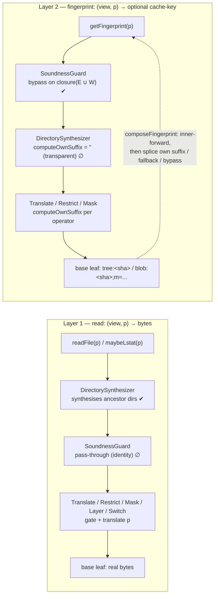
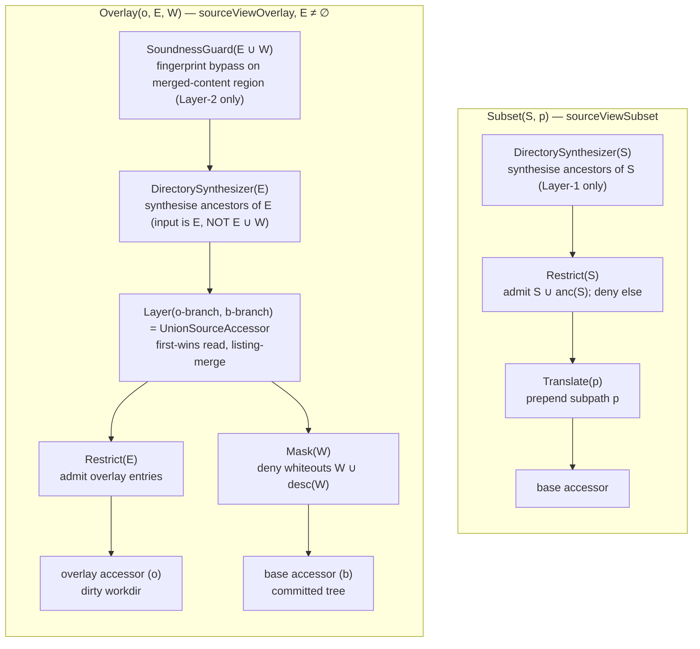
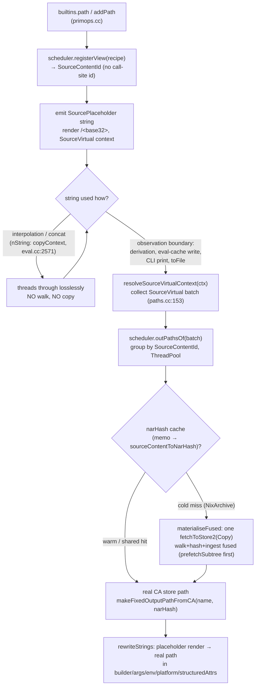
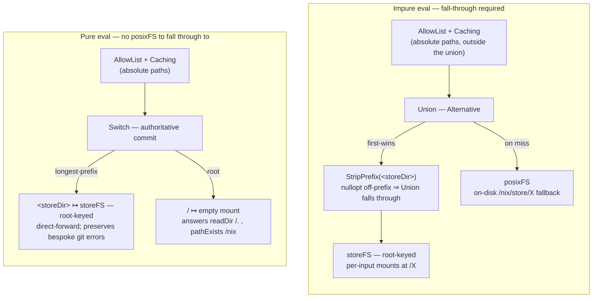

# A Virtualising, Composable, Transparent SourceAccessor

This document describes the source-materialisation architecture: its components, what each does, and how they interplay. It is written for a reader who wants to understand the system — not its history. The intent is to make the design legible to upstream: the model is one internal abstraction (a source is a *view* with content-determined identity and, where relevant, local provenance), and subtrees, arbitrary Git trees, filtered subsets, dirty overlays, sparse checkout roots, and physical checkout paths are all that one model. The user-visible API surface — `builtins.path`, `builtins.fetchTree`, `builtins.filterSource`, `readFile`/`fromJSON` — is unchanged.

The architecture decomposes into: a content-keyed projection substrate ([§0](#0-underlying-pattern)); six primitives and an eight-operator algebra over two layers ([§1](#1-the-algebra)); the concrete components that realise it ([§2](#2-components)); the invariants the algebra obeys and how they are tested ([§3](#3-algebraic-invariants)); the performance characteristics that motivate the design ([§4](#4-performance-characteristics)); the design rationale behind the non-obvious choices ([§5](#5-design-rationale)); the source-materialisation lifecycle, the eval-root assembly, on-demand git fetching, and the cross-cutting laws ([§6](#6-subsystems-and-interplay)); the deliberate design boundaries — what is *not* in the system, and why ([§7](#7-integration-non-goals)); and a comparison against the DetSys lazy-trees and tecnix monorepo precedents ([§8](#8-comparison-detsys-lazy-trees-and-the-tecnix-builtins)).

File:line citations point at where each piece of functionality lives in the tree, as an aid to reading the code alongside this description.

---

## Contents

- [0. Underlying pattern: content-addressed eval-time projection](#0-underlying-pattern)
- [1. The algebra](#1-the-algebra)
  - [1.1. Six primitives](#11-six-primitives)
  - [1.2. Five morphism families plus two transparent decorators](#12-five-morphism-families-plus-two-transparent-decorators)
  - [1.3. Two algebras, one operator stack](#13-two-algebras-one-operator-stack)
  - [1.4. Recipe → operator composition](#14-recipe--operator-composition)
- [2. Components](#2-components)
  - [A. `Projection<>` CRTP](#a-projection-crtp)
  - [B. Subpath-aware `getFingerprint` + structured fingerprints](#b-subpath-aware-getfingerprint--structured-fingerprints)
  - [C. `addPath` refs threading + cross-pipeline tree bridge](#c-addpath-refs-threading--cross-pipeline-tree-bridge)
  - [D. Filtered-shape cache](#d-filtered-shape-cache)
  - [E. Content-keyed parse cache](#e-content-keyed-parse-cache)
  - [F. `mountInput` known-narHash fast path](#f-mountinput-known-narhash-fast-path)
  - [G. `readBlob` phase 1/2 lock split](#g-readblob-phase-12-lock-split)
  - [H. `SourceViewAccessor` + recipes + synthesised Git trees](#h-sourceviewaccessor--recipes--synthesised-git-trees)
  - [I. `CURLOPT_POSTREDIR`](#i-curlopt_postredir)
  - [J. Protocol-v2 client + `GitPromisorProvider`](#j-protocol-v2-client--gitpromisorprovider)
  - [K. `prefetchSubtree` + eval triggers](#k-prefetchsubtree--eval-triggers)
  - [O. `SourcePlaceholder` + `MaterialisationScheduler` + content-keyed memo](#o-sourceplaceholder--materialisationscheduler--content-keyed-memo)
  - [P. `GitSourceAccessor` → `GitPromisorProvider` wiring](#p-gitsourceaccessor--gitpromisorprovider-wiring)
- [3. Algebraic invariants](#3-algebraic-invariants)
  - [Operator-algebra law inventory](#operator-algebra-law-inventory)
  - [The four cross-cutting seam laws](#the-four-cross-cutting-seam-laws)
- [4. Performance characteristics](#4-performance-characteristics)
- [5. Design rationale](#5-design-rationale)
- [6. Subsystems and interplay](#6-subsystems-and-interplay)
  - [6.1. Input materialisation](#61-input-materialisation)
    - [6.1.1. Base-plus-overlay assembly (the dirty-workdir copy)](#611-base-plus-overlay-assembly-the-dirty-workdir-copy)
  - [6.2. The `addPath` source-virtualisation boundary](#62-the-addpath-source-virtualisation-boundary)
  - [6.3. Git blob-fetch-on-demand and the tree-OID bridge](#63-git-blob-fetch-on-demand-and-the-tree-oid-bridge)
  - [6.4. The eval-root assembly](#64-the-eval-root-assembly)
  - [6.5. Design boundaries (deliberately not crossed)](#65-design-boundaries-deliberately-not-crossed)
  - [6.6. Cross-cutting laws and observability](#66-cross-cutting-laws-and-observability)
- [7. Integration non-goals](#7-integration-non-goals)
- [8. Comparison: DetSys lazy-trees and the tecnix builtins](#8-comparison-detsys-lazy-trees-and-the-tecnix-builtins)
  - [8.1. Lineage](#81-lineage)
  - [8.2. The two DetSys choices rejected](#82-the-two-detsys-choices-rejected)
  - [8.3. The tecnix builtins and the ZonePath/ZoneSrc smoking gun](#83-the-tecnix-builtins-and-the-zonepathzonesrc-smoking-gun)
  - [8.4. Obviation scorecard](#84-obviation-scorecard)
  - [8.5. Performance head-to-head](#85-performance-head-to-head)

---

## 0. Underlying pattern

The system borrows its central idea from **content-addressed derivations**. A floating (content-addressed) derivation output has a store path that is *unknown until the output is built*; during evaluation it is represented by a `DownstreamPlaceholder` — a deterministic `/<hash>` string — and `Derivation::tryResolve` substitutes that placeholder for the real path once it is known, via `rewriteStrings`. The same three moves — **a content-determined placeholder standing in for an artifact, threaded through evaluation, resolved at a boundary** — are what this system applies to *sources*. A source whose store path isn't yet known (because computing it requires a NAR walk) is **virtual**; walking and ingesting it makes it **materialised**. The vocabulary throughout is deliberately that of derivation output resolution: *placeholder*, *virtual* ⇄ *materialised*, *resolve*, *devirtualise*.

Underneath that sits a *projection* — a deterministic, content-keyed function

```
P : I₁ × ... × Iₙ ⇀ O
```

with `keyP(i₁, ..., iₙ)` (canonical, fingerprintable bytes), `computeP(...)` (deterministic on success), `encodeO(o)` (bytes stored), and a cache row `(domain(P), keyP(...)) → encodeO(computeP(...))`. Three laws hold:

1. **Soundness.** Equal `(domain, key)` ⇒ equal value. Domains that can't honour this (TTL, store-GC) use bespoke `lookupExpired` / `lookupStorePath` paths instead of `Projection<>`.
2. **Composition.** `Q(P(a))` reuses `P`'s cache row by content key, not by call path.
3. **Cache merge.** For content-keyed domains the row set is a join-semilattice under set union (the `INSERT OR IGNORE` discipline gives cross-process merge).

Every cache in the system is an instance: `treeHashToNarHash`, `sourcePathToHash`, `filteredSourcePathToHash`, `gitRevCount`, `gitLastModified`, `sourceContentToNarHash`, and the parse cache. The content-keyed subset is unified under `Projection<>` ([§2.A](#a-projection-crtp)); the store-GC/TTL cases stay bespoke. The `sourceContentToNarHash` projection is the **source analogue of the build-side `Realisation` table** (`drvOutput → outputPath`): it maps a `SourceContentId` to the narHash its materialisation produced, so the walk happens once per content identity across processes. (It is intentionally *not* a `Realisation` — [§6](#6-subsystems-and-interplay) explains why source realisations need neither signing nor substituter sharing.)

The substrate is **Build Systems à la Carte's selective task** (Mokhov, Mitchell & Peyton Jones, 2018) restricted to content-addressed keys. The content-addressing constraint removes the dirty-propagation engine that Salsa/Skyframe/Adapton need: content change = key change, so stale rows simply stop being queried.

## 1. The algebra

The system is six primitives ([§1.1](#11-six-primitives)) and an eight-operator algebra over two layers ([§1.2](#12-five-morphism-families-plus-two-transparent-decorators)–[§1.3](#13-two-algebras-one-operator-stack)). Recipes are construction records that a factory compiles into operator stacks ([§1.4](#14-recipe--operator-composition)).

### 1.1 Six primitives

**`SourceAccessor::getFingerprint(path) → (CanonPath, optional<string>)`** is the single content-identity surface. A wrapper does not short-circuit on its own field; it calls `composeFingerprint(*this, *next, outerPath, innerPath)` (`source-accessor.cc:7`), which forwards to the inner accessor first, then either splices the wrapper's `computeOwnSuffix(path)` into the inner fingerprint, falls back to the wrapper's own `fingerprint` field when inner has no content-keyed identity, or signals *bypass* (`nullopt`) when the wrapper's own suffix is `nullopt`. One virtual call produces the cache key; everything else falls out of it.

**`SourceContentId`** (`source-content-id.hh`) is what `(sourceFingerprint, shapeHash, method, refs)` hashes to. **There is no call-site identity** — two `builtins.path` calls anywhere with identical content-determining inputs produce the same `SourceContentId`. Encoding is canonical (NUL-separated fields, `StoreReferences` sorted, schema tag `src-content-id-v1`) so two processes agree.

**`SourcePlaceholder`** (`source-placeholder.hh`) = `(SourceContentId, name)` rendered as `/<base32(SHA-256)>` (52 Nix32 chars, no `-name` suffix). It is the source-side `DownstreamPlaceholder`: deterministic across processes, so error messages and bug reports quote stable strings.

**`SourceViewAccessor`** (`source-view.hh`) decorates an underlying accessor with a `ViewRecipe` (`std::variant` over `Root` / `Subtree` / `Subset` / `Overlay` / `TreeHandle` / `LocalCheckout`), a `SourceViewIdentity`, and a `SourceProvenance`. **Identity and provenance are orthogonal types.** Identity is content-determined and substituter-shareable; provenance (on-disk checkout path, sparse roots, dirty files) is local-capability data and never becomes a cache row. The byte/listing read methods (`readFile`/`lstat`/`maybeLstat`/`readDirectory`/`readLink`) are pure forwards to a `ref<SourceAccessor> readImpl` field — the operator stack the factory built — with no per-recipe dispatch (`source-view.cc:47-76`). Three methods consult view-level (Layer-3) state before the stack:

- `showPath` forwards to the workdir accessor for `recipe::Overlay` (`:78-85`);
- `getFingerprint` checks the recipe-supplied identity first (`:87-99`);
- `getPhysicalPath` returns the `checkoutPath` capability first (`:101-107`).

`SourceViewAccessor` carries a **second, distinct content-identity query**: `getIdentity(path)` (`source-view.cc:141`). Where `getFingerprint` is the *cache-key* function (routes through `readImpl`, so a Restrict/Mask/SoundnessGuard bypass correctly nullopts the key), `getIdentity` is the *pre-bypass* identity of the base at the translated path: it reads through `base`, not the operator stack, so a `Subset` over a Git base can report the unfiltered tree-SHA at the subpath even where the cache key bypasses. The path translation it applies (`recipeBasePath`, `:119` — `Subtree`/`Subset` re-anchor `subpath / x`, others pass through) is the single source of truth shared with the Git-tree resolver, so identity and the synthesis cache key agree on the base path.

**`MaterialisationScheduler`** (`materialisation-scheduler.hh`) is the in-process registry of registered-but-unmaterialised views plus the persistent realisation table (the `sourceContentToNarHash` projection). It coalesces concurrent demands on one `SourceContentId` via `boost::concurrent_flat_map<SourceContentId, std::shared_future<Hash>>` and batches independent contentIds through `ThreadPool`. API: `registerView`, `narHashOf`, `outPathOf`, `outPathsOf`.

**`GitRepoImpl::synthesiseTree(baseTreeOid, acceptedPaths)`** (`git-utils.cc`) constructs a Git tree containing only the accepted entries via `git_treebuilder_*`, **reading no blob bytes** — only tree metadata. The synthetic OID is a key into the `treeHashToNarHash` projection. A *hit* gives the narHash with no walk; a *cold miss* still reads every accepted blob (the projection's compute fn is `hashPath`→`dumpPath`). So synthesis is **cache-key normalisation, not walk avoidance**: its value is that two different base trees (or pipelines) filtering to an identical subset produce the same synthetic OID and share one row. It comes in two variants — `synthesiseTreeOid` (in-memory mempack, no `flush()`, used for the cache key) and `synthesiseTree` (= the former plus `flush()`, for a caller that needs a retrievable object).

A `SourceContentId` keyed by call-site identity, a separate `EvalOutputId`, and a per-input materialisation primitive are all *not* among these six: the call-site key is unsound for cargo workspaces, and the rest are special cases of the six. `InputMaterialisation` ([§6.1](#61-input-materialisation)) is the per-input narHash handle — a *consumer* of these primitives, not a peer.

### 1.2 Five morphism families plus two transparent decorators

Eight operators participate: `Translate`, `StripPrefix`, `Restrict`, `DirectorySynthesizer`, `Mask`, `Layer`, `Switch`, `SoundnessGuard`. They cluster into five categorical families:

| Family | Morphism | Operators |
|---|---|---|
| **Path translation** | Iso (monoid morphism on paths) + its Prism adjoint | `Translate` (prepend `p`; total), `StripPrefix` (strip `p`; deny off-`p`) — a section/retraction pair |
| **Admission** | Prism (commutative idempotent semilattice morphism on path sets) | `Restrict` (admit S ∪ anc(S)), `Mask` (deny W ∪ desc(W)), `DirectorySynthesizer` (synthesise ancestors of S) |
| **Materialisation (fall-through)** | Alternative (`<\|>`) | `Layer` (= `UnionSourceAccessor`) |
| **Materialisation (authoritative)** | Switch — longest-prefix commit (Layer's categorical dual) | `Switch` (immutable; `MountedSourceAccessor` = its mutable face) |
| **Fingerprint guard** | Writer-style decoration on the Layer-2 bypass set | `SoundnessGuard` |

`StripPrefix` is a free-monoid morphism on `CanonPath` (`StripPrefix(p)∘StripPrefix(p) = StripPrefix(p/p) ≠ StripPrefix(p)` — *not* idempotent), in contrast to the path-*set* Prisms Restrict/Mask, which are. `Switch` and `Layer` are distinct N-ary combinators: a `Switch` miss is final, a `Layer` miss falls through. `Mounted` is therefore a `Switch`, **not** `Layer([StripPrefix(p_i)(a_i)])` — a tempting reduction that is unsound. The counterexample: with `mounts = {/ → A holding /a/b/c, /a/b → B empty}`, `read(/a/b/c)` under a `Switch` routes to the nearest mount `/a/b → B`, strips to `/c`, finds nothing, and **commits** to not-found; a `Layer` of the same data falls through from the empty `B` to root `A` and **finds** `/a/b/c`. Sorting longest-prefix-first picks the right match but does not suppress the fall-through-on-miss that defines `Alternative`. What *is* sound is the per-branch identity `Mounted = Switch_{LPM}(StripPrefix(p_i)(a_i))` — a single mount's action is exactly `StripPrefix(p)(a)` (no shadowing with one mount), including a byte-identical `getFingerprint`.

`Restrict`'s admission is `paths.empty() || p.isRoot() || contains(p) || ancestorOfMember(p)` — the unconditional **root clause** matters (the root is always walkable so the stack can reach any admitted leaf), and the `paths.empty()` clause is the `Restrict(universe) ≡ identity` short-circuit. `Mask`'s is the dual: `paths.empty() || !memberOrDescendantOfMember(p)`.

Two **transparent decorator** families wrap any accessor without changing read semantics (idempotence + faithfulness laws, no semilattice/Prism/Iso structure). Their instances are separate classes:

- **`Cache.Lstat` / `Cache.Predicate`** — `CachingSourceAccessor` (positive lstat/readLink memo; the eval-root wrap) and `CachingFilteringSourceAccessor` (predicate memo; the base of `GitExportIgnoreSourceAccessor`). They are two classes by necessity — different key/value types — and the predicate cache uses a lock-free `boost::concurrent_flat_map` that tolerates benign duplicate compute under `eval-cores>1` rather than locking. Their law inventory is C1–C6: transparency (the cache changes cost, never the observed result), idempotence, and two soundness-bearing ones — **C3 positive-only** (a *miss* must not be cached as present, or a later appearance of the path would be masked — this is what the `CachingSourceAccessor` name encodes) and **C6 thread-safety** (concurrent reads of one key drive at most one underlying read).
- **`AccessControl(errorBuilder)`** — the throw-on-deny concern inside `FilteringSourceAccessor::checkAccess` + the `MakeNotAllowedError` callback. The eval-root `AllowList` carries two admission inputs (`allowedPrefixes`, a mutating `SharedSync<std::set>`, and `allowedPaths`, a `concurrent_flat_set`); it is a mutable permission ledger, not a pure operator, which is why it is not extracted ([§6](#6-subsystems-and-interplay)).

**Two error channels.** "Filtered out of a view" and "access denied for security" are different concerns. View factories build a `MakeNotFoundError` (throws `FileNotFound` — "this path doesn't exist in this view") and adapt it into the `MakeNotAllowedError` shape `checkAccess` expects via `adaptToNotAllowed` (`filtering-source-accessor.hh`); the security-flavoured `RestrictedPathError` is reserved for `AllowListSourceAccessor` / `restrictEval`. Operators that *provably never deny* (Translate, DirectorySynthesizer, SoundnessGuard — `kAdmission = AdmitAll`) take a `neverDenied()` error builder whose body is `unreachable()`, so an admission-shape change that makes the throw reachable becomes a loud failure rather than a silent latent bug.

**Methods that thread through every operator (not just the named read methods).** The algebra is wider than `readFile`/`getFingerprint`. Each operator also translates/gates `getPhysicalPath` (so an on-disk capability survives the stack), forwards `invalidateCache` to its children, and implements `prefetchSubtree` with real per-operator semantics:

- `Filtering` gates on `isAllowed` before forwarding;
- `Translate`/`StripPrefix` translate the prefix;
- `Switch` fans out via `forEachMountUnder` to reach strictly-deeper sub-mounts — Git submodules the owning mount can't see;
- `Union` forwards to the first child that has the path.

One deliberate *absence* is load-bearing: no operator overrides `pathExists`. It is inherited (`= maybeLstat(path).has_value()`) so that `DirectorySynthesizer`'s synthesised directory stats surface through `pathExists` automatically.

The CRTP base `PathSetOp<Derived>` (`filtering-source-accessor.hh:290-325`) shares `isAllowed`/`computeOwnSuffix` across the four path-set operators (Restrict, Mask, SoundnessGuard, DirectorySynthesizer). Each declares three `static constexpr` shape constants — `kAdmission` (`AdmitAll`/`AdmitClosure`/`DenyClosure`), `kFingerprint` (`Identity`/`BypassInClosure`), `kSemilattice` (`Meet`/`Join`) — and the base dispatches via exhaustive `switch` with no `default:` (adding a shape is a compile error at every site). The `static constexpr` turns the shape switch into a direct branch *within* a method; it does **not** devirtualise the *inter-accessor* calls (operators are held as `ref<SourceAccessor>`, so wrapper-to-wrapper `readFile` is a genuine virtual dispatch — `final` can't help when the static type is always the base). The shared factory `makePathSetOp<Derived>` (`:341-381`) implements identity short-circuit + semilattice fusion + fresh-wrap once; the Meet fusion additionally collapses *both* wrappers to the inner's `next` when the intersection is empty. `Translate` is not a `PathSetOp` (it carries a `CanonPath prefix`, not a path set).

### 1.3 Two algebras, one operator stack

Four logical layers:

- **Layer 1 — Read.** `(view, path) → bytes`. Each `read` walks the wrapper stack, gating and translating.
- **Layer 2 — Fingerprint.** `(view, path) → optional<cache-key>`. A catamorphism over the stack via `composeFingerprint` + per-operator `computeOwnSuffix`.
- **Layer 3 — View metadata.** Path-independent, view-constant: the recipe, `SourceViewIdentity` (`shapeHash`, `gitTree`, `purity`, optional `narHash`), `SourceProvenance` (`checkoutRoot`, `dirtyFiles`, `deletedFiles`, `sparseCheckoutRoots`), and the optional `checkoutPath` capability.
- **Layer 4 — Consumers.** `MaterialisationScheduler`, the persistent fetcher cache, `addPath`, the Git-tree resolver. Read Layers 2–3; walk Layer 1 to materialise.

Layer 1 and Layer 2 share the operator types, but each operator declares its behaviour in each algebra independently. `SoundnessGuard` is the headline asymmetry — read pass-through (Layer-1 identity) but fingerprint bypass on `closure(R)` (Layer-2 join-semilattice morphism), because the bypass region for an Overlay's fingerprint (`E ∪ W`) is wider than any single Layer-1 admission operator sees. `DirectorySynthesizer` is the dual — synthesises ancestor directories at Layer 1, transparent at Layer 2 (`computeOwnSuffix = ""`).

```
Translate(p)               : Iso on paths;             p ↦ b.read(p / x)
StripPrefix(p)             : Prism on paths (strip);    p ↦ b.read(x.removePrefix(p)), deny x ∉ p
Restrict(S)                : Prism (admit S ∪ anc(S)); meet-semilattice morphism (sets, ∩)
Mask(W)                    : Prism (deny W ∪ desc(W)); join-semilattice morphism (sets, ∪)
DirectorySynthesizer(S)    : Prism-synthesis sub-op;   join-semilattice morphism on Layer-1
Layer([a, b, ...])         : Alternative <|>;          first-wins read, listing-merge directories
Switch({p_i → a_i})        : longest-prefix commit;     authoritative dual of Layer (NOT a Layer)
```

Identity is the unit `Translate(/) ≡ StripPrefix(/) ≡ Restrict(universe) ≡ Mask(∅) ≡ SoundnessGuard(∅) ≡ DirectorySynthesizer(∅)`; the factory short-circuits these at construction.



(Both subgraphs walk the *same* stack — two passes over one set of wrappers. `✔` = active in that algebra; `∅` = identity.)

### 1.4 Recipe → operator composition

A `ViewRecipe` is a construction record; the factory (`source-view-factories.cc`) compiles it to an operator stack. Six factory functions exist — `sourceViewRoot`, `sourceViewSubtree`, `sourceViewSubset`, `sourceViewOverlay`, `sourceViewTreeHandle`, `sourceViewLocalCheckout`.

| Recipe | Operator composition (outer → inner) |
|---|---|
| `Root` | `Identity(base)` |
| `Subtree(p)` | `Translate(p)(base)` |
| `Subset(S, p)` | `DirectorySynthesizer(S) ∘ Restrict(S) ∘ Translate(p)(base)` |
| `Overlay(o, E, W)` | `SoundnessGuard(E ∪ W) ∘ DirectorySynthesizer(E) ∘ Layer([Restrict(E)(o), Mask(W)(b)])` (when `E ≠ ∅`) |
| `TreeHandle(oid)` | `Identity(base)`, with `identity.gitTree = oid` |
| `LocalCheckout(p)` | `Identity(base)`, with view-level `checkoutPath = p` (NOT an operator) |



`Root`/`TreeHandle`/`LocalCheckout` collapse to `Identity(base)` (no wrapper); they differ only in Layer-3 metadata (`identity.gitTree`, `checkoutPath`).

`DirectorySynthesizer`'s input is `E` only for Overlay, **not** `E ∪ W`. `SoundnessGuard(R)` and `DirectorySynthesizer(S)` look like duals (both join-semilattice morphisms on path sets) but discriminate different regions: `SoundnessGuard` bypasses fingerprint wherever merged content differs from base (whiteouts change a directory's listing, so `R = E ∪ W`), while `DirectorySynthesizer` makes ancestors *walkable* (whiteouts mask, they don't introduce leaves — including W would synthesise a ghost directory for a whiteout whose parent doesn't exist in base). The two free functions `layer1Region(recipe)` / `layer2Region(recipe)` (`source-view.hh:218-219`, over `regions()` at `source-view.cc:210-247`) formalise the discrimination with one `std::visit` arm per recipe variant, so adding a recipe forces both regions to handle it.

**Half-empty Overlay sentinel.** `E = ∅, W ≠ ∅` would naively build `Layer([Restrict(∅)(o), Mask(W)(b)]) ≡ Layer([identity(o), Mask(W)(b)])`, leaking every overlay file; the factory carves this out to `SoundnessGuard(W) ∘ Mask(W)(b)`. Both-empty short-circuits to `readImpl = base`.

**What the Overlay observably affects (the dirty-git-workdir case, `makeWorkdirOverlay`).** The Overlay's purpose is delta-based fingerprinting (`tree:R;d=H`) and NAR-walk accuracy (deleted files masked, modified/added files read at workdir bytes). It deliberately does **not** change a flake input's `outPath`: a `git+file://` input's `outPath` derives from the lockfile `narHash`, computed from the *committed* tree, and `builtins.readFile (input + "/f")` reads from that committed store path — not the workdir. Dirty-workdir edits surface only through an impure `builtins.fetchGit /path` that opts into workdir semantics. So the overlay is consulted during the fingerprint/materialisation walk that decides which store row to reuse; it is not visible to downstream expressions reading `outPath`. (`getWorkdirInfo` excludes submodules; untracked files are out of scope — only `dirtyFiles`/`deletedFiles`.)

## 2. Components

A reference index of the concrete components realising the algebra — one entry per component, naming where it lives and what it does. For how the components *interplay* (the source-materialisation lifecycle, the eval-root assembly, on-demand git fetching), see [§6](#6-subsystems-and-interplay); some material is necessarily summarised here and developed there. Entries are labelled A–K then O and P (the lettering has gaps); the operator algebra itself is not repeated here — it is [§1.2](#12-five-morphism-families-plus-two-transparent-decorators)–[§1.4](#14-recipe--operator-composition) and [§3](#3-algebraic-invariants).

### A. `Projection<>` CRTP

`projection.hh`. A CRTP wrapper: each concrete projection supplies `domain`, `toKey`, `fromValue`, `toValue`. `Foo::lookup(settings, from, [&]{…compute…})` runs the compute only on a miss and upserts; `peek()` returns the cached value without computing. Domains: `TreeHashToNarHash`, `GitRevCount`, `GitLastModified`, `FilteredSourcePathToHash`, `SourcePathToHash`, `SourceContentToNarHash`. (The refactor is intentionally partial — store-GC/TTL domains don't fit the `lookup-or-compute` shape and stay bespoke.)

### B. Subpath-aware `getFingerprint` + structured fingerprints

`git-utils.cc::GitSourceAccessor::getFingerprint`. Root paths return the input-level fingerprint; tree-rooted subpaths return `tree:<sha><flagSuffix>`; blob-rooted subpaths return `blob:<sha>;m=<git-mode><flagSuffix>`. The mode is required on the blob branch — Git blob OIDs don't encode the executable bit or symlink-vs-regular, but NAR serialisation does. The `flagSuffix` (`;e` export-ignore, `;l` LFS, `;s` submodules — constructed in `git.cc` at the input level) propagates input-level concerns to subpath fingerprints; `getFingerprint` only *propagates* an already-present suffix, it doesn't construct it.

The composition machinery is in `fingerprint.hh`: `mergeFingerprintSuffix(fingerprint, ";<tag>=<value>")` (alphabetical insert, throws on tag clash), `treeFingerprint(oidHex)`, `blobFingerprint(oidHex, modeOctal)`, and the inverse `bareTreeOid(fingerprint)` (the single canonical bare-`tree:` decoder — returns an OID iff the fingerprint is a suffix-free `tree:<hex>`, totals to `nullopt` otherwise, never throws). Wrapper-stack-order independence falls out of the alphabetical merge. `UnionSourceAccessor::getFingerprint` does *not* compose — it dispatches ("first child with a content-keyed fingerprint wins; else Union's own field"), skipping a child that lstats the path but carries no content identity (e.g. a posix accessor shadowing a store mount).

### C. `addPath` refs threading + cross-pipeline tree bridge

`fetch-to-store.cc::fetchToStore2`. It threads a `StorePathSet refs` through so `addPath` callers with string-context references reuse the cache instead of bypassing it (`refs.self` is hardcoded false — these source paths are never self-referential). After a `sourcePathToHash` miss for a bare `tree:<sha>` fingerprint (gated by `bareTreeOid`, via `peekTreeHashBridge`), it consults `treeHashToNarHash` — populated by tarball/GitHub fetchers — and on a hit reconstructs the store path without walking; symmetrically it writes that row back. So a tarball and a Git input unpacking to the same tree-SHA share a row. Two in-process memos (`filteredNarHashMemo`, `sourceNarHashMemo`, keyed by a NUL-separated `makeMemoKey`) absorb the within-process repeats.

### D. Filtered-shape cache

`filtered-shape.hh`, `fetch-to-store.cc`. `collectFilteredShape(accessor, root, filter)` mirrors `dumpPath`'s structural traversal but accumulates a content-free shape digest plus the accepted-path set: the filter is consulted on each child, root is included unconditionally, and symlinks are recorded by target string and **never recursed through** (the containment invariant — an accepted symlink can't let the walker escape). The user filter receives **absolute** paths (`path / name`), matching master's PathFilter contract. The cache key is `(sourceFingerprint, method, subpath, shapeHash)` via `FilteredSourcePathToHash`; two filters yielding the same accepted set against the same source share a row. On the miss path the walker builds an `acceptedFilter` from the recorded set so `addToStore` doesn't re-run the user predicate. `walkShape` throws on unsupported node types (char/block/socket/fifo).

### E. Content-keyed parse cache

`parse-cache.hh`, `parse-cache.cc`. Headline workload `builtins.fromJSON (builtins.readFile X)`: when `X` resolves to a content-fingerprintable source the parsed Value tree is persisted under `(content-fingerprint, format, parser-version, path)`.

- **The side-table.** A per-`EvalState` `stringFingerprints: concurrent_flat_map<const StringData *, StringFingerprint>` connects `prim_readFile` (populates after `mkString`) to `prim_fromJSON` (looks up `&args[0]->string_data()`). It is cleared on `resetFileCache` (the safe boundary against GC address reuse), and empty strings are excluded (a static empty makes allocation identity meaningless).
- **The load-bearing invariant.** Keying on the `StringData *` pointer is sound only because that pointer is stable across `callFunction`: `mkString` allocates the `StringData` on the GC heap, and `callFunction` copies the `StringWithContext` payload bitwise (`vRes = vCur`), so the `str` pointer survives the call into `prim_fromJSON`.
- **The persistent store.** SQLite at `~/.cache/nix/parse-cache-v1.sqlite`, `Documents(fingerprint, format, parser_key, path, body)` with a tagged binary blob body; **symbol strings, not symbol IDs**, are stored so two processes deserialise identical trees. It degrades to a no-op when the cache dir is unwritable.
- **A side fix this surfaced.** `SQLiteStmt::Use::getStr` truncates at NUL, so a binary-safe `getBlob` was added.

### F. `mountInput` known-narHash fast path

`paths.cc::mountInput`. When the lock supplies `narHash`: derive the candidate CA store path from `(name, knownHash, refs={})`. There are three outcomes, in order:

1. **Already present / substitutable** — if `isValidPath` (cheap) or `ensurePath` (substituter) succeeds, mount the accessor at the candidate path and return. No NAR walk, no copy.
2. **Immutable-rev but absent (the cold local-only case)** — the candidate is neither valid nor substitutable, but the input carries a git/treeOID `rev` *and is not a `path:` input* (the `immutableRev` gate), so its content is *immutable*: the rev addresses a fixed git object whose narHash cannot drift under us. Rather than fall through to the slow path's eager dryRun — which would re-derive the very narHash already in hand — mount the live accessor at the real candidate path, set `narHash` directly, and return, **deferring the byte-copy** to the first hard demand ([§6.1](#61-input-materialisation)). A consumer that only reads metadata or instantiates a derivation never dryRun-walks the input; a build copies exactly once. Because the candidate is the *real* canonical CA path (not a stand-in), this is sound even in pure eval — it can persist into a `.drv`/lock/eval-cache verbatim. The (pathological) corrupted-lock mismatch — a rev whose recorded narHash disagrees with the rev's actual content — still fires at the copy boundary as a graceful `Error(102)`.
3. **Otherwise** — fall through. The gate (`immutableRev`) is deliberately *stricter* than both `isLocked` and a bare `getRev()`. It is not `isLocked`, because a `path:` input is `isLocked` iff it carries a narHash (`path.cc`) yet points at a **mutable** directory. It is not a bare `getRev()` either, because a `path:` input *also* accepts a user-supplied "fake" `rev` attribute (`path.cc`'s allowed-attrs) over that same mutable directory — so `getRev()` alone would wrongly admit `path:?rev=…`. Deferring a mutable input would let a metadata/`readFile`-only consumer observe the (possibly stale) name without the narHash ever being checked. So `path:` (`getType() == "path"`), a rev-less tarball, and an unlocked `fetchTree { narHash = …; }` all fall through to the slow path, whose `InputMaterialisation` (carrying `expectedNarHash`) verifies eagerly when bytes are demanded — exactly as master. For a truly unlocked input there is no narHash yet, and the slow path virtualises rather than walking eagerly ([§6.1](#61-input-materialisation)).

### G. `readBlob` phase 1/2 lock split

`git-utils.cc::GitSourceAccessor::readBlob`. Phase 1 (under the State lock) walks the tree to resolve `path → git_oid` and captures the LFS-smudge decision; Phase 2 (lock-free) does `git_odb_read` against libgit2's thread-safe `git_odb`, including any LFS HTTPS fetch. `git_odb` is internally thread-safe; `git_tree`/`git_repository` are not. Concurrent reads contend only on the brief Phase 1 — the substrate for `eval-cores > 1`.

### H. `SourceViewAccessor` + recipes + synthesised Git trees

The decorator and its six recipes are described in [§1.1](#11-six-primitives)/[§1.4](#14-recipe--operator-composition); this entry adds the two pieces not covered there — the pre-bypass identity channel (`getIdentity`/`recipeBasePath`, [§1.1](#11-six-primitives)) and the Git-tree resolver.

`resolveViewToGitTreeWith` (`source-view-git.cc`) maps a view to a Git tree OID:

| Recipe | Git tree OID |
|---|---|
| `Root` | `tree:<sha>` from the fingerprint |
| `TreeHandle` | the recipe OID |
| `Subtree` | the base subpath fingerprint **re-anchored via `recipeBasePath`** |
| `Subset` over a Git base | `synthesiseTree` |
| `Overlay` / `LocalCheckout` | `nullopt` |

The synthesis path is reached through three layers, each adding a gate:

1. `MaterialisationScheduler::synthesiseViewTreeOidFor` — a scheduler method that gates on `method == NixArchive` (the projection's tree-NAR-equals-canonical-dump invariant), which calls
2. the free `synthesiseViewTreeOid` — gates on `recipe::Subset` (only a filtered subset has a synthetic OID to key on), which calls
3. `resolveViewToGitTreeWith` with the non-flushing `synthesiseTreeOid` seam.

`synthesiseTreeRecursive` recurses into an accepted directory whenever the entry is `GIT_FILEMODE_TREE` (so an accepted directory with *no* accepted children synthesises an *empty* tree, matching the filtered walk) and splices non-tree entries (file/symlink/gitlink) verbatim by OID.

### I. `CURLOPT_POSTREDIR`

`filetransfer.cc`. Sets `CURLOPT_POSTREDIR = CURL_REDIR_POST_301 | _302 | _303` for `HttpMethod::Post`. Without it, curl converts POST→GET on redirect and drops the body, silently breaking protocol-v2 upload-pack POST against a 301-redirecting server. Prerequisite for [§2.J](#j-protocol-v2-client--gitpromisorprovider).

### J. Protocol-v2 client + `GitPromisorProvider`

`git-promisor.hh`, `git-promisor.cc`. Three layers:

- **pkt-line framing** — `pkt::appendData`/`appendFlush`/`appendDelim`/`readLine`, three reserved sizes `0000`/`0001`/`0002`.
- **`probeV2`** — `GET /info/refs?service=git-upload-pack` with `Git-Protocol: version=2`, parses the advertisement for `version 2` + `fetch=...filter`. The uncached primitive; callers cache via the global per-URL `gitV2CapsCache`.
- **`ensureObjects(span<Hash> wants, FetchFilter filter)`** — one coalesced `command=fetch … filter blob:none … want … done` POST, sideband-demuxed, fed to `git_indexer_*`.

The provider does not globally register a libgit2 transport — negotiation happens above the smart-subtransport layer. The `partialclone` extension is whitelisted at init via `git_libgit2_opts(GIT_OPT_SET_EXTENSIONS, …)` so partial-clone repos open. (From-scratch C++ over vendoring `gitoxide`: the surface is ~250 LOC and a Rust toolchain in the build pipeline costs more than it saves.)

### K. `prefetchSubtree` + eval triggers

`SourceAccessor::prefetchSubtree(path, depth)` is virtual with a no-op default; wrappers override per [§1.2](#12-five-morphism-families-plus-two-transparent-decorators). Eval triggers: `prim_readFile` prefetches the parent dir at depth 1; `prim_readDir` prefetches the dir at depth 1. `GitSourceAccessor::prefetchSubtree` walks to depth, enumerates blob OIDs absent from the local ODB via `git_odb_exists`, and calls `provider->ensureObjects(missing, Blobless)` outside the lock; no provider ⇒ no-op.

### O. `SourcePlaceholder` + `MaterialisationScheduler` + content-keyed memo

`source-content-id.hh`, `source-placeholder.hh`, `materialisation-scheduler.hh`. The scheduler holds `narHashByContent_` (in-process memo over the persistent `sourceContentToNarHash` projection); `inFlight_` (`concurrent_flat_map<SourceContentId, shared_future<Hash>>`, coalescing concurrent walks); and `registrations_` (placeholder → `Registration`) + `regsByContent_` (contentId → registration, the secondary index that turns `narHashOf`'s registration lookup from an O(registrations) scan into an `equal_range`).

The three resolution methods:

- **`narHashOf(contentId)`** does memo → projection → walk via `fetchToStore2(DryRun)`, with `shared_future`-coalesced concurrent demands.
- **`outPathOf(placeholder)`** peeks the narHash caches first (warm/shared ⇒ 0–1 walk); on a cold miss for a NixArchive source it **fuses** hash+copy into one `fetchToStore2(Copy)` (`materialiseFused`) since the Copy already yields the narHash, eliding the separate DryRun.
- **`outPathsOf(span)`** groups by contentId: a single placeholder delegates to `outPathOf` (preserving the fusion); multiple *distinct* contentIds run a parallel narHash prelude on a `ThreadPool` then materialise each group; within a group `materialiseGroup` does **copy-once-link-N** (Copy the first sibling, hardlink the rest into their name-stamped CA paths via `registerLinkedCAPath`). The single-contentId case deliberately skips the prelude so the first sibling's `outPathOf` fuses.

The lifecycle — registration, lossless threading through interpolation, resolution at an observation boundary — is the floating-CA pattern ([§0](#0-underlying-pattern)). The resolution sites are in `paths.cc`: `resolveSourceVirtualContext` (the batched pre-serialise chokepoint), `ensureLazyPathCopied`, `devirtualizeStorePath`.



The persistent registry lives in the fetcher cache under `sourceContentToNarHash`, not alongside build-side `Realisation` rows ([§6](#6-subsystems-and-interplay)).

### P. `GitSourceAccessor` → `GitPromisorProvider` wiring

`GitAccessorOptions::provider` (optional `shared_ptr<GitPromisorProvider>`) is threaded through `getRawAccessor`/`getAccessor` into `GitSourceAccessor::State`. `getAccessorFromCommit` constructs the provider when `getPartialCloneRemoteUrl()` returns a URL and the v2 capability cache reports `supportsFilter`, then threads it into `repo->getAccessor`.

## 3. Algebraic invariants

These hold by construction, by test, and by review. Each named test below exists in the tree; where a law is a RapidCheck property vs an example-based unit test, that is stated, because it bears on how much the test actually guarantees.

**Soundness law for content-keyed projections.** Equal `(domain, key)` ⇒ equal value, modulo NAR canonicalisation version (out of scope) and fetcher policy state (`lfs=`/`submodules=`, which enter the key as fingerprint suffixes). This is a design invariant enforced by the key-construction tests — `Projection.KeyShapeIsStableAcrossRebuilds`, `Projection.SourcePathToHashKeyFieldsDiscriminate`, `Projection.SourceContentToNarHashDistinctContentIdsDistinctRows`, `Projection.ComputeNotCalledOnHit`, plus `Fingerprint.StackOrderInvariant`, `FingerprintComposition.TwoWrappersCommute`, `SourceContentId.SameInputsSameId` — not a single named property. (The projection-layer test once mis-named `TreeHashToNarHashSoundnessLaw` actually checks cache *idempotence*; it is named `TreeHashToNarHashCacheIdempotence` accordingly, and the genuine content-soundness lives in L-ContentIdFunctoriality below.)

**Wrapper-stack-order independence.** Two wrappers appending distinct suffixes produce byte-identical fingerprints regardless of nesting (`FingerprintComposition.TwoWrappersCommute`). (`Algebra.SuffixesAreAlphabetisedRestrictMask` tests the observable byte-identity form; no operator emits a non-empty suffix today, which the test comment states.)

**Virtual-projection invariant.** Constructing a `SourceViewAccessor` and querying its identity/provenance reads no source bytes — tested for all six recipes plus composition (`VirtualProjection.RootIsVirtual`, …, `CompositionIsVirtual`; `ReadingDoesMaterialiseBytes` is the negative control).

**Symlink containment.** The filtered-shape walker records symlink targets by string and never recurses through them (`FilteredShape.WalkerDoesNotRecurseThroughSymlinks`).

**Content-determined identity.** `SourceContentId::compute` keys on content only (`SourceContentId.NameIsNotInTheKey`, `SourcePlaceholder.CargoWorkspaceSharingPattern`).

**Cross-process determinism.** Two processes computing one `SourceContentId` produce identical bytes; the parse-cache codec stores symbol strings; `mergeFingerprintSuffix` orders alphabetically.

### Operator-algebra law inventory

Per-operator tests in `src/libfetchers-tests/<operator>-source-accessor.cc`; cross-operator in `algebra-cross-cutting.cc`; `Switch` in `src/libutil-tests/switch-source-accessor.cc`; factory shape in `factory-fusion.cc`.

- **L1 (Translate monoid morphism).** `Translate(p)∘Translate(q) ≡ Translate(p/q)`; `Translate(/)` identity; factory fuses to `inner->prefix / prefix`.
- **SP1–SP6 (StripPrefix Prism, Translate's adjoint).** Identity short-circuit; self-fusion to `prefix / inner->prefix` (OUTER/INNER — *opposite* of Translate, pinned structurally by `factory-fusion.cc`); **not idempotent** (`NotIdempotent`); Prism deny both directions; faithfulness; fingerprint threading with off-domain guard; distributes over `Layer`. Plus the adjunction laws (`algebra-cross-cutting.cc`): `TranslateThenStripIsTotalIdentity` (counit, total retraction), `StripThenTranslateIsIdentityOnImage` (unit, section on the cone), `AdjunctionSectionIsIdempotent` (the section composite is a closure operator), and `AdjunctionRetractionPreservesFingerprint` (the Layer-2 form).
- **Switch.** Non-identity with `Layer` as UNIT (`AuthoritativeCommitNoFallthrough` + `LayerWouldFallThroughUnlikeSwitch`) and PROP (`AuthoritativeCommitProperty`); resolution `ResolutionMatchesNearestOwner`; per-branch identity `PerBranchEqualsStrippedInner` (+ cross-DAG `SwitchBranchEqualsStripPrefix`); `MountOrderIndependent`; `ReadDirectoryDoesNotMerge`.
- **L2/L3 (Restrict meet- / Mask join-semilattice morphism).** Idempotent, commutative.
- **L6 (Layer Alternative).** Associativity, identities, first-wins reads, listing-merge.
- **L7 (SoundnessGuard join-semilattice morphism on fingerprints).** Read pass-through; bypass on `closure(R)`.
- **L8 (symlink-containment).** `Restrict(S)` admits ancestors only, never descendants; tested with a generator forced to 50% symlinks (`MemoryFsConfig{.symlinkProbability = 0.5}` via a `MemoryFsConfigGuard`, vs the 30% default) so the terminate-at-symlink named case fires, not just the trivial absent-path case.
- **L10 (Overlay fingerprint soundness).** `SoundnessGuard(E ∪ W)` captures the cross-set bypass region and falls out algebraically — there is no recipe-aware fingerprint short-circuit on `SourceViewAccessor` itself.
- **D1–D13 (DirectorySynthesizer).** Identity at ∅, idempotent, join fusion, commutative, read-passthrough; `maybeLstat` synthesises ancestors only; `readDirectory` merges synthesised **intermediates only** (a leaf member that is a direct child of `p` and absent from base is *not* listed — matching what `maybeLstat` reports); distributes over Layer; Layer-2 transparent; non-commutativity-with-Restrict (D12, concrete UNIT); symlink-in-S type preservation (D13). Plus the monotonicity properties (`Restrict/Mask/DirectorySynthesizer/SoundnessGuardMonotone`).
- **Fc (factory construction contracts).** 19 `RecipeConstruction.*` cases pin each recipe's stored fields and derived `layer1Region`/`layer2Region` against struct field order — a structural guard a read-output test can't give (a field-order swap that uniformly inverts both inputs is invisible behaviourally; this is what caught the `recipe::Overlay{whiteouts, entries}` swap). `Algebra.ShapeDispatchAnchor` is the exhaustiveness anchor against the `unreachable()` after each shape switch.
- **Cross-algebra named obligations.** `Algebra.BypassAbsorbs` (a Layer-2 bypass/`nullopt` is absorbing in the suffix monoid — distinct from alphabetisation), `Algebra.SymlinkResolutionAgreesOnAcceptedTargets` (symlink resolution agrees across the algebra on accepted targets — distinct from L8 containment and D13 type-preservation), and `DirectorySynthesizer.OuterMostRestoresCommutativity` (the positive resolution of D12: D as the outermost wrapper restores Restrict commutativity).

The deferred decorator families carry their own (not-yet-implemented) law inventories — `C1–C6` for the cache decorators ([§1.2](#12-five-morphism-families-plus-two-transparent-decorators)) and `A1–A6` for `AccessControl`.

### The four cross-cutting seam laws

The headline inventory above does not by itself reach four seams; these laws do:

- **L-ErrPreserve / L-ErrFallthrough / L-DenyOpaque / L-Dual (error channel).** An authoritative combinator that resolves to a single inner accessor (Switch, in-prefix StripPrefix, Translate) re-raises the inner's *most-derived* exception type, not a boolean-collapsed `FileNotFound` — proven by a `ThrowingLeaf` raising a nonce-bearing `CustomBespokeError` and a typed catch through the combinator (`switch-source-accessor.cc`, `strip-prefix-source-accessor.cc`, `algebra-cross-cutting.cc`). `Layer`/`Union` *may* substitute its own `FileNotFound` after an all-children miss — the asymmetry is the law (`UnionMasksBespokeErrorAsFileNotFound`). A `PathSetOp` deny raises without consulting `next` (a `CallCountingLeaf` asserts zero leaf reads on a denied path — the deny leaks nothing about the masked subtree). `DualSwitchCommitsLayerFallsThrough` is the Union mirror of the authoritative-commit property.
- **L-ContentIdFunctoriality (content identity through a NAR-preserving wrapper).** `SourceViewAccessor::getRootTreeHash` forwards the root tree OID for Root (via `base->getRootTreeHash()`) and TreeHandle (from `identity.gitTree`), and returns `nullopt` for Subtree/Subset/Overlay/LocalCheckout — the contrapositive is the soundness direction (never key a filtered/overlaid/subtree NAR under the unfiltered tree OID). The example-based cases are plain `TEST(SourceView, …)` in `src/libfetchers-tests/source-view.cc` (`RootForwardsRootTreeHash`, `TreeHandleReportsItsOid`, `NarAlteringRecipesDoNotForwardRootTreeHash`); the end-to-end RapidCheck-style guard over a real git accessor is `GitFingerprintTest.RootTreeHashSurvivesSourceViewWrapper` in `git-fingerprint.cc`.
- **L-BridgeKeyCanonical (bridge key vs dedup key).** A cross-pipeline bridge key must be canonical (suffix-free `tree:<sha>`); a cache-dedup key may carry suffixes. `bareTreeOid` is the single decoder, validated against an independent brute-force reference (`Projection.BareTreeOidMatchesBruteForceReference`, `BareTreeOidNeverThrowsAndMatchesReference`).
- **L-NoLeak (the leak boundary, tested through the real primop).** `boundary-audit-property.cc` drives `baseNameOf`/`dirOf`/`substring`/`replaceStrings` through the real builtin (`getBuiltin` + `callFunction`) on an unresolved placeholder and asserts each throws — so deleting a production guard fails the test (an inline replay of the guard would not).

## 4. Performance characteristics

The numbers below are the design's motivation; "walk" = one tree traversal, "copy" = walk + store write (they coincide inside `fetchToStore2`).

**`mkDerivation { src = lib.cleanSource ./.; }`.** First eval runs the filter, collects the shape, and writes a persistent `filteredSourcePathToHash` row (the walk dominates); a second eval hits the row (no walk); a same-process third hits the in-process memo (no SQLite round-trip). Two filters with the same accepted set against the same source share the row. The structure walk has a per-eval floor — the user filter must run to compute the shapeHash — but only blob bytes are deferred.

**`${input}/sub` via `builtins.path`.** A populated cache hits `sourcePathToHash` on the subtree `tree:<sha>`; a tarball and a git input unpacking to the same tree-OID hit the `treeHashToNarHash` bridge. The motivating baseline is that without the subtree `tree:<sha>` fingerprint this is keyed per-rev with no cross-rev sharing — N revisions sharing one subtree are N subtree walks — which is exactly what the bridge collapses.

**Cargo workspace (N packages, distinct per-package `name`s)** — the accounting other "one walk" mentions refer to:

- *Cold store:* all N `builtins.path` calls share one `SourceContentId` and emit placeholders. When a consumer resolves them, `outPathsOf` coalesces the narHash walk by contentId — the structural walk + filter runs **once**. It then computes a per-placeholder store path via `makeFixedOutputPathFromCA(name, …)`; the N CA paths are distinct (name-stamped) and invalid cold, so the cold copies are collapsed by **copy-once-link-N** — one byte-Copy, N−1 hardlinks via `registerLinkedCAPath`. Net: one narHash walk, one copy, N−1 links.
- *Warm:* every per-name path is valid ⇒ in-process memo / persistent projection hit on every call; no walk, no copy.

**Single-observer deferred source** (one `builtins.path` over a content-fingerprinted base). Cold: **one walk, not two** — `outPathOf`'s cold-miss path for a NixArchive source fuses the narHash DryRun and the ingest Copy into a single `fetchToStore2(Copy)` (`materialiseFused`). Warm: zero walks. (A plain non-git `builtins.path` with no fingerprint takes the eager `fetchToStore` path and was always a single walk.) The fusion is pinned by `tests/functional/source/single-walk-fusion.sh`, which counts `hashing` (DryRun) log lines and asserts ≤1 — verified non-vacuous (unfused = 2, fused = 1).

**Rev-pinned flake input, cold store** (the fresh-checkout / first-build shape). The known-narHash defer ([§2.F](#f-mountinput-known-narhash-fast-path) outcome 2) names a rev-pinned input from its lock narHash with **no dryRun walk**; only the flake-self (which has no pre-known narHash) still walks. Measured for `nix eval .#drv.drvPath` over a locked git dependency on a cold store: `hashing` drops from 2 (master: dep dryRun + self) to 1 (self only). Metadata-only consumers do zero dep walks; a build copies the dep exactly once. Pinned by `tests/functional/source/known-narhash-defer.sh` (asserts the defer marker fired and total `hashing` ≤ 1; soundness via the unverified-narHash contract in `lazy-narhash.sh`, which the `getRev()` gate preserves by excluding mutable `path:`/rev-less inputs from the defer).

**Dirty git working tree, edit loop** ([§6.1.1](#611-base-plus-overlay-assembly-the-dirty-workdir-copy)). Editing one file in an N-file workdir and building it materialises the committed base (once per process), then assembles the dirty revision by reflinking/hardlinking the N−1 unchanged files and writing only the changed one — instead of re-copying all N. The win is filesystem-dependent and the measurements span the range honestly:

- *CoW store (btrfs/xfs, the best case):* `tryCloneFile`'s `FICLONE` shares the unchanged extents outright, so assembly is O(changed bytes) regardless of tree size. The `dirty-tree-assemble-cow` NixOS VM test (store on a real btrfs partition, 200 files × 64 KiB, one edit) measures **`btrfs filesystem du` exclusive = 0** — i.e. *every* byte of the assembled tree is shared with the base; editing one file allocates no new data blocks for the unchanged majority.
- *non-CoW store (extN/tmpfs):* the unchanged files are hardlinked (metadata only, no byte copy). The `nix-store-benchmarks` `BM_FullCopyTree` vs `BM_AssembleFromBase` contrast (256 files × 256 KiB on tmpfs) measures ~64 ms → ~38 ms (**1.7×**), growing with tree size. (With *tiny* files on tmpfs the two are at parity — a memcpy is already free — which is why the bench uses larger files and the CoW proof lives in the VM, where a real filesystem participates.)
- *store footprint:* unconditionally improved — inodes/extents are shared with the base, not duplicated.

The re-hash guard ([§6.1.1](#611-base-plus-overlay-assembly-the-dirty-workdir-copy)) keeps it sound. Pinned by `tests/functional/source/dirty-tree-assemble.sh` (asserts ≥ N−2 files shared with base, the changed file rewritten, the result valid + correct, and the per-process base memo materialises the base once across two derivations), `src/libstore-tests/register-assembled-ca-path.cc` (incl. the negative `expectedPath`-mismatch-throws test), and the `dirty-tree-assemble` / `dirty-tree-assemble-cow` NixOS VM tests (real disk-backed and btrfs stores).

**Git-shaped filtered subsets.** On a `treeHashToNarHash` hit, no walk — `computeNarHash` synthesises the subset OID and looks the narHash up before any DryRun. On a miss it walks fully (reading every accepted blob) and writes back on the synthetic OID, so the next eval of any source resolving to that synthetic tree is walk-free. Cache-key normalisation, not first-cold walk-avoidance.

**Concurrency.** `readBlob`'s Phase 2 (byte transfer) is lock-free; concurrent reads contend only on the brief Phase 1 tree walk (verified with 4096 reads across 8 threads). This is the substrate for parallel eval, which the evaluator does not yet exercise.

## 5. Design rationale

Why the non-obvious choices are shaped the way they are.

**Algebra over special cases.** Subtree narrowing, filtered subsets, dirty overlays, arbitrary tree handles, and on-disk checkout roots are one model — a wrapped accessor with a recipe — composed from named operators after their FP roles (Iso, Prism, Alternative, semilattice morphism). The alternative, per-recipe `if`-chain dispatch inside each read method, conflates "how was this view built" (a path-independent record consumed by identity derivation) with "how does a read resolve" (a path-dependent substrate). Separating them is what makes new recipes (e.g. Subtree-of-Subset) fall out as operator composition rather than new dispatch code.

**Content-only identity (no call-site key).** Keying a placeholder on `(sourceFingerprint, callSiteId, name)` would make a cargo workspace recompute once per package. Content-only keying with `name` as the per-output disambiguator collapses the N packages to one shared identity — and is what makes the placeholder reproducible across processes, so an error message or bug report names the same string every time.

**Virtual placeholder, not a real-looking fake path.** A source whose store path requires a walk could be represented two ways: a content-determined *placeholder* with a syntactically distinct render (`/<base32>`, our `SourceVirtual`), or a fake-but-real-looking store path (`/nix/store/<hash>-name`). The latter is what DetSys's `StorePath::random` does, and it is rejected here for three reasons that recur throughout the design:

- the derivation hash-substitution invariant needs a placeholder to rewrite (the `Opaque` arm does no rewrite);
- the eval-cache cross-process guard needs to distinguish a not-yet-materialised stand-in from a GC'd real path (a fake real-looking path is indistinguishable, giving silently-wrong cache reads);
- boundary-leak auditing needs a sigil to grep for (a real-looking fake path leaks undetectably — the failure mode DetSys's bug stream demonstrates).

The distinct render is the thing that makes observation coverage auditable.

**Resolution is per-observation, not per-force.** Resolving `SourceVirtual` at `forceValue` time (so every `string_view()` is correct by construction) fails three ways:

- `forceValue` is `[[gnu::always_inline]]` and the hottest function in the evaluator (a per-call context check taxes every already-forced call);
- eager resolution defeats `outPathsOf` batching;
- `string_view()` is `noexcept`, called from contexts where I/O is unsafe (equality, attr-name lookup).

The right granularity is the `NixStringContext &` accumulator that serialisers already thread — resolve once at the boundary, after the walk has accumulated every reachable placeholder.

**Two operators sharing a class breaks commutativity.** `DirectorySynthesizer` is a separate operator rather than a branch inside `Restrict` because the first cut — `RestrictSourceAccessor::maybeLstat` mixing filtering with per-wrapper synthesis — decided synthesis from the *wrapper's own* `paths`, not the *composed* admit set. Concretely, `Restrict({/a/b}) ∘ Restrict({/})(base).maybeLstat(/a)` returned `Some(tDirectory)` (the outer admits `/a` as an ancestor of `/a/b` and synthesises locally) while the swapped stack `Restrict({/}) ∘ Restrict({/a/b})(base).maybeLstat(/a)` returned `nullopt` — observably non-commutative, where admit-set intersection says they must agree. Splitting `Restrict` into a pure Prism filter plus a `DirectorySynthesizer` that takes the *composed* admit set restores strict commutativity. The diagnostic generalises: the symptom was a test name with a hedging suffix (`Restrict.CommutativeOnRealMembers`), and the cause was two operators sharing a class.

**Read the code before reaching for a new abstraction.** Several would-be abstractions turned out to be primitives already present: `mountInput`'s `Opaque{realPath}` already does the eager-narHash virtual-path job (so `SourceVirtual` is needed *only* for `addPath`, which has no lockfile narHash); `coerceToString`'s `nString` branch (`copyContext` then return the view) already *is* the serialiser-walk accumulator pattern; and `derivationStrictInternal`'s collect→batch-via-`outPathsOf`→rewrite is the floating-CA resolution shape already in production. The boundary cover-fixes lift that existing shape rather than inventing one.

**The batched form is mandatory at observation chokepoints.** `resolveSourceVirtualContext` resolves through one `outPathsOf` call, never a per-element `outPathOf` loop — the per-element form silently serialises what should be one coalesced parallel walk (N cargo packages sharing a contentId would become N sequential lookups), and the bug is invisible to correctness tests because the *output* is identical. When a primitive has both a per-element and a batched form, the batched form is the one that belongs at a chokepoint.

**`AllowList` is a stateful effect, not an operator.** It looks like a combinator (`AccessControl ∘ AllowListPredicate`), but the eval-root allow-set grows dynamically as thunks force and authorises concrete store paths (lockfile/fetch sites) that never had a placeholder. Fusion needs sets fixed at construction; this set never is. Only the git-workdir `AllowList` (built once from `wd.files`, never mutated) is construction-determined. So the throw-on-deny concern is extracted only as dead-error-builder cleanup on the always-admit operators; the eval-root ledger stays a stateful effect.

**Synthesis is normalisation, not a walk-avoider.** It is tempting to call Git tree-synthesis a cold-eval speedup. It is not: a cold `treeHashToNarHash` miss still reads every accepted blob. Its only marginal value is that two different base trees filtering to an identical subset share one row. The dominant monorepo patterns (whole inputs, `${input}/sub` subtrees) are served by the actual-tree-OID bridge instead. The durable lesson is the methodological one: building and unit-testing a component in isolation does not make it reachable, and a unit test that calls it directly cannot reveal that nothing in production does — which is why the equivalence is a property test *and* the wiring has an end-to-end test.

**Structural tests for structural bugs.** A field-order swap between two same-typed fields (`recipe::Overlay`'s `whiteouts`/`entries`) is invisible to any behavioural test, because the inversion is uniform across all read paths. Structural tests that inspect stored fields are the only thing that catches it.

**British-`s` and floating-CA vocabulary.** The naming deliberately tracks Nix's house spelling (`Realisation`, `realise`, `optimise`) and the derivation-output vocabulary (placeholder/virtual/materialise/resolve/devirtualise), because the source-materialisation problem *is* the derivation-output-resolution problem applied to sources — naming it so makes the borrowing legible rather than re-inventing terms.

## 6. Subsystems and interplay

The primitives and operators compose into four subsystems: input materialisation ([§6.1](#61-input-materialisation)), the `addPath` source-virtualisation boundary ([§6.2](#62-the-addpath-source-virtualisation-boundary)), git blob-fetch-on-demand ([§6.3](#63-git-blob-fetch-on-demand-and-the-tree-oid-bridge)), and the eval-root assembly ([§6.4](#64-the-eval-root-assembly)). [§6.5](#65-design-boundaries-deliberately-not-crossed) records the design boundaries that are deliberately *not* crossed (with their reasons), and [§6.6](#66-cross-cutting-laws-and-observability) the cross-cutting laws and observability.

### 6.1 Input materialisation

`InputMaterialisation` (`input-materialisation.hh`) is the per-input handle that defers a flake input's narHash walk. It is a `Phase { Pending, Running, Done, Failed }` state machine with `shared_future` winner-election: many narHash observers of one input share a single walk, and a `Failed` walk latches so every subsequent force rethrows (the handle never swallows a failure). `makeVirtualNarHashAttr` builds a `LazyAttr` whose body forces the handle (wrapped in `memo<>` so re-forces skip even the read-lock); `EvalState::inputMaterialisations_` coalesces handles across `mountInput` calls of one input within an eval, and `resetFileCache` clears it.

For an **unlocked** input there is no narHash up front, so `mountInput`'s slow path does not walk eagerly. It mints a **content-deterministic** stand-in store path (`SHA256(matKey)` via `makeFixedOutputPathFromCA`, *not* `StorePath::random`), mounts the live accessor under it, and records the stand-in→handle association in a registry `virtualMounts_` (cleared in `resetFileCache`). The first hard demand materialises: `devirtualizeStorePath` / `ensureLazyPathCopied` consult `virtualMounts_`, run the deferred `fetchToStore(Copy)`, and rewrite the stand-in to the real path.

A registry is used rather than a real-looking `Opaque` for the [§5](#5-design-rationale) "virtual placeholder, not a fake path" reason — the registry *is* the sigil.

One consequence is worth stating precisely, because it is easy to misread. `emitTreeAttrs` builds the input's `outPath` attribute via `mkStorePathString`, which wraps the path as `Opaque{path}`; when the input was virtualised, that `path` is the **stand-in**, so the `outPath`'s context element is `Opaque{stand-in}` until a boundary resolves it. Soundness does **not** rest on "the path is real from day one." It rests on three things:

1. `resolveSourceVirtualContext`'s `Opaque`-arm (`paths.cc:182`) rewrites the stand-in to the real path at every observation boundary;
2. `ensureLazyPathCopied` checks the deferred Copy's store path against the devirtualised one. The diagnosis depends on which defer produced the path: for a `virtualMounts_` **stand-in** the handle already verified content against `expectedNarHash`, so a mismatch here can only be an internal inconsistency (e.g. unsound cross-accessor caching) and is a **panic** (a bug); for the known-narHash **rev-pinned defer** ([§2.F](#f-mountinput-known-narhash-fast-path) outcome 2) `realPath` was minted directly from the lock's narHash with no prior force, so a mismatch means the rev's content disagrees with its recorded narHash (a corrupted lock) — a user-facing **`Error(102)`**, not a panic;
3. after devirtualising, `ensureLazyPathCopied` re-mounts under the real key while *leaving* the stand-in mount in place, so any already-minted `Opaque{stand-in}` value keeps resolving (the dual-mount).

The gate is `!isLocked && !hasNarHashAttr && !pureEval`: pure eval is excluded so no stand-in can enter an eval cache, and an unlocked input can't reach `mountInput` in default pure eval anyway. A `requireLockable` input (a transitive flake input that must resolve to a lockable identity) is forced for its lock regardless, so the defer is simply a no-op for it — acceptable, since it was going to be walked for the lock. The payoff is narrow and exact: an `--impure`/relative/dirty-workdir input read for metadata only (`.outPath`/`.rev`/`.lastModified`, never bytes, never `narHash`) does zero walks.

This is also where the structural difference between the two virtualisation paths shows. `addPath`'s `SourceVirtual` placeholders are **not** mounted into `storeFS` at registration — they aren't live-readable until resolved (which walks). `mountInput`'s product, by contrast, **is** read live (`flake.path` parses `flake.nix`; `input + "/f"` reads bytes), so returning a bare placeholder string would not suffice — the design must mount the live accessor under the stand-in key, which is what the root-keyed `storeFS` reshape ([§6.4](#64-the-eval-root-assembly)) permits. A second construction-time soundness obligation binds both paths: the `SourceContentId::compute` inputs `(sourceFingerprint, shapeHash, method, refs)` must match the arguments the eventual `addToStore` uses, or the resolved store path won't match what the Copy writes — `ensureLazyPathCopied`'s mismatch panic is the backstop that catches a violation.

#### 6.1.1 Base-plus-overlay assembly (the dirty-workdir copy)

When the demand that forces materialisation is a *build* (a source crossing into a derivation), the bytes must physically land in the store — laziness cannot avoid that, because a local build requires `isValidPath(inputSrc)` and bind-mounts the real on-disk path. For a **dirty git working tree** the naive copy is wasteful: editing one file in an N-file monorepo re-copies all N files, even though N−1 are byte-identical to the committed tree.

The accessor for a dirty workdir is a `SourceViewAccessor` with a `recipe::Overlay` ([§1.4](#14-recipe--operator-composition)) whose `entries` are the changed paths and `whiteouts` the deletions, over a `base` accessor that is the committed tree. `ensureLazyPathCopied` exploits this structure: instead of one whole-tree `fetchToStore(Copy)`, it materialises the committed `base` and **assembles** the dirty store path from it via `LocalStore::assembleCAPathFromBase`:

The committed base is materialised by a full `fetchToStore(Copy)`, but the base accessor carries no fingerprint (`GitRepoImpl::getRawAccessor` doesn't set one), so `fetchToStore`'s own `sourcePathToHash` cache treats it as uncacheable and would re-walk the whole committed tree for every consumer. The committed tree OID is stable across edits and available O(1) via `getRootTreeHash`, so a per-`EvalState` memo (`materialisedBases_`, keyed on that OID) materialises the base **once per process** — so that a single eval in which many derivations share one dirty monorepo `src` (the nixpkgs shape) pays the base copy once, not N times. (Cross-*process* reuse — successive `nix build`s of an edit loop — still re-copies the base; closing that would require giving the base accessor a `tree:<oid>` fingerprint, which is deferred because that field also feeds the cross-pipeline `treeHashToNarHash` bridge and interacts with the LFS/export-ignore poisoning guards.) The assembly itself:

- unchanged files (not in `entries`) are **reflinked** (`tryCloneFile`, a copy-on-write `FICLONE` clone on btrfs/xfs) or, where the filesystem has no CoW, **hardlinked** from the base — O(1) per file, no data blocks copied;
- changed files are written fresh from the live accessor; whiteouts are simply absent.

The result is hashed once and the NixArchive CA path derived from that hash; the seam then checks that path equals the one the evaluator already minted (`realPath`) and, on success, uses it in place of the full copy. Any disagreement — a path mismatch, a non-applicable base (no `LocalStore`, base not materialisable, base not a usable prefix), or any thrown error — falls back to the full copy, which is unconditionally correct. (Because a dirty workdir overlay is never `rev`-locked, `realPath` here was produced by the slow path's own force over this same accessor, so a mismatch indicates an assembler disagreement, not a stale lock — hence "fall back", not a user-facing error.)

**The re-hash guard (the load-bearing soundness obligation).** Unlike `registerLinkedCAPath`'s copy-once-link-N — which links *byte-identical* siblings, where equality holds by construction — the assembler builds a **novel** tree, so a wrong base, a stale unchanged file, or a mis-classified path would produce content that does not match the narHash naming it. `ValidPathInfo::makeFromCA` stores `narHash` *verbatim* (it never re-hashes the bytes), so the ordinary path-derivation check would not catch this. The assembler therefore re-hashes the assembled tree (NAR, SHA-256) and rejects a mismatch *before* `registerValidPath`. This re-hash is the same single read the hashing already requires (there is no separate dryRun), so it is not a second walk; it caps the win at "the byte-copy of the unchanged majority is saved", not "the read is avoided". The saving is therefore disk footprint + I/O (and, on a CoW store, near-total): on a 300-file tree with one edit, 299 files are shared with the base and one is rewritten. The guard is verified by a negative unit test (`AssembleFromBaseExpectedPathMismatchThrows` in `register-assembled-ca-path.cc`): an assembly whose content does not hash to the expected name must throw and register nothing.

### 6.2 The `addPath` source-virtualisation boundary

`addPath` (reached by `builtins.path` and `builtins.filterSource`) is where a source becomes virtual. When the source has a content fingerprint and the caller supplied no `expectedHash`, it builds a `SourceViewAccessor` (`sourceViewSubset` filtered / `sourceViewSubtree` unfiltered), splices `;shape=<hash>` into the view's `fingerprint`, registers the view (`registerView`), and emits a `SourceVirtual` placeholder (`mkSourcePlaceholderString`) — no walk. The eager `fetchToStore` + `allowAndSetStorePathString` path is the fall-through for `expectedHash || !fingerprint` (a hash known up front, or a source with no content identity). `addPath` resolves the source-root symlink once before the branch split so the filtered and eager paths hash identically.

A virtual source differs from `mountInput`'s `Opaque{realPath}` in that materialising it has three mandatory side effects — copy to the store (`fetchToStore2(Copy)`), register in the AllowList (`allowPath`), mount in `storeFS` — so it must materialise at the right boundary. The boundary machinery is the floating-CA chokepoint of [§0](#0-underlying-pattern): the `NixStringContext &` accumulator collects every reachable `SourceVirtual` across a serialiser walk; `resolveSourceVirtualContext` batches them through one `outPathsOf` (coalescing the narHash walk by `SourceContentId`); `rewriteStrings` substitutes the renders. This is the same shape `derivationStrictInternal` uses for `DownstreamPlaceholder`s, lifted to every observation site.

Because the placeholder render must reach a boundary intact for `rewriteStrings` (a literal substring substitution) to work, the boundary surface is audited: every site that emits a string-with-context either threads the accumulator and resolves, or is a deliberate exception.

- **Persisted fields.** The persisted-field set on a derivation is `builder`/`args`/`env`/`platform`/`structuredAttrs` (the last round-tripped through unparse→rewriteStrings→parse, since it serialises into the `.drv` independently of `env`).
- **The one place rewrite can't work.** The body-slicing primops (`baseNameOf`/`dirOf`/`substring`/`replaceStrings`) take a sliced fragment that isn't a complete render — so they **throw** on a `SourceVirtual` argument (the alternative, eager-resolve-before-slice, would silently force materialisation and break the deferral).
- **Eval-cache write.** Resolves placeholders to `Opaque{realStorePath}` at write time, so persisted rows never contain `SourceVirtual`.
- **The regression gate.** `src/libexpr-tests/boundary-audit-*.cc` — 23 files, 36 cases across the audited sites; the search surface for a new bypass is `git grep "string_view()" / ".getString()" / 3-arg forceString` in CLI/primops code.
- **Fixture contract** (`boundary-audit-fixture.hh`, worth knowing before adding a case). It opens a `local?root=<temp>` store, **not** the inherited `dummy://` (which lacks `addToStoreFromDump`, the path `outPathOf`'s `fetchToStore2(Copy)` dispatches to); `mintPlaceholder`/`mkPlaceholderString` build the input and `detectLeak` checks **both** leak shapes — the body form `/<base32>` and the context wire form `~<base32>:<name>`.
- **Known blind spot.** `detectLeak` (like `rewriteStrings`) is a literal substring match, so a boundary that URL- or JSON-escapes or hex-decodes the render before emitting it would bypass both the rewrite and the detector — no current boundary applies such a transform, but a new one that did would need more than the literal check.

The `;shape=<hash>` splice matters and must not be removed as a simplification: `fetchToStore2` keys `sourcePathToHash` on `(fingerprint, method, subpath)`, so without it two views over the same base+subpath with different filters would collide, and the DryRun inside `computeNarHash` would return the wrong (unfiltered-base) narHash while the Copy wrote to a different store path than `outPathOf` returns. It rides on the *fallback* `fingerprint` field, which is reached only for a filtered `Subset` (where `Restrict`'s `computeOwnSuffix → nullopt` bypasses past `readImpl`); an unfiltered `Subtree` short-circuits through `readImpl` to the bare `tree:<sub-sha>`, so it keeps a canonical bridge key ([§6.3](#63-git-blob-fetch-on-demand-and-the-tree-oid-bridge)).

### 6.3 Git blob-fetch-on-demand and the tree-OID bridge

This is a distinct axis from source virtualisation: it governs *which blob bytes arrive from the network*, not *when the narHash walk runs*. The two compose — an unlocked metadata-only input fetches zero blobs (virtualisation defers the walk, on-demand fetch omitted the blobs).

**On-demand fetch.** `GitPromisorProvider` ([§2.J](#j-protocol-v2-client--gitpromisorprovider)) backfills missing blobs over protocol-v2. The `git-lazy-fetch` setting (a user-facing `nix.conf` option, also seeded from `NIX_GIT_LAZY_FETCH`) makes Nix *create* its cache repo as a blobless partial clone (`--filter=blob:none`), deferring blob downloads to first read.

- **Safety probe.** Creation is gated — only http/https/ssh remotes whose server advertises protocol-v2 `filter` are marked partial, because the backfill provider only speaks those transports; marking any other remote partial would omit blobs nothing could backfill.
- **Always sound.** Enabling it is therefore always sound; on an unsupported remote it is a transparent no-op — and even on a supported one, if the protocol-v2 negotiation silently degrades (e.g. a filter-less server, or an sshd that doesn't `AcceptEnv GIT_PROTOCOL` so the version env is dropped and the exchange falls back to v0), the advertisement carries no `filter`, the probe returns false, and the caller does a full fetch. That v0-advertises-no-filter fallback is the linchpin of "always sound."
- **Coalesced backfill.** The whole-tree narHash walk coalesces its backfill: `prefetchSubtree(root, UINT_MAX)` runs before the walk at every forcing site (`InputMaterialisation::force`, `ensureLazyPathCopied`, and the scheduler's `computeNarHash`/`materialiseFused`/`outPathOf` Copy branches), and a `Switch` fans the prefetch out to submodule sub-mounts — one coalesced request instead of one round-trip per blob.
- **Transports.** The provider has both an HTTP transport (stateless POST over `FileTransfer`) and an ssh transport (one `git-upload-pack` pipe via `SSHMaster`). The ssh command must be the **bare** `git-upload-pack '<path>'`: every real forge restricts the ssh login to `git-shell`, which allowlists only the bare verb as the command's *first word* and rejects any prefix — so `GIT_PROTOCOL=version=2` is carried out-of-band via `ssh -oSetEnv` rather than an inline `env …` prefix (an earlier inline form passed against a login-shell sshd but was rejected by `git-shell`-restricted forges — a real GitHub Enterprise failure). The ssh exchange is also stateful and advertisement-first (the server sends its v2 capability advertisement before reading the command), so one buffering `FdSource` must span both the advertisement read and the pack drain.

Composition with virtualisation is exact for a **locked** input. Its `flake.lock` node carries `narHash`, so `mountInput` takes the known-narHash fast path ([§2.F](#f-mountinput-known-narhash-fast-path)): if the derived CA path is valid *or substitutable*, it returns with no walk and zero blobs. The forced whole-tree backfill happens only when that fast path *misses* — a cold partial clone with no substituter — and there the narHash is contractually required anyway. So for a locked input "lazy fetch saves no blobs" is true only for that one first-cold-no-substituter materialisation, not the steady state.

**The tree-OID bridge** makes the narHash walk happen at most once per distinct tree OID across revs/pipelines/processes. `treeOID → narHash` is a pure total projection (the NAR is determined by the tree — node types via `GIT_FILEMODE_*`, exec bit, symlink target, blob bytes; no mtime/uid), so the work is *coverage*, not new metadata. The narHash is a **flat** SHA-256 over the whole NAR stream, not a Merkle tree, so it caches at tree-OID granularity — you cannot O(1)-combine child narHashes into a parent's. Coverage comes from three angles:

- **whole git inputs** key on their **root tree OID** via `getRootTreeHash()` (a base virtual that the leaf `GitSourceAccessor` surfaces and `SourceViewAccessor` forwards for NAR-preserving recipes — L-ContentIdFunctoriality, [§3](#3-algebraic-invariants)), so two commits with an identical root tree, and a tarball with that tree, share one walk;
- **forge inputs** (github/gitlab/sourcehut) get this for free (their accessor is a `GitSourceAccessor` rooted at the tarball-cache tree OID);
- **unfiltered `builtins.path` subtrees** bridge by their bare `tree:<sub-sha>` fingerprint.

Filtered subsets bridge by the *synthetic* OID ([§2.H](#h-sourceviewaccessor--recipes--synthesised-git-trees)) — cache-key normalisation only. An `;e`/`;l`/`;s`-flagged fingerprint is deliberately disqualified from the bridge: export-ignore drops tree entries and LFS smudges blob bytes, so the flagged variant is a different NAR for the same tree OID.

### 6.4 The eval-root assembly

`storeFS` is a `Mounted`/`Switch` whose inner FS-accessor is keyed at **root**, mounted at `<storeDir>` by the outer eval-root accessor — so a read of `<storeDir>/X/f` is stripped exactly once (by the outer mount) before reaching the FS accessor. Keying the inner accessor at `<storeDir>` instead would double-strip (the outer strips `<storeDir>`, then `storeFS` tries to strip it again against its own `<storeDir>`-keyed mount — a miss). The lazily-mounted per-input accessors (`storeFS->mount(...)` from `outPathOf`/`mountInput`) use the same root-relative key, `storeMountKey = CanonPath(p.to_string())`.

The two eval modes need **different** combinators, because the root combinator question is about fall-through:

- **Impure eval** — `Union(posixFS, makeStripPrefix(<storeDir>)(storeFS))`. Fall-through is required: a physical `/nix/store/X` that the relocated `storeFS` misses must resolve against on-disk `posixFS`. `Union` (`Alternative`) provides it; `StripPrefix(<storeDir>)` is the named re-root (its `maybeLstat` returns `nullopt` off-prefix, so the Union falls through cleanly). A `Switch` here would commit to `storeFS`'s miss and never consult `posixFS`.
- **Pure eval** — `makeSwitch({/: empty, <storeDir>: storeFS})`, a direct-forward `Switch`. There is no `posixFS` to fall through to, so authoritative-commit is correct; and `Switch` is *required* over `StripPrefix+Union` here for two reasons that only surface in pure eval — `StripPrefix`'s Prism gate denies *ancestors* of `<storeDir>`, so it cannot answer `readDir /.` / `pathExists /nix` (which pure eval needs, and the empty-root mount provides), and `Union`'s `maybeLstat`-gate would throw its own generic `FileNotFound`, masking the Git accessor's bespoke "path not in repository" errors that flake source-path handling depends on.

The AllowList + Caching wraps sit *outside* the union, on absolute paths. This is what makes `StripPrefix` a production operator (the impure store branch) rather than only a test-tree adjoint of `Translate`.



(Both modes mount the **root-keyed** `storeFS` at `<storeDir>`, so a store-path read is stripped exactly once. The only difference is the root combinator: `Union` consults `posixFS` on a `storeFS` miss; `Switch` commits.)

### 6.5 Design boundaries (deliberately not crossed)

- **Not a public API change.** `builtins.path`, `builtins.fetchTree`, `builtins.filterSource`, `readFile`/`fromJSON` keep their meaning; no new builtins.
- **Not a flake-input format change.** `flake.lock` still records parent-input narHashes; `dir = "…"` still points at a subpath. Subtree-as-Input is a separate concern.
- **Not a derivation hash change.** Placeholders/stand-ins resolve to concrete CA store paths before derivation hashing; existing derivation hashes are stable.
- **Not an `AccessControl` operator.** The eval-root allow-set is an irreducible stateful effect, not a pure operator ([§5](#5-design-rationale)); only the dead-error-builder cleanup on always-admit operators is extracted.
- **Not a source-`Realisation` persistence layer.** Source realisations are content-determined — signing attests nothing a recompute wouldn't, and substituter sharing duplicates what the binary cache already serves — so the `sourceContentToNarHash` projection in the fetcher cache is the whole mechanism; there is no signed, GC-aware, substituter-shared source-realisation table. (Moving source realisations into LocalStore SQLite for GC awareness is a possible future direction, recorded so it isn't mistaken for a gap.)
- **Not async eval.** The lock split prepares for `eval-cores > 1`; materialisation batches via `ThreadPool`, but eval itself remains thread-per-task.
- **Not a recipe-shape unification.** The operator algebra makes a `recipe::Restrict`-style unification unnecessary — `Subtree-of-Subset` is operator composition.

A separate axis the design does not (yet) match: DetSys parallelises derivation (`.drv`) writes onto a background thread during eval; there is no equivalent here (`writeDerivation` is synchronous). It is orthogonal to source materialisation — it touches `.drv` blob writes, not tree walks — and is a candidate independent perf direction. The flake-input locking phase is also still serial; parallelising it is low-value because the inner `nix build`/`nix develop` loop of an already-locked flake does no locking-phase fetches (the build phase is lazy in `call-flake.nix`), and `git-lazy-fetch` already shrank each locking-phase fetch to metadata-only.

### 6.6 Cross-cutting laws and observability

The four seam laws ([§3](#3-algebraic-invariants)) are where the design's soundness concentrates: the error channel must preserve dynamic exception types through authoritative combinators (so a `Switch` direct-forwards the Git accessor's bespoke error rather than collapsing it to `FileNotFound`); content identity must forward only through NAR-preserving recipes; bridge keys must be canonical while dedup keys may carry suffixes; and the leak boundary must be tested through the real primop. Each was added because a real seam was missed — e.g. the content-identity forward was dead on the wrapped `builtins.path`-over-git path until `SourceViewAccessor::getRootTreeHash` forwarded it, and the test that "passed" only used the unwrapped accessor.

The lazy lifecycle is observable at `--debug` via greppable prefixes that do *not* instrument the per-read hot path (which is pinned by the seam laws, not logs): `virtual-mount:` (per-input mount/devirtualise), `virtualise:` (the filtered-shape walk + `addPath` registration), `materialise:` (the scheduler's coalescing / group / synthesis events), and `lazy-fetch:` / `git-lazy-fetch:` (partial-clone creation + on-demand backfill — the fetch axis). These join the pre-existing `hashing`/`copying` Activity lines the functional walk-count tests grep.

## 7. Integration non-goals

[§6.5](#65-design-boundaries-deliberately-not-crossed) listed the boundaries *internal* to the design (operators not extracted, formats not changed). This section lists the *external* non-goals — what the work deliberately does not touch in the surrounding system:

- **Not a system `git` invocation.** All Git interaction goes through libgit2 + the Nix-owned protocol-v2 client. (The one exception is the initial flake-input `fetch`/`ls-remote`, which has always shelled out to `git`.)
- **Not a libgit2 fork.** The `GIT_OPT_SET_EXTENSIONS` whitelist is the only libgit2-side configuration; partial-clone fetch is implemented above libgit2's smart-protocol layer.
- **Not a daemon protocol change.** Source realisations are local.
- **Not a cross-machine cache merge.** The fetcher cache is a join-semilattice for content-keyed domains, but there is no `nix fetcher-cache merge` operation.
- **Not a generic `Layer`.** `Layer` here is specifically `Alternative.<|>` for `Maybe<read>`; other Layer-like idioms (interpose, decorator) are out of scope.

## 8. Comparison: DetSys lazy-trees and the tecnix builtins

This places the design against the two precedents it subsumes: DeterminateSystems' **lazy-trees** and the **tecnix** fork's monorepo builtins (a fork *of* DetSys). Every claim about those two trees below is cited to a commit-pinned permalink so it doesn't drift.[^trees] The thesis: both are partial, special-cased instances of one general mechanism — content-addressed eval-time projection ([§0](#0-underlying-pattern)) — so the combinator algebra plus content-determined placeholders makes the special cases unnecessary rather than ported.

### 8.1 Lineage

The three do not share a base. **DetSys** is upstream Nix + a `lazy-trees` setting (default off).[^lazytrees] **tecnix** is the DetSys fork with `lazy-trees` on by default + 11 `__unsafeTectonixInternal*` builtins[^tectonix-builtins] + a GCS transport. **This system** is based on upstream Nix; it ports the `storeFS`/`MountedSourceAccessor`/`mountInput` mount infrastructure but not the `lazy-trees` setting, and has no `StorePath::random` in `src/libexpr`.

### 8.2 The two DetSys choices rejected

Under `lazy-trees=true`, `mountInput` gives each input a **random** virtual store path (`StorePath::random`) and mounts the accessor there.[^detsys-mountinput] Two choices are rejected here:

1. **Random store paths are user-hostile** — the hash carries no content identity, so errors/output/lockfiles surface inscrutable strings and there is no cross-process determinism. The `SourcePlaceholder` is content-keyed, so the same source produces the same string in every process ([§5](#5-design-rationale)). This is also a soundness difference, not just ergonomics: `StorePath::random` is byte-identical in *shape* to a real `/nix/store/<hash>-<name>` path,[^storepath-random] so any boundary that reads it without devirtualising leaks a fake, non-reproducible path undetectably — the documented ongoing whack-a-mole in the DetSys tree (`builtins.hashString`, `getFlake`, each a separate fix).[^detsys-leaks] The distinct `/<base32>` render is what makes the leak boundary auditable instead.
2. **String coercion forcing a copy is a footgun.** DetSys's `coerceToString(..., copyToStore=true)` of a path copies immediately. Here `builtins.path` returns a string already carrying `SourceVirtual` context, so interpolation takes the `nString` branch (which just `copyContext`s and returns the view, `eval.cc:2571`) — the placeholder threads through losslessly; resolution is forced only at genuine observation boundaries.

On the axis where DetSys is most lazy — a flake input read for metadata in a pure eval that never builds — this system matches it (zero walks at mount, [§6.1](#61-input-materialisation)), but via a content-deterministic stand-in + registry rather than a random path.

### 8.3 The tecnix builtins and the ZonePath/ZoneSrc smoking gun

tecnix's 11 builtins evaluate a monorepo whose manifest maps zone paths to ids. The instructive pair: tecnix has `ZoneSrc` (returns a zone subtree as a **string** store path) and a near-identical `ZonePath` (returns a **path**), added separately because — per its own commit message — "Changing it to a path would result in the string interpolations devirtualizing the zones, copying them into the nix store, which would tank eval perf in large zones."[^zonepath] That is the [§8.2](#82-the-two-detsys-choices-rejected)(2) footgun in the wild: because DetSys path-coercion forces a copy, tecnix must maintain two parallel builtins and audit every call site. A single `builtins.path` returning a placeholder-carrying string that survives interpolation dissolves the fork — there is no string-vs-path distinction to maintain.

### 8.4 Obviation scorecard

- **Fully obviated (the laziness mechanism):** `ZoneSrc`, `ZonePath`, `TreeSha`. `builtins.path` over a content-fingerprinted git subtree names a subtree by content and materialises it lazily, generically, with no manifest or `--tectonix-git-sha`.
- **Subsumed by virtual subtrees:** `Tree treeSha`. A tree a user can reach is named `commit + "/subpath"`; the only uncovered case is a genuinely detached tree OID with no reachable commit — a tecnix-internal artifact, not a user-expressible request. The substrate (`recipe::TreeHandle`) proves the model covers it.
- **Relocated to user-space:** `Manifest`/`ManifestInverted`. A manifest is a JSON file; `builtins.readFile (fetchTree {…} + "/.meta/manifest.json")` reads it lazily.
- **Partially obviated (mechanism yes, policy no):** the dirty-workdir family. The overlay-on-committed-tree *mechanism* is the Overlay combinator — and its materialisation is now cheap (base-plus-overlay assembly, [§6.1.1](#611-base-plus-overlay-assembly-the-dirty-workdir-copy): unchanged files reflinked/hardlinked from the committed base, only edits written); the monorepo *policy* (which zones are sparse, how ids are assigned) is deployment-specific and out of scope.
- **Out of scope:** the GCS transport.

Two differentiators are worth stating because they are not obvious from the table: DetSys *has* a `treeHashToNarHash` projection but wires it only to the tarball/github fetchers, never to the `git:<rev>` git-input path[^detsys-treehash] — so two commits with an identical tree, or a git input vs a tarball of the same tree, re-walk; the tree-OID bridge here covers exactly that git-input path ([§6.3](#63-git-blob-fetch-on-demand-and-the-tree-oid-bridge)). And byte reads here are lock-free (the `readBlob` Phase-1/Phase-2 split, [§2.G](#g-readblob-phase-12-lock-split)) where DetSys holds a lock across `getBlob` — the substrate for parallel eval.

### 8.5 Performance head-to-head

Walk = one tree traversal; copy = walk + store write.

| Scenario | DetSys `lazy-trees=true` | tecnix | This system |
|---|---|---|---|
| Pure `nix eval` reading one file of a flake input, no build | 0 walks / 0 copies (random mount) | same | 0 walks / 0 copies on the in-scope axis (content-deterministic stand-in, [§6.1](#61-input-materialisation)) |
| Derivation `src` = a flake input | 1 walk + 1 copy cold; 0/0 warm | same | 1 walk + 1 copy cold; 0/0 warm |
| `builtins.path { path = gitInput + "/sub"; }` | 1 walk + 1 copy cold (coercion may copy again) | same, mitigated only where `ZonePath` adopted | 1 fused walk cold; 0 warm; interpolation never re-copies |
| `builtins.path { filter = …; }` warm | re-walks structure every eval (no cache) | same | re-walks structure (filter must run) but bytes deferred + persistent row; 0 content walks |
| Cargo/monorepo: N derivations over subtrees of one source | N walks + N copies cold | same | 1 shared narHash walk + 1 copy + N−1 hardlinks cold; 0 warm |
| Build over a dirty git workdir (1 file edited in an N-file tree) | full N-file re-copy each edit | same | base-plus-overlay assembly ([§6.1.1](#611-base-plus-overlay-assembly-the-dirty-workdir-copy)): N−1 files reflinked/hardlinked from the committed base, 1 written; on CoW, 0 new data blocks |
| Locked `rev` flake input, cold store, metadata-only / instantiate | 1 walk to recompute the lock's narHash | same | 0 walks — named from the recorded narHash, copy deferred ([§2.F](#f-mountinput-known-narhash-fast-path) outcome 2) |
| Interpolating a virtual source into a string | forces a copy (the `ZonePath` footgun) | dodged only by manual path-typing | no copy — placeholder threads through |

The strict wins are cargo coalescing + copy-once-link-N, interpolation-without-copy, the dirty-workdir base-plus-overlay assembly, and the rev-pinned defer (neither DetSys nor tecnix does either of the last two — both re-copy a dirty tree whole and re-walk a locked input on a cold store). The pure-eval flake-input row is parity. The one axis where DetSys is ahead is the orthogonal async `.drv` writer ([§6.5](#65-design-boundaries-deliberately-not-crossed)), which is unrelated to source materialisation.

---

[^trees]: Trees surveyed, commit-pinned so citations don't drift: [DeterminateSystems/nix-src@35cd98d10](https://github.com/DeterminateSystems/nix-src/tree/35cd98d10b3605d8d7e350460ae5c7dc60262f80) (branch `main`) for the DetSys fork, and [Shopify/tecnix@45d9c6f4a](https://github.com/Shopify/tecnix/tree/45d9c6f4a4e7b9457bb3fe5dab18427f5671735f) (branch `tecnix-gcs`) for tecnix. Every DetSys/tecnix `file#Lnnn` citation below is a permalink into one of these two commits.

[^lazytrees]: The `lazy-trees` setting (default `false`): [DetSys:eval-settings.hh#L470](https://github.com/DeterminateSystems/nix-src/blob/35cd98d10b3605d8d7e350460ae5c7dc60262f80/src/libexpr/include/nix/expr/eval-settings.hh#L470) (`Setting<bool> lazyTrees`, registered name `lazy-trees` at [#L473](https://github.com/DeterminateSystems/nix-src/blob/35cd98d10b3605d8d7e350460ae5c7dc60262f80/src/libexpr/include/nix/expr/eval-settings.hh#L473)). Upstream master has no such setting.

[^tectonix-builtins]: All 11 live in [Shopify/tecnix:src/libexpr/primops/tectonix.cc](https://github.com/Shopify/tecnix/blob/45d9c6f4a4e7b9457bb3fe5dab18427f5671735f/src/libexpr/primops/tectonix.cc) (418 LOC), named `__unsafeTectonixInternal{TreeSha, Tree, ZoneSrc, ZonePath, ZoneRoot, ZoneIsDirty, DirtyZones, SparseCheckoutRoots, Manifest, ManifestInverted, GitSha}` — verified by `grep -oE "unsafeTectonixInternal[A-Za-z]+" tectonix.cc | sort -u` returning exactly 11.

[^detsys-mountinput]: `EvalState::mountInput` assigns `StorePath::random(input.getName())` under `lazyTrees`: [DetSys:paths.cc#L83](https://github.com/DeterminateSystems/nix-src/blob/35cd98d10b3605d8d7e350460ae5c7dc60262f80/src/libexpr/paths.cc#L83).

[^storepath-random]: `StorePath::random` is defined at [DetSys:path.cc#L75](https://github.com/DeterminateSystems/nix-src/blob/35cd98d10b3605d8d7e350460ae5c7dc60262f80/src/libstore/path.cc#L75); it returns a normal `/nix/store/<hash>-<name>` store path with a random hash part — syntactically indistinguishable from a real one (the reason a leak can't be grep-detected, unlike our `/<base32>` render).

[^detsys-leaks]: Examples of the boundary-by-boundary devirtualize fixes in the DetSys tree: [`builtins.hashString: Devirtualize lazy paths` (823f756ff)](https://github.com/DeterminateSystems/nix-src/commit/823f756ff4b83e6b2bc936a0ff95f95e9ae4b3fd) and [`builtins.getFlake: Devirtualize strings` (bb3846e6d)](https://github.com/DeterminateSystems/nix-src/commit/bb3846e6d8d420d808685f959368a90a19d0020a), among others — each a separate site discovered to read the random path without first devirtualising it.

[^zonepath]: Both registered in [Shopify/tecnix:tectonix.cc#L192](https://github.com/Shopify/tecnix/blob/45d9c6f4a4e7b9457bb3fe5dab18427f5671735f/src/libexpr/primops/tectonix.cc#L192) (`ZoneSrc`, string) and [#L213](https://github.com/Shopify/tecnix/blob/45d9c6f4a4e7b9457bb3fe5dab18427f5671735f/src/libexpr/primops/tectonix.cc#L213) (`ZonePath`, path). The quote is the commit message of [`Add unsafeTectonixInternalZonePath` (9d8ed1617)](https://github.com/Shopify/tecnix/commit/9d8ed1617b6cc7c3f1e736388521656fcc4070d2), verbatim.

[^detsys-treehash]: `treeHashToNarHash` is declared at [DetSys:git-utils.hh#L129](https://github.com/DeterminateSystems/nix-src/blob/35cd98d10b3605d8d7e350460ae5c7dc60262f80/src/libfetchers/include/nix/fetchers/git-utils.hh#L129) and defined at [git-utils.cc#L758](https://github.com/DeterminateSystems/nix-src/blob/35cd98d10b3605d8d7e350460ae5c7dc60262f80/src/libfetchers/git-utils.cc#L758). Its only caller is the tarball path ([tarball.cc#L527](https://github.com/DeterminateSystems/nix-src/blob/35cd98d10b3605d8d7e350460ae5c7dc60262f80/src/libfetchers/tarball.cc#L527)); `grep -c treeHashToNarHash src/libfetchers/git.cc` (the git-input fetcher) returns 0 — so a `git:<rev>` input never consults it.

