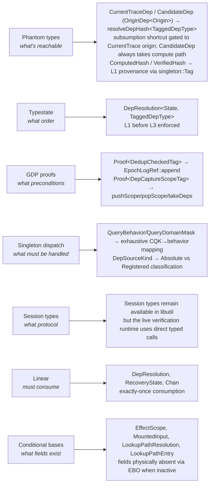
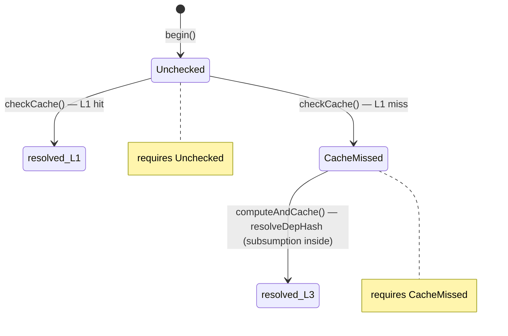

# Eval-Trace Subsystem

## Architecture Overview

The eval-trace system is a BSalC (Build Systems a la Carte) constructive trace
cache for the Nix evaluator. It records evaluation results with their
dependencies, then verifies cached results by checking whether dependencies
have changed — skipping re-evaluation when they haven't.

### Directory Layout

```
src/libexpr/eval-trace/
  cache/        Trace session, materialization, replay (hot path)
  deps/         Dependency recording, hashing, interning
  store/        SQLite-backed trace store, verification, recovery
  context.cc    Pointer equality, sibling identity
  counters.cc   Performance counters

src/libexpr/include/nix/expr/eval-trace/
  cache/        Headers for trace session, backends
  data/         TracedData (structured JSON/TOML/dir materialization)
  deps/         types.hh (CanonicalQueryKind, QueryBehavior, QueryDomainMask), recording.hh
  store/        trace-storage.hh, sqlite-trace-storage.hh, in-memory-trace-rows.hh, verifier.hh, recorder.hh, verification-session.hh, verification-protocol.hh

src/libexpr-tests/eval-trace/
  dep/          Dependency recording tests
  nix-binding/  Per-binding .nix tracking tests
  store/        Trace store, verification, recovery, protocol tests
  traced-data/  Materialization + dep-precision tests
  verify/       Integration tests

src/libutil/include/nix/util/           Type-safety libraries (each has CLAUDE.md)
  gdp/            GDP proofs: Proof<Tag>, Certifier<Tag> (withProof, withProofIf), ProofGuarded
  linear.hh       Linear<Derived> CRTP for exactly-once state consumption
  singleton/      Tag<V> for runtime→compile-time dispatch
  session-types/  Session types (ported from Dialectic): Chan<S,Tx,Rx>, protocols (library retained; eval-trace does not consume it — Bundle 4 replaced the session-typed verification shell with direct typed calls + Linear typestate)
  tagged.hh       Tagged<Tag,T> phantom-typed wrapper
  guarded.hh      Guarded<T,Mutex> continuation-based sync
  string-intern-table.hh  Thread-safe string interning
```

### Key Files — Eval-Trace

- `deps/types.hh` — CanonicalQueryKind enum, QueryBehavior/QueryDomainMask
  subsumption model, 2-variant DepSourceKind (`Absolute`, `Registered`)
  with two named factories: `DepSource::fromNodeKey` (graph-node identity)
  and `DepSource::fromRuntimeRoot` (runtime fetchTree identity), both
  resolved by `SemanticRegistry`. `Dep::Key` constructors
- `deps/input-resolution.cc` — dep-key authorship rules: registry mount
  resolution is authoritative for registered sources/subdirs; `PathObject`
  preserves runtime alias separation when registry lookup alone is insufficient;
  lookup-path results inherit the matched search-path element's logical origin
  rather than reconstructing it from the registry afterward
- `store/trace-storage.hh` — abstract `TraceStorage` base (owns
  `storeMutex_`, session identity, NodeStamp counter) +
  `ExclusiveTraceStorageAccess` capability + `TraceObserver` interface.
  Two concrete backends derive from `TraceStorage`: `SqliteTraceStorage`
  (production, persistent) and `InMemoryTraceRows` (non-persistent).
- `store/sqlite-trace-storage.hh` — concrete `SqliteTraceStorage`
  class (residual `Certifier<BlockingTag>` inheritance for lifecycle
  paths that mint their own `bs`: constructor `bulkLoadAllLocked`,
  destructor commit, `flushExclusive`, `recordRuntimeRootExclusive`,
  `loadRuntimeRootsExclusive`, `bulkLoadAll`). The
  `ExclusiveTraceStorageAccess` capability is minted by
  `TraceStorage::withExclusiveAccess` and holds `storeMutex_`,
  precondition for primary public data-path methods and
  `FileStrandGate::ifPassed`; residual friend/orchestrator paths
  still take `Proof<BlockingTag>` directly.
  `CurrentTraceDep`/`CandidateDep` origin-tagged `OriginDep<Origin>`
  wrappers (minted via sealed `OriginScope<Origin>::tag`) with
  `VerifiedSubsumption` capability gating L1 subsumption writes,
  `resolveCurrentDepHash` typestate entry point, `stableRecoveryKey` (stable
  flake identity used to key history bootstrap during verification)
  `AuthorityState` is a GDP proof tag with `AuthorityGate` as its sole
  certifier — `lockFlake` calls `AuthorityGate::withAuthority` and
  threads the proof through `buildResolvedFlakeGraph` and its internal
  helpers.
- `store/verification-session.hh` — `VerificationSession` with encapsulated
  L1 cache (`currentDepHashes_` is private), capability-gated
  `markFileVerified`, private `verifiedContentFiles_`
- `store/verification-protocol.hh` — Shared `VerifyOutcome` enum and
  `RecoveryState` stage tags
- `store/verifier.hh` / `store/verifier.cc` — `Verifier` class (async
  orchestrator, prefetch pool, bound session state) plus the file-static
  phase functions it drives: `DepResolution` typestate (L1→L3),
  `VerifyImpl` (`runStorePathBatch`, `runPrePassDeps`, `runPass1`,
  `runPass2`, `applyOutcome`), `RecoveryState<Stage>`, and the
  `SqliteTraceStorage::verifyTrace`/`recovery`/`verify` method bodies
  (friended to the phase helpers)
- `store/dep-resolution-service.cc` — `resolveDepHash<TaggedDepType>`
  (the single subsumption enforcement point, owns L1 caching via
  `ProvenancedHash<HP>`: `ComputedHash` for compute, `VerifiedHash` for subsumption)
- `store/recorder.hh` / `store/recorder.cc` — `Recorder` class: the
  BSàlC recording pipeline extracted from `SqliteTraceStorage::record`.
  Fires `TraceObserver` callbacks post-publish when an observer is
  supplied
- `hash-spec.hh` / `hash-spec.cc` — Active eval-trace hash backend
  (`blake3` default, `sha256` optional) and setting serialization for
  `eval-trace-hash-algorithm`.
- `canonical-hash.hh` — `CanonicalHashBuilder`: length-framed,
  domain-separated hash preimage builder used by structured multi-field hashes
  such as trace hashes, struct hashes, result hashes, session keys, recovery
  keys, directory listings, NixBinding hashes, runtime-root source keys, and
  policy digests.
- `deps/hash.hh` / `deps/hash.cc` — Sorted dep canonicalization plus
  `TraceHash` / `StructHash` computation over `(key, value)` or key-only
  material, using the active backend and phantom-typed hash wrappers.
- `eval.hh` / `eval.cc` — coercion/publication boundary for path/string
  provenance. `ContextObject` is the sealed string coercion result,
  `CoercedPath` is the sealed path coercion result. All provenance
  read/write goes through `lookupSemanticHandle`/`mergeSemanticHandle`
  (single entry points). `setSemanticHandle` is the low-level write
- `deps/dep-recording-context.hh` — Per-fiber dep recording context. Scope
  management (`pushScope`/`popScope`/`takeDeps`) is private + GDP-guarded via
  `Proof<DepCaptureScopeTag>`. No root scope in constructor. Epoch log writes
  GDP-guarded via `EpochLogRef` with two proof-gated write paths:
  `append(Proof<DedupCheckedTag>)` (certifier: `DedupGate`) and
  `appendReplayed(Proof<RecordingScopeActiveTag>)` (certifier: `RecordingScopeGuard`).
- `deps/dep-capture-scope.hh` — RAII scope for dep recording. Privately inherits
  `Certifier<DepCaptureScopeTag>`. Also defines `RecordingScopeGuard` for
  GDP-guarded `replayTrace`. Takes `const SemanticRegistry &` for provenance
  resolution (replaces the deleted `GuardedSessionMounts &`).
- `semantic-objects.hh` — defines PathObject, TextObject,
  StructuredObject, IdentityObject, SemanticHandle. SemanticHandle has
  `.path`, `.text`, `.structured`, `.identity` fields. IdentityObject is
  an independent overlay (orthogonal to SemanticKind) carrying stable
  identity stamps for string/path values across materialization boundaries.
- `store/semantic-registry.hh` — SemanticRegistry: immutable mount/provenance
  registry pre-populated at session open from `ResolvedFlakeGraph` node keys.
  Forward entries (`entries_`) map `DepSource → SourcePath` for verification.
  Reverse mount points (`mountPoints_`) map `CanonPath → [(DepSource, subdir)]`
  for recording-side provenance. Both indexes use the same node-key identity
  namespace (via `DepSource::fromNodeKey`), ensuring deps recorded via
  `reverseResolve()` are resolvable by `resolve()`. Runtime roots (non-graph
  fetchTree) use `DepSource::fromRuntimeRoot` and are added separately.
  Replaces the deleted DynamicMountTable, SessionMountTable,
  MountResolutionGate, and InputResolver/FrozenInputResolver infrastructure.

### Key Files — Type-Safety Libraries (libutil)

Each library has its own CLAUDE.md with full API docs and C++ caveats.

- `libutil/tagged.hh` — `Tagged<Tag, T>`: phantom-typed wrapper for nominal
  typing. IDs, hashes, dep provenance are all `Tagged` aliases. Prevents
  confusion between structurally identical but semantically distinct values.
- `libutil/gdp/proof.hh` — `Proof<Tag>`, `Certifier<Tag>` (parameterized
  private inheritance, not CRTP): zero-cost scoped proof tokens. C++
  approximation of Haskell's GDP (Ghosts of Departed Proofs). Proof exists
  only as `const &` inside a scoped continuation. Proofs are created via
  `Certifier<Tag>::withProof(f)` and `Certifier<Tag>::withProofIf(cond, f)`
  — protected static methods accessible only to subclasses, with the usual
  C++ caveat that new subclasses can still be defined elsewhere.
- `libutil/gdp/proof-guarded.hh` — `ProofGuarded<T, Tag>`: data wrapper
  that requires `const Proof<Tag> &` to access. Alias: `StrandLocal<T, Tag>`.
- `libutil/move-only.hh` — `MoveOnly`: small mixin for ordinary move-only
  capability/handle types where copying must be forbidden but dropping is
  normal. Use for reusable capabilities and scope tokens, not for must-consume
  typestate.
- `libutil/linear.hh` — `Linear<Derived>`: CRTP mixin enforcing
  exactly-once consumption. Destructor aborts if state dropped without
  transition. Implemented as the stronger must-consume layer on top of
  `MoveOnly`. Catches move-then-drop bugs Rust's borrow checker would prevent.
- `libutil/singleton/dispatch.hh` — `Tag<V>`: type carrying NTTP for bridging
  runtime enum to compile-time template parameter. Used with exhaustive switch
  dispatch (`-Wswitch-enum` enforced).
- `libutil/session-types/` — Session types ported from Dialectic [1]. Type-level
  protocol encoding (Done, Send, Recv, Choose, Offer, Loop, Call, Split).
  `Chan<S, Tx, Rx>` enforces protocol at compile time via `&&`-qualified methods.
- `libutil/conditional-base.hh` — `Absent<T>`, `ConditionalBase<Cond, T>`:
  conditional EBO base for parameterized class templates. When `Cond` is true,
  the base is `T` (fields present); when false, `Absent<T>` (empty, physically
  absent via EBO). `Absent<T>` is keyed on `T` so distinct field bundles
  produce distinct empty types — no manual slot numbering. Used by
  `EffectScope`, `MountedInput`, `LookupPathResolution`, `LookupPathEntry`.
- `libutil/guarded.hh` — `Guarded<T, Mutex>`: continuation-based synchronized
  data. `withLock(f)` holds lock exactly for the duration of `f`.
- `libutil/string-intern-table.hh` — `StringInternTable`: thread-safe string
  interning with O(1) resolve. `concurrent_flat_set` + `ChunkedVector`.

[1] https://github.com/boltlabs-inc/dialectic (MIT license)
    Local reference: ~/dialectic

## EvalEnvironment Integration

The eval-trace system integrates with the evaluator through the
`EvalEnvironment` effect boundary. All effectful observations (filesystem
reads, env var lookups, fetch/materialization, store operations) that
produce trace dependencies are routed through `EvalEnvironment`, which
returns typed observation objects and handles dep recording internally.

### Effect modes

Each `EvalEnvironment` method has three public overload families:

| Mode | Signature shape | Used by | Dep recording |
|------|------|---------|---------------|
| Auto-dispatch | `method(request)` | Most primops and eval.cc callers | Yes, if session active |
| `ObserveOnlyTag` | `method(ObserveOnlyTag, request)` | Verifier/recovery read-only observation | No |
| `DetachedEffectScope` | `method(DetachedEffectScope &, request)` | Shared libexpr/libflake pipelines | No |

`BoundEffectScope` and `TraceAccess` overloads are **private** — auto-dispatch
handles session binding and recording internally.

Primops and eval.cc use auto-dispatch:
```cpp
EvalEnvironment environment(makeDetachedEvalEnvironmentAuthority(state));
auto observation = environment.readFile(request);
```

Auto-dispatch tries `tryBindCurrentEvalSession()` first (Bound path with
recording via `withRecordingAccess` → `TraceAccess`), then falls back to a
detached scope. `TraceAccess::current()` checks at call sites are no longer
needed — `withRecordingAccess` inside the Bound path finds and reuses the
active `TraceAccess` automatically.

Direct `TraceAccess::current()` calls in primops (shape deps, structured
projections, etc.) are trace-runtime instrumentation, not EvalEnvironment
boundary APIs.

### Session lifecycle

1. **Capture** — `captureSessionOpenInputs()` snapshots policy and lookup
   path state into a `CapturedSessionOpenInputs` (Linear)
2. **Assemble** — `assembleFlakeTraceSessionOpen()` or
   `assembleFileEvalTraceSessionOpen()` consumes linear inputs and produces
   `EvalTraceSessionAuthority` (Linear)
3. **Open** — `openEvalSession()` consumes the authority and returns a
   `BoundEffectScope` capability
4. **Record** — bound operations record deps through the session's
   `SemanticRegistry` for provenance resolution
5. **Complete** — fetch completion (`completeLockedRuntimeFetch` /
   `completeUnlockedRuntimeFetch`) consumes the session and returns it

### Key files

- `src/libexpr/eval-environment.cc` — 1959-line implementation
- `src/libexpr/eval-environment/authority.cc` — `TraceSessionFactory`,
  authority construction from `EvalState`
- `src/libexpr/eval-environment/session-builders.cc` — session config/reuse
  key builders, flake and file-eval assemblers
- `src/libexpr/eval-environment/request-builder.cc` — typed request
  construction from raw Values
- `src/libflake/eval-trace-session-open-adapter.cc` — flake-local adapter
  for graph extraction into `FlakeGraphAuthorityNodeSpec`
- `src/libexpr/include/nix/expr/eval-environment/` — headers:
  `environment.hh`, `capabilities.hh`, `observation-types.hh`,
  `session-types.hh`, `request-types.hh`, `request-builder.hh`,
  `domains.hh`, `authority-internal.hh`, `fwd.hh`

### Known gaps in eval-environment coverage

- The `fetch()` helper in `fetchTree.cc` (backing `fetchurl`/`fetchTarball`)
  bypasses EvalEnvironment. The `prim_fetchTree` flow is fully migrated.
- `prim_storePath` calls `store->ensurePath` before EvalEnvironment
  construction.
- `prim_readFile` has a post-read `store->queryPathInfo` for reference
  scanning.
- `derivationStrict`, `toFile` (see OR-1), `fetchMercurial`,
  `fetchClosure` are outside the plan's stated scope (store writes /
  legacy builtins).

## Open research: known soundness and precision gaps

These are verified-real gaps that the short-commit sequence of mechanical
fixes can't close. Each needs a design decision or architectural RFC before
any implementation. The entries below are written so that someone resuming
work can pick up without re-deriving the analysis — they include the
current file:line landmarks, what's been ruled out, and what design space
remains.

**Test-side deferred work index:** see `src/libexpr-tests/eval-trace/
CLAUDE.md` §D for test strengthening / infrastructure gaps that reference
specific OR-N items (search `Deferred Work Index` or `DEF-N`).

### OR-1: `prim_toFile` records no content dep (PRECISION, may or may not be reachable)

**Symptom.** `builtins.toFile "name" "contents"` stores `contents` into the
Nix store and returns the path, but `prim_toFile` (in `src/libexpr/primops.cc`)
never records any eval-trace dep on its content argument.  The trace for
the expression containing the `toFile` call records no dep keyed on
`contents`.

**Reachability: empirically not reachable in the common case.** Verified
2026-04-19 with the installed nix binary:
- `nix eval --expr 'builtins.toFile "n" "v1"'` vs `'... "v2"'` →
  different `FileEvalExpressionHash` → different session key → fresh
  cold eval on each. No stale serve.
- `nix eval -f top.nix` where `top.nix = builtins.toFile "n" "v1"`,
  then edit to `"v2"` → warm verify correctly invalidates
  ("not everything is cached"). Something DOES track `top.nix`'s
  content as a dep on the trace (likely a FileBytes recorded by
  `ExprTracedData` wrapping the file).
- The regression test `BuiltinsToFile_ContentChange_Invalidation`
  (`src/libexpr-tests/eval-trace/verify/derivation.cc`) USED to
  reproduce a stale serve because `TraceCacheFixture` used a fixed
  `testFingerprint` for every `makeCache` call regardless of the Nix
  expression. That fixture artifact was not production-reachable.
  2026-04-20 (§N.1): `TraceCacheFixture::makeCache` now mixes the
  expression text into the fingerprint, matching production's
  per-expression session-key derivation. The test was flipped to
  `EXPECT_EQ(calls, 1)` — v2's cold eval naturally runs at its own
  slot. The test-level reproducer for OR-1 is gone; production
  reachability is still only through the OR-3 shape below. A future
  OR-1 reproducer would need to be constructed explicitly via the
  `TraceCacheTest::makeCache(expr, Hash, int*)` overload in
  `store/cache.cc`, bypassing the fingerprint mixing.

**What reachability would require.** A context where `toFile "n" "v1"`
runs inside a trace whose fullDeps lack any `FileBytes` dep on the
.nix file where the literal appears. The `ExprParseFile::eval`
backstop (eval.cc:1432-1434) unconditionally calls
`maybeRecordImportedFileContent` when `traceActiveDepth > 0`, which
records FileBytes on every parsed source file reached via a traced
eval. Every `evalFile` inside a cold-recording TracedExpr thus
produces a FileBytes dep on the evaluated file. An edit to the file
invalidates that FileBytes, causing fresh eval — the stale `toFile`
output never surfaces to the user.

The only way to bypass the backstop is for a trace to somehow not
record FileBytes on its source. I cannot construct that shape in
the current code; OR-4's "narrow trigger" list applies here too.

If OR-3 were fixed (cache-side changes to force eager root
invalidation), OR-1's reachability picture wouldn't meaningfully
change — the FileBytes backstop is already sufficient.

**What's been ruled out.**
- `maybeRecordRawContentDep(access, v)` in
  `src/libexpr/eval-trace/deps/input-resolution.cc` is a no-op
  without `TextObject` publication — so literal strings in source
  silently pass through it. Usable for the `toFile "n" (readFile "f")`
  composition case (where readFile provides provenance); unusable for
  the literal-string case.
- `DerivedStorePath` keyed on the output path is circular: verification
  would need to re-hash `contents` to compute the dep key, which
  defeats the purpose.

**Design space (if a fix becomes motivated).**
- ~~A. New `recordToFileContentDep` helper reusing
  `CanonicalQueryKind::RawBytes`.~~ **Not implementable (correction
  2026-04-22).** `RawBytes`' verifier path in
  `dep-resolution-service.cc` dispatches to `computePathHashedDep`,
  which calls `resolver.resolve(source, key)` and `path->readFile()`
  on the key as an absolute on-disk file path.  A synthetic key of
  shape `(nameHash, posIdx)` has nothing for the accessor to find —
  every verify would return `sentinel(SentinelHash::Missing)`.  The CLAUDE.md
  ~40-80 LoC estimate for option A was based on a misreading of
  the verifier's RawBytes dispatch; treat option A as retired.
- B. A dedicated CQK like `ToFileContent` with a purpose-built key
  encoder. Heavier — touches types.hh (enum + descriptor + lattice
  predicates), verifier dispatch, serialization round-trip, the
  CQK lattice test.  **~400-600 LoC.  The only viable shape if a
  fix is pursued.**

**Recommended approach (updated 2026-04-30).** Do NOT land a fix
until a production reachability case is demonstrated. Two defences
combine to make OR-1 unreachable in normal evaluation:
1. Session-key derivation via `computeFileEvalLogicalIdentityHash`
   + gitIdentityHash fold-in for git repos: an edit to the source
   file either changes session_key (non-git `-f foo.nix` keys on
   absolute file path; protected by `--expr` hash) or changes
   gitIdentityHash (git worktree dirty marker on edit).
2. `ExprParseFile::eval` FileBytes backstop at eval.cc:1432-1434:
   any cold-recording trace evaluating a `.nix` file records
   `FileBytes(source)` unconditionally. Edit → FileBytes fails →
   fresh eval. This is the same backstop that shields OR-4.

A reproducer would need to construct a trace whose fullDeps lack
any FileBytes dep on the file containing the `toFile` call. I
cannot construct that shape in the current code. Without a
reproducer, an option-B fix addresses a gap that cannot be
triggered.

### OR-3: nixpkgs benchmark stale-serve — cause unidentified

**Symptom.** The `nixpkgs@6b74cf77bde9` benchmark run shows
`closures.gnome.x86_64-linux` serving a stale cached value where
reference (no-cache) evaluation produces a different value. The
original framing (prior to 2026-04-30) attributed this to the
"source-copy deps land on child thunks, not the root" shape. That
framing has been **empirically ruled out** as the root cause; see
"2026-04-30 finding" below. The real benchmark root cause is
unidentified; subprocess-per-commit dep-graph diff is still the
investigation blocker.

**Dep-recording path for `${./dir}` coercion (unchanged, not a bug).**
- `${expr}` → `ExprConcatStrings::eval` → `copyPathToStoreViaEvalEnvironment`
  in `src/libexpr/eval.cc` → `environment.copyPathToStore` in
  `src/libexpr/eval-environment.cc`.
- `copyPathToStoreImpl` appends `DerivedStorePath` to `deferredDeps`.
- `recordDeferredPathDeps(access, ...)` calls `access.record(...)`
  on the CURRENT scope (topmost `DepCaptureScope`).
- Each `evaluateResolvedTarget` opens its own `DepCaptureScope`, so
  parent and child attr scopes are distinct. The DSP dep lands on
  whichever scope is active at the moment the `${./dir}` expression
  evaluates — typically a child thunk.

**This is per-leaf lazy verification, not a bug.** The cache's
contract is "each trace's own deps determine whether it re-evaluates
when forced." Under that contract:
- The root attrset's trace has no source-tree deps (its expression
  doesn't directly read sources).
- `forceRoot` warm-hits root without re-evaluating, because root's
  own deps haven't changed. The returned attrset is a set of
  TracedExpr child thunks.
- When a user (or downstream code) forces a specific child, the
  child's trace is verified against its own deps. If the child has
  a DSP/FileBytes dep on a changed source, verify fails and the
  child re-evaluates.
- Siblings whose own deps are unaffected serve the cached value
  without re-evaluation — this is the precision the contract
  preserves.

This is empirically pinned by
`dep/source-tree-soundness.cc::ParentChild_PerLeafLazyVerification`:
`forceRoot` returns `loaderCalls==0` after a source mutation
(correct — root's trace has no source deps); forcing `srcPath`
triggers re-eval; forcing `childA` (depends on mutated file) picks
up the new value; forcing `childB` (depends on an unchanged file)
continues to serve cached. Zero loss to soundness, precision, or
performance.

**2026-04-30 finding — previous "forceRoot serves stale" framing
was wrong.** The historically-DISABLED
`ParentChild_ChildInheritsStaleStorePath` test asserted
`EXPECT_EQ(loaderCalls, 1)` AFTER `forceRoot` alone and called its
failure (`loaderCalls==0`) a soundness bug. That assertion
over-specified the cache's contract: it demanded eager
invalidation of the root trace on any source change, which can only
be satisfied by one of:
- Hoisting child source-copy deps to `scopeStack.front()` (lost
  precision: root invalidation cascades through ParentSlot to
  every sibling, breaking selective sibling invalidation); OR
- Eagerly forcing every child on root force (lost performance:
  defeats Nix's laziness).

Both violate the project's hard constraint on zero
precision/performance loss. The cache's actual behavior is
correct; the test's first assertion was not. The test has been
reformulated as `ParentChild_PerLeafLazyVerification` and enabled
(see its comment for the full explanation).

**Same-class dep kinds (precision-preserving by the same contract).**
`NarIdentity`, `DirectoryEntries`, `GitRevisionIdentity` all follow
the same per-leaf contract: each leaf's trace records its own deps;
verification is per-leaf. No "hoist to root" fix is correct for any
of them under the hard constraint.

**Related landed fix — dirty-accessor `srcToStore` guard.** The
`srcToStore` fingerprint guard in `copyPathToStoreImpl` (eval-environment.cc:1408-1419)
gates the `srcToStore` cache on a non-null accessor fingerprint.
`PosixSourceAccessor` returns no fingerprint, so unfingerprinted
accessors bypass the cache and re-run `fetchToStore` on every
copy. This closes a cross-session caching hole where a dirty
`PosixSourceAccessor` would otherwise leak a stale store path
through the `srcToStore` map. This fix is complete for its
scope; it's a separate concern from per-leaf lazy verification.

**Design-space options retired (2026-04-30).** CLAUDE.md previously
listed Option A (hoist source-copy CQKs to `scopeStack.front()`),
Option B (new `EnclosedCopy` CQK on parent), Option C (eager-force),
and Option D (split DSP). All four would have required either
precision loss (A, B, D via root invalidation cascading to siblings
through ParentSlot) or performance loss (C defeats laziness, B adds
verifier work on every parent trace). Under the project's hard
constraint, none are acceptable. Retiring the design space here.

**Remaining OR-3 concern: the benchmark stale-serve itself.**
`closures.gnome.x86_64-linux` at `nixpkgs@6b74cf77bde9` genuinely
stale-serves under subprocess-per-commit eval. That is a real
soundness failure — the test harness verifies reference-equality —
but its shape is NOT what the historically-DISABLED in-process
tests reproduced. CLAUDE.md's previous text hinted at an asymmetric
dep-graph shape ("one sibling reads files directly, one reads
through a memoized thunk"), but no in-process reproducer exists.

To make progress on OR-3's remaining concern, the investigation
must:
1. Run `nix run .#eval-trace-bench -- generate --nixpkgs ~/nixpkgs
   --num-commits 500 --runs reference,cold,hot` to confirm the
   failure still occurs on the current code.
2. Dump per-commit `fullDeps` for both `closures.gnome.aarch64-linux`
   and `closures.gnome.x86_64-linux`. Diff them.
3. Identify a specific leaf whose cached deps do not detect a
   source change that reference-eval catches. That is a
   precision-preserving dep-recording gap: a specific leaf is
   missing a dep it should have recorded. Fix is at the recording
   site for that shape, not at the scope-attribution layer.

Until step 2's output is available, any fix proposal is speculation.
The cache-side OR-3 concern (parent-vs-child scope attribution) is
closed; the benchmark concern (specific-shape leaf missing a dep)
remains open pending reproduction.

**Warm-hit-no-epochMap asymmetry (probed 2026-04-30, ruled out as
the benchmark root cause).** An adversarial code trace identified
an asymmetry: cold `forceThunkValue` (eval.cc:1677-1705) populates
`MemoReplayStore::epochMap[&v]` via `ReplayPublishScope`'s
`recordThunkDeps` when the thunk's eval grows the global epoch log.
Warm-hit through `TracedExpr::eval` → `materializeResult`
(trace-session.cc:609-642) does NOT grow the log — `replayTrace`
is gated on an active DepCaptureScope; `materializeResult` itself
does not append. `recordThunkDeps` then sees
`epochStart == epochEnd` and creates no epochMap entry
(memo-replay-store.hh:67-79). Downstream: `replayMemoizedDeps(v)`
at context.cc:821 returns early when `replayBloom.test(&v)` is
false, skipping both direct replay AND
`SiblingReplayCaptureScope::maybeCapture`.

Four probe tests
(`WarmHit_Child_NoEpochMapEntry`,
`WarmHit_ThenSourceMutation_SiblingsStillInvalidate`,
`RecAttrsetSibling_TraceValueContext_InvalidatesOnSourceChange`,
`NestedAttrset_WarmHitChain_InnerInvalidatesOnSourceChange`)
confirmed the mechanism-level asymmetry but showed it is benign
in the current architecture: cold re-eval traverses `realRoot`'s
fresh thunks via `navigateToReal`, never the materialized tree.
Regression guards at `memo-replay-store.hh::recordThunkDeps` and
the warm-hit branch of `trace-session.cc` document the asymmetry.
If a future refactor makes cold re-eval reach warm-materialized
Values, the asymmetry becomes a soundness hole; until then it's
an observable but benign code-level feature.

### OR-4: `TraceParentSlot` doesn't capture key-set changes (STORAGE-LAYER, not demonstrably reachable)

**Summary (updated 2026-04-30).** `TraceParentSlot` encodes the
parent's INPUT fingerprint, not its output shape. Removing a sibling
from a parent whose deps didn't change would leave the parent's trace
hash unchanged, and a removed child's orphaned `CurrentNode` row
could verify against the unchanged parent. That's a real property of
the storage layer, pinned by the synthetic test
`Integration_ParentSlot_DoesNotCaptureKeySetRemoval`
(which uses raw `db->record()` calls, not real evaluation).

**Reachability from real evaluation: not demonstrated.** The
`ExprParseFile::eval` backstop (eval.cc:1422-1435) unconditionally
calls `maybeRecordImportedFileContent` whenever `traceActiveDepth > 0`
and a TraceSession is bound. That records `FileBytes(source_file)`
into whatever trace is currently cold-recording. In the `-f foo.nix`
flow, rootLoader's `evalFile` → `ExprParseFile::eval` runs inside the
root TracedExpr's `evaluateResolvedTarget` (where
`TraceActivationScope` has incremented `traceActiveDepth`), so the
root trace records FileBytes on foo.nix. An in-place edit to
foo.nix → FileBytes fails → root verify fails → fresh eval → parent
re-recorded with the new key set → removed child's old CurrentNode
is either overwritten or orphaned under a parent whose current
cached `attrs_t` reflects the new shape. Either way, Nix evaluation
resolves `parent.<removedKey>` against the NEW materialized parent,
which doesn't have the removed key → `AttrPathNotFound` (correct).

**Regression test pinning the storage-layer property.**
`Integration_ParentSlot_DoesNotCaptureKeySetRemoval` in
`src/libexpr-tests/eval-trace/verify/integration.cc`. Uses raw
`db->record()` calls to directly construct the "parent has no deps,
child's ParentSlot points at parent" shape and checks that
`verifyTrace(childB)` returns true even after parent is re-recorded
without childB. Asserts `EXPECT_TRUE` with TODO to flip to
`EXPECT_FALSE` if Option B is implemented. The test does NOT exercise
the evaluation pipeline — it exercises only the dep-store + verify
path. An in-process test going through `TraceSession::makeCache`
and real `nix eval`-style forcing cannot reproduce the stale serve
because FileBytes-backstop catches source edits.

**Why TVC doesn't have the same gap.** `TraceValueContext(siblingPathId)`
re-verifies the sibling's own trace via `resolveTraceContextHash` in
`src/libexpr/eval-trace/store/verifier.cc`.  The sibling's
trace hash encodes its own inputs; if the sibling is semantically
unchanged, serving it is correct.  ParentSlot fails specifically because
the parent's trace hash encodes inputs only, not output shape.

**Storage-layer trigger conditions.** To actually hit the gap via real
evaluation, ALL of the following must hold:
1. Parent's cold-recorded trace has zero `FileBytes` deps that would
   change under a key-removing edit (i.e., the `ExprParseFile`
   FileBytes-backstop somehow didn't fire — unusual).
2. Key removal comes from a source not tracked as a dep.
3. The parent itself isn't re-recorded between the edit and the
   next access of the removed key.
4. Session key stays stable across the edit (true for non-git
   `-f foo.nix`; protected by gitIdentityHash otherwise).

Condition 1 is the hard part. The FileBytes-backstop fires whenever
`traceActiveDepth > 0` at parse time, which is whenever rootLoader
runs inside a TracedExpr's cold-record path. I cannot construct a
shape that bypasses it in normal evaluation.

**Design space.**
- A. New CQK `AttrKeySet` on the parent's trace, value =
  active-digest(sorted attr names).  Emitted in `trace-session.cc` after
  `buildCachedResult`.  Every parent attrset trace gains one extra dep.
  Parent invalidates on ANY key addition/removal.
- B. Extend `resolveTraceContextHash` (specifically the ParentSlot path)
  to check that the parent's CURRENT output key-set contains the
  dep's `childPathId`'s terminal symbol.  Parent still has empty deps,
  so its hash doesn't change — but the ParentSlot verifier now requires
  the parent to "claim" the child.  Narrower, targeted fix touching
  only `verifier.cc`.

**Recommended approach.** B, because it matches the semantic precisely
("parent must still list this child") without requiring a new dep on
every parent attrset. The LoC / semantic-clarity ratio is best. The
soundness improvement is the same.

**Implementation sketch for B.**
- Before returning from `resolveTraceContextHash`, load the parent's
  current `CachedResult`. If it's an `attrs_t`, check whether the
  dep's `childPathId`'s terminal symbol is in the attrset's key set.
  If not, return `std::nullopt` (invalidate).
- The dep's `childPathId` needs to be routed through. `ParentSlot`
  currently stores only `parentPathId`; it needs to know which child
  is asking. Options: (a) the child's own pathId is available from
  the verifier context; (b) encode the child's terminal symbol into
  the ParentSlot dep's key material.

**Plumbing analysis (2026-04-22).** The child pathId is **NOT**
currently threaded into `TraceStore::verifyTrace(TraceId)` — traces
are content-addressed, so a traceId→pathId mapping is not 1:1 and
cannot be inverted.  Option (a) requires adding an `AttrPathId
childPathId` parameter to `verifyTrace` + `resolveTraceContextHash`
+ `VerifyContext` (~5-10 LoC), then threading it through from
`TraceStore::verify(pathId)` in `verifier.cc` and
`verifier.cc::verifyAttrImpl(pathId)` — both
callers already have the pathId on hand.  **Option (a) is cheaper
than (b):** (b) would require bumping `kSchemaEpoch` (the existing
schema-versioning mechanism used for OR-5's closure) and changing
`TraceContextDepKeyBlobEntry`'s shape; (a) touches only the verifier
call graph — the check is a side effect, not a hash input, so no
schema migration is needed.

**Key-set access path (2026-04-22).** After the existing
`lookupCurrentNode(bs, parentPathId)` call, invoke
`decodeCachedResult(bs, parentRow->resultId)` in
`store/trace-result-codec.cc` (already memoized via
`resultPayloadCache`).  If `std::holds_alternative<attrs_t>(result)`,
iterate `attrs_t::entries` and match against
`vocab.childName(childPathId)`.  Non-attrset parent results should
be treated as "not eligible for key-set check" — ParentSlot is only
emitted for attrset parents, so non-attrset implies a semantic
mismatch (invalidate).  Memoize per `(parentPathId, childPathId)`
alongside the existing `session.traceContextMemo`.

**LoC estimate (~120-150 LoC production + ~50 LoC test-fixture
churn).**
- Production: `verifyTrace`/`resolveTraceContextHash` signature
  change + threading through `VerifyContext` + key-set check
  (~50-70 LoC) + orchestrator + sync-verify call-site updates
  (~2 LoC) + extend `traceContextMemo` key to `pair<AttrPathId,
  AttrPathId>` (~5 LoC) + `TraceStoreTestAccess::verifyTrace`
  overload updates (~10 LoC).
- Test-fixture churn: flip
  `Integration_ParentSlot_DoesNotCaptureKeySetRemoval` to
  `EXPECT_FALSE(verifyTrace(...))` (~5 LoC); rewrite
  `store/trace-parent-slot.cc` fixtures so the parent is an
  `attrs_t` containing a `"child"` entry and the child path is
  `vpath({"parent", "child"})` (~30 LoC, net-neutral LoC count
  because the current fixtures don't model the parent-is-attrset
  invariant the production emission code assumes).
- No schema bump required; no blob-format change.

### OR-7: BUG-8 Epoch log not truncated on exception (PERF, needs plumbing)

**Symptom.** `~DepCaptureScope` in `deps/recording.cc` does NOT
truncate `epochLog_` on the exception path.  The log retains partial
entries, inflating `epochLogStartIndex` for subsequent scopes and
causing replay false negatives (missed memoization).  Performance
regression only, never a wrong result.

**Why the comment used to say "correctness bug if truncated".** The
original comment overstated the risk.  `MemoReplayStore::rollbackEpoch`
in `include/nix/expr/eval-trace/deps/memo-replay-store.hh` already
scrubs `epochMap` entries whose `DepRange` points past a given bound.
A correct truncation would call `rollbackEpoch(epochLogStartIndex)`
then truncate the log.  The comment in `recording.cc` has been
reworded to reflect the real blocker.

**Real blocker.** API boundary.  `DepCaptureScope` doesn't hold a
`MemoReplayStore *`.  Plumbing one through (or routing truncation via
the recording context) is non-trivial.  No benchmark has produced a
measurable perf regression, so the refactor is unmotivated.

**Plumbing shape analysis (2026-04-22).** If a benchmark motivates
the fix, the cheapest path is Option (a): add an `EvalState &`
reference to `DepCaptureScope`, mirroring the existing
`PublicationWarmupScope` idiom in `eval.cc` (which already holds
`EvalState &` + `epochStart` and calls
`state.rollbackReplayEpoch(epochStart)` + `ctx->epochLog.truncate(
epochStart)` on `discard()`).  Both production construction sites
(`TraceSession::withDepCaptureScope`, `TracedExpr::evaluateResolvedTarget`)
already have `cache->state` in scope.  ~15 LoC — smaller than the
"non-trivial" framing implied above.  Option (b)
(`std::function` callback) and (d) (thread-local indirection) are
strictly worse: (b) heap-allocates per scope, (d) reintroduces
exactly the guardless-public-setter thread-local shape the codebase
deliberately replaced with RAII-only scope types (see the
"RAII-only thread-local scope types" Closure note below).  Option
(c) (`MemoReplayStore *` on
`DepRecordingContext`) is slightly more type-honest but requires
threading through `FiberScheduler::run` / `FiberEvalContext` (~25
LoC).

**What would trigger action.** A benchmark showing exception-path
unwinding (e.g., `tryEval`-heavy code) produces growing `epochLog_`
that measurably degrades replay hit rate across a long-running eval.
None of the fixtures in `/Users/cbaker2/ext-sources/nix/benchmarks/
eval-trace/` exercise exceptions; building one would take ~30 lines
of Nix + functional-test scaffolding using `readEvalTraceCounter`
(§N.8 in the test guide) to observe miss-rate deltas.  Until that
benchmark exists, leave as-is.

### OR-10: Specific weak assertions called out by test audit

The four parallel agent audits (see `src/libexpr-tests/eval-trace/
CLAUDE.md` §N) surfaced ~30 specific tests with weak or vacuous
assertions that §N summarizes as patterns.

**Major audit resolution pass completed 2026-04-20** (§N.1–§N.9 in
`src/libexpr-tests/eval-trace/CLAUDE.md`). The `loaderCalls`/
`EXPECT_NO_THROW`/shared-fingerprint drift classes were largely
resolved. Remaining items below are the ones still unaddressed; each
resolved cluster links to its §N.x fix.

**Resolved 2026-04-20 (no action required):**

- ✅ `store/cache.cc` `ColdWarm_*` macro family — §N.3 macro now
  auto-asserts `EXPECT_EQ(loaderCalls, 0)` on the warm call.
- ✅ `store/cache.cc` hand-rolled `ColdWarm_Attrset_VerifyHit`,
  `ColdWarm_NestedAttrset_VerifyHit`, `ColdWarm_StringList_CanonicalList`,
  `ColdWarm_List_VerifyHit`, `Session_DifferentFingerprints_Isolated`
  — §N.3 hand-rolled pass added explicit assertions.
- ✅ `verify/integration.cc` `Integration_FullFlow_*` (ScalarRoot,
  NestedAttrAccess, TwoIndependentAttrs, ParsedExpr) — §N.3
  hand-rolled added explicit `loaderCalls` assertions.
- ✅ `verify/integration.cc` `MapAttrs_UnrelatedKeyChange_WarmHit`
  — §N.3 flipped from `EXPECT_NO_THROW` wrapper to explicit
  `EXPECT_EQ(calls, 0)` (structural override confirmed).
- ✅ `traced-data/materialization/nested-invalidation.cc` — §N.3
  added `loaderCalls` assertions to 5 `_CacheHit`/`_CacheMiss` tests.
- ✅ `traced-data/materialization/error-recovery.cc` — §N.3 added
  explicit `loaderCalls` assertions for recovery and same-keys-diff-
  values cases.
- ✅ `traced-data/materialization/multi-source.cc` — §N.3 added
  explicit assertions.
- ✅ `traced-data/materialization/cross-scope-{attrkeys,haskey,typeof,cache}.cc`
  — §N.3 hand-rolled pass.
- ✅ `traced-data/materialization/nested-diagnostic.cc` — §N.3.
- ✅ `eval-trace-volatile.sh` and `eval-trace-output.sh` missing
  `clearStoreIndex` calls — §N.9 Phase B and Phase C added them at
  the start of each test case. `clearStoreIndex` itself was hoisted
  to `tests/functional/common/functions.sh` (§N.9 Phase A).
- ✅ All 70 `RC_ASSERT(loaderCalls == N)` sites across
  `property/**/*.cc` — §N.4 migrated to `PathCountersSnapshot`
  counter-delta (primary: `snap.primaryCacheServedOnly()`; miss:
  `deltaTraceCacheMisses >= 1`). Closes the history-bootstrap
  ambiguity that the `loaderCalls == 0` idiom admitted.
- ✅ `property/special/concurrent-eval.cc` — §N.5 strengthened via
  `PathCountersSnapshot` + §N.1 mixing; hazard
  framing updated (distinct session keys now, so the shared-
  fingerprint concern doesn't apply).
- ✅ `src/libexpr/eval-trace/store/verifier.cc` and
  `store/verifier.cc` — new `nrHistoryBootstraps` counter
  (declared in `counters.hh`) enables primary-vs-history-bootstrap
  discrimination. Used by `PathCountersSnapshot::primaryCacheServedOnly()`.

**Retracted framing.** The "per-iteration `simulateWarmRestart()` +
fingerprint rotation missing" concern for most `property/invariant/`
tests was retracted in §N.4: the shared-fixture RC model is a
documented design choice (see `src/libexpr-tests/eval-trace/
property/CLAUDE.md` "Fixture Pattern"). The real concern — tests
asserting something the design doesn't guarantee — was addressed by
the counter-delta migration.

**All items resolved 2026-04-20** via the Group A / B / C / functional
closure pass:

- ✅ 1 unit-test shape (`standalone-verify.cc`): added `loaderCalls=1`
  assertion on the warm pass after nested key mutation. Group A.
- ✅ 2 `calls == 0 || calls == 1` alternations
  (in `property/coverage/eval-control.cc`): pinned to `calls == 1` —
  both `seq` and `deepSeq` force `readFile`, which records a FileBytes
  dep; mutating the file must invalidate. Group A.
- ✅ 1 alternation in prose (`verify/integration.cc`
  `Recovery_DepChange_RecoversToPriorTrace`): pinned to
  `ASSERT_TRUE(result.has_value())` with `EXPECT_EQ(value, "result-v1")`
  — constructive recovery MUST find v1 in History since v1's env-var
  dep matches the current oracle. Group A.
- ✅ 4 over-specified phase/recovery tests (in
  `verification-phases.cc` and `git-identity-recovery.cc`): each round
  now asserts on the full set of recovery-path counters
  (`nrRecoveryGitIdentityAttempts` / `Candidates` / `Accepted` /
  `Rejected`).  Pinned skip-fires / skip-demoted to the expected round.
  Group B.
- ✅ 6 tautological tests (in `derived-store-path.cc`, `recovery.cc`,
  `large-trace.cc`, `record-verify.cc`, `multi-session.cc`): each
  rewritten with non-empty deps and/or counter deltas / value-equality
  round-trip / sibling isolation checks.  Group C.
- ✅ 5 functional-test shapes
  (`eval-trace-core.sh` T7/T8, `eval-trace-recovery.sh` T6,
  `eval-trace-soundness.sh` T2, `eval-trace-deps.sh` T7/T8 and T19/T20,
  `eval-trace-impure-soundness.sh` T4/T5): each uses the new
  `readEvalTraceCounter` helper in `tests/functional/common/functions.sh`
  to parse `NIX_SHOW_STATS` and assert on specific counter deltas
  (`record.count`, `hits`, `recovery.attempts`, `recovery.historyBootstraps`).
  Infrastructure change: `nrHistoryBootstraps` now emitted in the
  JSON output as `evalTrace.recovery.historyBootstraps`.

Closure notes retained in the Closure-notes section below; treat OR-10
as retired. Future weak-assertion audits should extend §N patterns in
`src/libexpr-tests/eval-trace/CLAUDE.md` rather than re-opening an
OR-N entry.

See also: `src/libexpr-tests/eval-trace/CLAUDE.md` §D (Deferred Work
Index) for the cross-cutting index of pending work across OR-N and
§N patterns.

### OR-11: path_t materialization rebuilds via rootFS, losing original accessor (LATENT, schema change to fix)

**Symptom.** `src/libexpr/eval-trace/cache/materialize.cc`, inside
`materializeResult` for the `path_t` branch, restores a cached Nix path
value via `v.mkPath(st.rootPath(CanonPath(p->path)), st.mem)`.
`rootPath` wraps the path in `state.rootFS`.  The original accessor
that the path was recorded with (`storeFS` for flake-source paths,
`rootFS` for local filesystem paths, possibly a third accessor for
paths from elsewhere) is NOT preserved — it was not persisted in the
`path_t` encoding.  The restored path therefore carries
`rootFS` regardless of its origin.

**Bug class.** Same as the `ExprConcatStrings::eval` accessor-drop fixed
in commit `libexpr: preserve path accessor in path + "/${x}"
concatenation`, and the `state.storePath` fix that followed.  This one
is in a different call site and requires a schema change to fix rather
than a local code change.

**Reachability: not demonstrated as a user-visible bug in production.**
This is a latent hazard.  For it to surface, downstream Nix code would
need to compare the restored path's accessor identity against another
path that was NOT obtained through the cache restoration path.  With
the two committed fixes, most flake-evaluation paths converge on
`storeFS`, so a restored `path_t` with `rootFS` would compare unequal
to a fresh flake path.  The specific trigger would be nixpkgs-lib code
that stores a path in an attr, caches it, restores via eval-trace, and
later compares the restored value against a freshly constructed
`storeFS`-rooted path.

**What's been ruled out.** The existing `ExprConcatStrings` and
`state.storePath` fixes do NOT cover this site — materialization runs
on the warm-verify code path, bypasses `state.rootPath` for other
reasons (it's directly reconstructing a stored result), and operates
against the cache `ResultPayload`'s string representation where accessor
identity was never encoded.

**What fixing would require.**
- Extend `path_t` (in `src/libexpr/include/nix/expr/eval-trace/result.hh`)
  with a field that encodes accessor identity — one of:
  - `AccessorKind` enum tag distinguishing `rootFS` vs `storeFS` vs
    other accessors, persisted in the result payload, decoded back
    into a SourcePath with the matching accessor at materialization
    time.  Requires `kSchemaEpoch` bump.
  - `DepSource`-style canonical identity (the existing `DepSource`
    persists graph-node and runtime-root identities and could be reused
    for this purpose).  Would align path provenance with dep
    provenance.  Also requires `kSchemaEpoch` bump.
- Alternatively: re-derive the accessor at materialization time by
  looking up the path against the session's `SemanticRegistry` — the
  registry already knows the canonical source for every dep-recorded
  path, and a path in a `path_t` cached result was necessarily a
  recorded dep at record time.  No schema bump; but the registry
  lookup adds a per-restore cost.

**Recommended approach.** Defer the local code change until a
reachability case is demonstrated.  Meanwhile: document the
`SemanticRegistry` lookup option so that when the §N-style
`path_t`-round-trip test is added to `traced-data/materialization/`,
the author has a starting point.

**Cross-reference.** Companion fixes in the same bug class:
  - `ExprConcatStrings::eval` — committed, tests in
    `src/libexpr-tests/path-accessor-preservation.cc`.
  - `state.storePath` — committed.
  - `state.rootPath` — unchanged; intentional, this is the entry point
    for paths that really do belong to `rootFS`.

**Hazard-class analysis.** `doc/eval-trace/audit/rearchitecture-proposal.md`
§14 documents the full accessor-identity hazard class — the committed
fixes, this latent site, the root-cause equality-policy mismatch, and
four ranked prevention options (Option B = `AccessorForwardingScope`
sealed capability following the `OriginScope` pattern, recommended if a
new bug in this class surfaces; Option D = revisit
`SourceAccessor::operator==`'s handle-vs-filesystem-identity policy,
standing design question).

## Closure notes: resolved issues retained as guidance

Items that were once tracked as "Open research" but are now either
fixed or classified as working-as-designed. Retained here because the
rationale is guidance for future work, not because the issue itself
is still open.

### Bare-import FileBytes backstop (was OR-2)

**Status.** Resolved by a minimal structural fix at
`ExprParseFile::eval` (in `eval.cc`) and `scopedImport` (in
`primops.cc`).

**What broke.** Both call sites had a three-branch structure:
1. `hasTraceContext() && findNonRecExprAttrs -> exprAttrs`: run
   `registerNixBindings` only — no FileBytes backstop.
2. `else if (traceActiveDepth)`: call
   `maybeRecordImportedFileContent`, which emits a `FileBytes` dep
   via `environment.readFile`.
3. else: nothing.

Branch 1's lack of a backstop meant that consumers who never fired
a Nix-level ExprSelect on the imported attrset — `builtins.deepSeq`,
`attrNames`, `seq`, formals destructuring, `findAlongAttrPath` /
the `nix eval` attr-path navigation, direct C++ `attrs()->get`
introspection — recorded zero deps on the imported file.  Any
content edit was invisible; warm verify silently served stale.

**Fix.** Move `maybeRecordImportedFileContent` out of the `else`
branch so the FileBytes backstop fires for *every* traced import,
including NixBinding-eligible attrset bodies.  `registerNixBindings`
still runs only when `exprAttrs` is present and regardless of
`traceActiveDepth` (it populates the parse-time semantic analyzer
that access-time `maybeRecordNixBindingDep` consumes).  The only
structural change is the gate on the content-dep emission.

**Why the existing machinery handles the rest.**
- Access-time `maybeRecordNixBindingDep` (from `ExprSelect`,
  `ExprOpHasAttr`, `prim_getAttr`) emits its own FileBytes via
  `recordFileBytesDepViaCache`; `scopeContainsDepKey` dedups
  against the Branch-1 emission.
- When a per-binding `StructuredProjection(Nix, ..., bindingName)`
  dep covers the file, the existing pass-2 override
  (`ValidViaStructuralOverride` in `runPass2`) subsumes the
  FileBytes on warm verify, preserving precision for accessed
  bindings.
- `markFileIdentityVerified` fires for every `FileBytes` that
  passes pass-1, so structural deps keyed to the same
  `FileIdentity` are subsumed without recompute.  The backstop
  adds cost only when it fails — i.e., exactly when the file
  changed.

**Why Option B (`ImplicitStructure(Nix, Keys)`) was not taken.**
The earlier §OR-2 design-space analysis recommended an
`ImplicitStructure` key-set dep to recover precision on
comment-only edits in the bare-import path.  The minimal fix
deliberately omits it:

- The precision loss only applies to the bare-import-no-access
  case.  Any Nix-level ExprSelect / ExprOpHasAttr / `prim_getAttr`
  on the imported attrset already records a per-binding
  `StructuredProjection`, which covers comment-only edits via
  pass-2 structural override (unchanged by this fix).
- Adding a Keys dep would over-record on every NixBinding-eligible
  import in the trace, not just on bare-import-no-access paths.
  It would invalidate `aliases.nix`-style key-additive edits that
  are currently served via per-binding SP override for consumers
  that DO access specific bindings.
- Extending precision to bare-import-no-access is a separate,
  independent improvement: emit the Keys dep lazily at
  consumption sites (`prim_attrNames`, formals, etc.) via a
  NixBinding analogue of `maybeRecordAttrKeysDep`.  That is not
  in scope for the soundness fix and should not gate it.

**Regression tests pinning the fix.**
- Unit: `BareImport_ContentChange_Invalidates` /
  `BareImport_ValueChange_Invalidates` /
  `BareImport_UnrelatedFileUnchanged_CacheHit` in
  `src/libexpr-tests/eval-trace/dep/oracle-nested.cc`
  (positive soundness, negative value-change, precision companion).
- Unit: `MapAttrs_ValueChange_CacheMiss` in
  `src/libexpr-tests/eval-trace/verify/integration.cc` — pins the
  coarse invalidation semantic for `mapAttrs` over bare imports
  (this test previously asserted a false-positive cache hit
  because OR-2 suppressed the dep).
- Functional: Tests 6, 7, 8 in
  `tests/functional/eval-trace-impure-soundness.sh`.  Test 6
  pins the soundness shape (key-set edit → warm verify rejects
  under `NIX_ALLOW_EVAL=0`); Test 7 pins the coarse-conservative
  behaviour for comment-only edits; Test 8 pins that the
  backstop is per-file (unrelated-file edit hits cache).

**Maintenance guidance.** If a future change reintroduces the
`else` gate around `maybeRecordImportedFileContent` — or factors
the emission into a branch that skips the `exprAttrs` case —
every one of the pins above will fail.  If a key-set precision
improvement is pursued, prefer the deferred-at-consumption-site
design documented above over an eager parse-time emission: the
consumer-site path retains the property that key-additive edits
only invalidate callers who actually observe the key set.

### Policy-digest propagation into stable recovery keys (was OR-5)

**Status.** Resolved in the commit following `90e908ad6`.

**What broke.** `stableRecoveryKey` was derived from
`computeFileEvalLogicalIdentityHash` (source-identity, lookup path,
auto-args, store-dir, current-system) without the policy-digest fields
(`allowedUris`, `restrictEval`, `pureEval`,
`enableImportFromDerivation`, NIX_PATH env, `nixPath` config). The
primary `Sessions.session_key` included the policy digest via
`buildSemanticSessionKey`, but when that primary lookup missed the
orchestrator fell through to `scanHistory(stableRecoveryKey, pathId)`
— two sessions with different policy but the same source identity
shared a `stableRecoveryKey` and the second bootstrapped from the
first's History row.

**Fix.** `computeFileEvalLogicalIdentityHash` now takes an optional
`policyDigest` field. `buildFileEvalStableRecoveryKey` threads the
digest through; the source-identity and in-process session-reuse keys
keep `policyDigest = std::nullopt`. `kSchemaEpoch` bumped 19 → 20 to
orphan old History rows.

**Guidance for future policy fields.** When adding a new field to
`computePolicyDigest`:
1. `Sessions.session_key` differentiates automatically via
   `buildSemanticSessionKey`.
2. The stable recovery key differentiates automatically via the
   `policyDigest` already threaded into `computeFileEvalLogicalIdentityHash`.
3. Add a functional test that mutates only the new field between two
   otherwise-identical evaluations and asserts `records_b > 0` on
   cold recording, OR fails a warm verify via `NIX_ALLOW_EVAL=0`
   with exit 1.

**Regression tests pinning the fix.**
- `tests/functional/flakes/eval-trace-deps.sh` Test 25 — cold session
  B with different `--allowed-uris` must record its own trace
  (`records_b > 0`) rather than hit session A's History row.
- `src/libexpr-tests/eval-trace/verify/integration.cc::Integration_OR5Reproducer_ScanHistoryServesCrossSession`
  — unit-level reproducer asserting `deltaHistoryBootstraps >= 1`
  via `PathCountersSnapshot`.
- `PrimaryCacheServedOnly_RejectsHistoryBootstrap` — same shape,
  asserts `EXPECT_FALSE(snap.primaryCacheServedOnly())`, documenting
  the §N.4 Case A discrimination between primary-cache-served and
  history-bootstrap-served results.

### Pass-2 override trace-hash patch not persisted (was OR-6)

**Status.** Working as designed. No code change.

**Shape.** `SqliteTraceStorage::patchTraceHashInMemory` (in
`store/sqlite-trace-storage.cc`) mutates the in-memory `traceCache`
entry's header when `ValidViaImplicitShapeOverride` fires during
verify (see `applyOutcome` in `verifier.cc`).  It deliberately
does NOT emit `UPDATE Traces SET trace_hash = ...`.

**Why persistence would be wrong.** `Traces.trace_hash` is a
content-address over `hash(sorted dep_keys × values)`. Persisting the
patched hash would let two logically distinct traces with the same
`(struct_hash, values_blob)` resolve to different `trace_hash`
depending on whether pass-2 override fired. `getOrCreateTrace` dedups
on `trace_hash`; a DB UPDATE would let the next session look up a
trace that doesn't match its own content hash.

**Cost.** One extra pass-1 + pass-2 cycle per affected trace per
session; `session.verifiedTraceIds` short-circuits after that. Only
measurable in contrived benchmarks with many
`ValidViaImplicitShapeOverride` traces across subprocess boundaries.

**Maintenance note.** The "BUG-6" label on `patchTraceHashInMemory`
in `sqlite-trace-storage.cc` has been dropped from the comment (confirmed
2026-04-29).  This entry remains as guidance: the behaviour is
intentional, not a bug; if you add any new comment referring to the
code site, prefer a neutral name like "session-scoped pass-2 override
patch".

### Bootstrap-fingerprint + missing-SessionConfig latent bug (was OR-8)

**Status.** Closed by the defensive fix that fuses `useCache` and
`sessionConfig` into a single optional `TraceSession::BackendParams`.

**Shape (historical).** `TraceSession`'s constructor took
`std::optional<std::reference_wrapper<const Hash>> useCache` and
`std::optional<SessionConfig> sessionConfig` as separate optionals.
The production path tied them together via
`buildBackendFingerprint`/`semanticSessionDigest` in `authority.cc`,
but nothing in the type system prevented a caller from constructing
a session with `useCache=Some, sessionConfig=None`. If that
combination were ever reached, the constructor's defense-in-depth
`if (sessionConfig) backend->setSessionConfig(...)` guard silently
skipped configuring the backend, and later `record()` calls would
write History rows under the bootstrap recovery key —
`"bootstrap:<fingerprint>"` — polluting cross-session recovery
lineage.

**Fix.** Introduced `TraceSession::BackendParams{fingerprint,
sessionConfig}` as a nested type; the only constructor now takes
`std::optional<BackendParams>`. Production
`authority.cc::makeTraceSession` builds `BackendParams` only when
both inputs are `Some` and asserts the invariant:

    assert(!backendFingerprint == !payload.sessionConfig
        && "OR-8 invariant: fingerprint and sessionConfig must agree in production");

Every caller — production and test — must construct
`BackendParams{fingerprint, sessionConfig}` explicitly. The
historical `useCache`-only convenience ctor (which silently
produced `BackendParams{fingerprint, std::nullopt}`) has been
deleted; there is no shorthand that could silently re-introduce
the bootstrap-key bug at a call site.

**Maintenance guidance.** Any new `TraceSession` construction in
production code should either (a) go through
`makeTraceSession` in `authority.cc` (which owns the invariant
assert), or (b) construct `BackendParams` explicitly with both
components present. Test fixtures that deliberately exercise the
bootstrap path (`store/cache.cc`, `helpers.hh`,
`verify/integration.cc`, `traced-data/materialization/pointer-equality.cc`)
build `BackendParams{fingerprint, std::nullopt}` at the call site,
making the bootstrap shape visible during code review.

### RAII-only thread-local scope types for the colored-evaluator bridge (was OR-9)

**Status.** Resolved 2026-04-22; tightened further 2026-04-23.

**What the gap was.** `TracedExpr::eval` dispatches through the
uncolored virtual `Expr::eval(EvalState&, Env&, Value&)` interface
and recovers its `EvalContext<Suspendable>` from a thread-local
pointer because `forceValue` / `forceThunkValue` / `Expr::eval` are
not parameterized over `EvalContext<Mode>`.  Originally the
thread-local had a publicly-exported raw setter; the symmetric
`standaloneDepCtx_` had the same shape.  Every in-tree caller was
RAII-wrapped via `Finally`, but the setter-exposed API left two
hazards:

1. **Nesting bug in `StandaloneDepCtxGuard`.** Its dtor
   unconditionally wrote `nullptr`, so nesting the guard (or
   stacking a `DepCaptureScope` standalone fallback on top of an
   existing test-standalone context) silently clobbered the outer
   scope.
2. **Worker-thread misuse (OR-9's originating concern).** A
   parallel primop spawning worker threads that called `forceValue`
   on a `TracedExpr` thunk without initializing the thread-local
   would silently degrade verification.  Not reachable by any
   in-tree code today, but a programmer footgun for future parallel
   primops.

**Structural enforcement.** Three invariants, each backed by either
structural (compile-time) or runtime (abort on violation) enforcement:

1. **Ownership.** Only `SuspendableCtxScope` can produce an
   `EvalContext<Suspendable>`.  The ctx's Suspendable ctor is
   `private`; `SuspendableCtxScope` is friended and mints ctxs via
   placement-new into aligned storage inside the scope
   (`storage_`).  No other path can construct the ctx.
2. **Tracking.** The thread-local pointer (`current_`) is a private
   static member of `SuspendableCtxScope`; there is no public
   setter.  Writes are confined to the scope's ctor/dtor and the
   `restorePointer()` accessor (private, friended only to
   `saveThreadLocals` / `restoreThreadLocals` for the structured
   fiber snapshot/restore path).  `innermost()` is the only public
   reader — debug/introspection only.
3. **Ref-implies-scope.** Holding `EvalContext<Suspendable>&`
   implies a live ancestor scope on the current thread's stack.
   Follows from (1): every ctx has a scope that owns it.
   `[[clang::lifetimebound]]` on `ctx()` catches the common escape
   patterns at compile time under clang (gcc silently ignores; the
   attribute is defense-in-depth on top of the structural primary).

**Thread-affinity aborts.** Four detection points close the
worker-thread scenario with loud failures via
`evalContextViolation`, all prefixed `eval-trace/dispatch:` for
grep:

- `TracedExpr::eval` outermost entry — worker dispatching into the
  colored pipeline.
- `SuspendableCtxScope` ctor — direct construction off the owner
  thread.
- `SuspendableCtxScope` adopt path — nested across mismatched
  state, scheduler thread id, or executor.
- `EvalContext<Suspendable>::syncAwait` — ctx smuggled across
  threads.  Implemented by the `checkSyncAwaitPreconditions()`
  helper that both `syncAwait` overloads call as their first
  statement.

Three death tests in `src/libexpr-tests/eval-trace/fiber-owner-thread.cc`
cover the three production abort paths
(`TracedExpr_OffOwnerThread_Aborts`,
`SuspendableCtxScope_OffOwnerThread_Aborts`,
`SyncAwait_OffOwnerThread_Aborts`), plus a unit test
(`Innermost_TracksScope`) for the Tracking invariant.  Silent
deletion of any single abort check would fail the corresponding
death test.

**Standalone side.** `StandaloneDepCtxGuard` in
`src/libexpr/include/nix/expr/eval-trace/deps/dep-capture-scope.hh`
was upgraded in the 2026-04-22 first pass to save the prior
standalone ctx in its ctor (instead of unconditionally clearing to
`nullptr` in the dtor).  Nesting the guard or stacking a
`DepCaptureScope` standalone fallback on top of a test-supplied
standalone context is now structurally safe.  The standalone slot
remains a file-static in `fiber-scheduler.cc`; mutation is only
through the guard's ctor/dtor.

**Call-site migration.**

- `forceThunkValue<Suspendable>` in `eval.cc`: no scope is
  constructed.  Receiving `ctx` by reference implies a live
  ancestor scope on this stack (Ref-implies-scope invariant), so
  the thread-local is already correct.
- `TracedExpr::eval` in `trace-session.cc`: outermost entry checks
  `scheduler->onOwnerThread()` before `run()`; body uses a single
  `std::optional<SuspendableCtxScope>`, `emplace`d when
  `FiberScheduler::current()` is non-null.  The scope's ctor
  decides adopt-vs-mint by reading `current_`.
- `TracedExpr::evaluateResolvedTarget` in `trace-session.cc`:
  takes an `EvalContext<Suspendable>&` by parameter; no scope
  construction needed.
- `DepCaptureScope` in `deps/recording.cc`: the `prevStandalone`
  field + manual save/restore was replaced in the 2026-04-22 first
  pass by `std::optional<StandaloneDepCtxGuard> standaloneGuard`,
  declared after `ownedCtx` in the struct so it destructs first.
- Test fixtures (`libexpr-tests/eval-trace/dep/epoch-*.cc`): no
  changes; they already go through `StandaloneDepCtxGuard`, which
  is now strictly safer for nested usage.

**Design notes.**

- **`FiberScheduler` ownerThreadId capture.** `FiberScheduler` must
  be constructed on the thread that will drive its `run()` loop —
  typically the eval thread.  The ctor captures
  `std::this_thread::get_id()`, and the captured id is compared
  against `std::this_thread::get_id()` at each of the four abort
  points above.  Moving `FiberScheduler` construction to a
  different thread would cause every affinity check to abort on
  the legitimate eval thread.
- **`EvalContext<Suspendable>::executor()` is public** so
  `SuspendableCtxScope`'s adopt-path consistency check can compare
  executors (same state + same ownerThreadId + same executor).
  Callers that want to post async work should go through
  `syncAwait`, not the raw executor.
- **Pattern for future thread-sensitive operations** on
  `EvalContext<Suspendable>`: begin with
  `checkSyncAwaitPreconditions()` (or an equivalent `ownerThreadId_`
  comparison) and call `evalContextViolation` with the
  `eval-trace/dispatch:` prefix on mismatch.  Today the population
  is `{syncAwait}`; future additions must apply the same pattern.
- **Friend granularity.** `SuspendableCtxScope` is friended into
  `EvalContext` for placement-new access only, not other private
  state; the narrow use is deliberate.  Pass-key pattern was
  considered (explicit `Key` type guarded by the scope) and
  deferred — friend-class is a ~3-LoC cost and the failure mode
  requires writing deliberate bad code inside `SuspendableCtxScope`
  itself, a single small class whose sole purpose is being correct.

**Full closure out of scope.** Threading `EvalContext<Mode>&`
through `forceValue` / `forceThunkValue` / `forceAttrs` /
`forceList` / every `Expr::eval` override / every primop would
remove the runtime gap entirely but remains prohibitive on
cost/benefit grounds.

### Cross-session subsumption restriction + `srcToStore` fingerprint guard

**Status.** Landed across two commits: `ExclusiveTraceStoreAccess
capability + related soundness fixes` (the `ExclusiveTraceStoreAccess`
commit that restricted subsumption to Structural / ImplicitStructural
and added the `srcToStore` fingerprint guard) and `drop CandidateDep
subsumption shortcut (adversarial review)` (the follow-up that gated
the shortcut on `Origin == CurrentTrace`).

**What broke.** Two layered hazards.
1. `resolveDepHash` returned the stored `dep.hash` for Normal-behaviour
   deps (FileBytes, NarIdentity, ExistenceCheck) whenever
   `session.isFileVerified(traceId, dep.key)` was true (the signature is
   now trace-scoped; historically it was session-wide), so a warm-verify
   would serve a hash computed against a different file state from a prior
   `VerificationSession`.  Even after the behaviour-kind restriction
   landed, the shortcut still fired for `CandidateDep` iterated by
   `tryStructuralVariantRecovery`: the candidate's historical
   `dep.hash` was returned directly, making the recovery loop
   tautological (every candidate on a verified file matched,
   regardless of whether current F agreed with the candidate's
   recorded F).
2. `copyPathToStoreImpl` in `eval-environment.cc` cached
   `{path, store}` → store path regardless of accessor.  A dirty
   working directory (`PosixSourceAccessor`) returns no fingerprint;
   its first-computed store path was served forever across subsequent
   mutations.

**Fix.** The subsumption branch in `resolveDepHash` (see
`canSubsumeShortcut` in `store/dep-resolution-service.cc`) is now
gated on `QueryBehavior ∈ {Structural, ImplicitStructural}` AND
compiled only for `CurrentTrace` via
`if constexpr (std::is_same_v<Origin, dep_origin::CurrentTrace>)`.
A `static_assert` at the top of `resolveDepHash` forces any future
`Origin` to audit the dispatch — adding a third origin without
updating the shortcut is a compile error.  In
`eval-environment.cc::copyPathToStoreImpl`, the `cacheable`
predicate now additionally requires
`path.accessor->getFingerprint(path.path).second.has_value()`, so
dirty-accessor paths bypass the `srcToStore` cache entirely.

**Regression tests pinning the fix.**
- `src/libexpr-tests/eval-trace/store/cross-session-subsumption.cc`
  — 8 tests total, with two explicit `_SubsumptionLeaks_*`
  reproducers (`NarIdentityStaleServed`, `ExistenceStaleServed`)
  plus `_SubsumptionIsolated_FreshSessionFailsCorrectly` as the
  positive-control companion.
- The `cacheable` comment in `eval-environment.cc::copyPathToStoreImpl`
  cross-references `SourceTreeSoundnessTest.ParentChild_PerLeafLazyVerification`
  (which verifies the end-to-end per-leaf re-evaluation contract
  when the fingerprint guard correctly forces a re-copy on mutation).

**Relationship to OR-3.** The `srcToStore` fingerprint guard closes
the dirty-accessor slice of OR-3's original concern. The broader
"source-copy deps recorded on child thunks" framing was reframed
2026-04-30 after empirical verification (see OR-3): the cache's
per-leaf lazy verification is sound under the project's hard
constraint on zero precision/performance loss. OR-3's remaining
open concern is the nixpkgs benchmark stale-serve, which requires
subprocess-per-commit reproduction.

### OR-10 test-strengthening audit (retired)

**Status.** All items resolved 2026-04-20.

**What the audit found.** Three parallel agent audits surfaced ~30
specific tests with weak or vacuous assertions (`EXPECT_NO_THROW`
primary, `calls == 0 || calls == 1` alternations, over-specified
multi-input mutations, tautological round-trips). Patterns are
documented in `src/libexpr-tests/eval-trace/CLAUDE.md` §N.

**What was fixed.** Two infrastructure changes unblocked most
rewrites:
1. `Counter::enabled = true` is now set globally in the test
   harness (`src/libexpr-tests/main.cc`). Previously, observing a
   counter required either `NIX_SHOW_STATS=1` in the env or a
   `PathCountersSnapshot` wrapper, which tests silently forgot.
2. `nrHistoryBootstraps` is now emitted in `NIX_SHOW_STATS` JSON
   as `evalTrace.recovery.historyBootstraps`. Previously declared
   and incremented but not surfaced, so shell tests could not
   discriminate primary-session hits from History-bootstrap hits.
   A `readEvalTraceCounter` helper in
   `tests/functional/common/functions.sh` centralizes the python3
   JSON-parsing idiom.

**Guidance for future weak-assertion audits.** Extend the §N
patterns in the test guide rather than re-opening an OR-N entry.
The recurring traps that §N documents:
- §N.3: `loaderCalls` / `PathCountersSnapshot` on warm verifies.
- §N.4: primary-cache-served-only vs history-bootstrap vs recovery.
- §N.6: `EXPECT_NO_THROW` as primary assertion.
- §N.8: functional tests must parse `NIX_SHOW_STATS` to discriminate
  path-kind (via `readEvalTraceCounter`), not only stderr.

## BUG-N Index

The `BUG-N` labels scattered through comments in eval-trace code refer
to a small set of historical defects whose defensive machinery is
still load-bearing.  Each entry below names the defect, the current
mechanism that prevents its recurrence, and where the regression or
defensive site lives.

- **BUG-1 — Stored vs current git-identity hash confusion.** The
  same raw `EvalTraceHash` type was used for a trace's recorded
  `GitRevisionIdentity` hash and for the hash recomputed from the
  live workdir during verification.  The two values share a
  representation but mean different things; a sign error passing one
  where the other was expected served a stale `StoredGitIdentityHash`
  into a current-state comparison and vice versa.  Today the two
  domains are phantom-typed via `Tagged<>` wrappers
  (`StoredGitIdentityHash`, `CurrentGitIdentityHash`) in
  `include/nix/expr/eval-trace/deps/types.hh` — `computeGitIdentityHash`
  in `deps/dep-hash-fns.hh` returns `CurrentGitIdentityHash`,
  `TraceStore::extractGitIdentityHash` in `store/sqlite-trace-storage.hh`
  returns `StoredGitIdentityHash`, and
  `VerificationSession::gitIdentityCache` (see
  `store/verification-session.hh`) is keyed to the current domain.
  Passing a stored hash where a current hash is expected (or vice
  versa) is a compile error.  `TraceStore::publishRecord` in
  `store/sqlite-trace-storage.cc` unwraps `StoredGitIdentityHash` to raw bytes
  only at the SQL boundary.

- **BUG-4 — Null `boundHandle_` crash during session release.**
  `TraceSession`'s construction performs several steps after
  `makeTraceBackend` returns (`setSessionConfig`,
  `loadAndVerifyRuntimeRoots`, bind).  If any of those threw, the
  backend remained in a partially initialised state; the destructor
  then dereferenced a null `boundHandle_` during release.  The fix
  in `cache/trace-session.cc` (the `TraceSession` constructor body)
  installs a RAII guard that resets `backend` to `NullTraceBackend`
  when any setup step throws, so release sees a benign backend
  instead of a half-bound one.  `nrTraceBackendSetupFailed` counts
  the fallback firings (see the Diagnostic counters note below).

- **BUG-6 — "Pass-2 override trace-hash patch not persisted"**
  (NOT a bug).  The code site is `TraceStore::patchTraceHashInMemory`
  in `store/sqlite-trace-storage.cc`.  The `BUG-6` label itself has been dropped
  from the comment (confirmed 2026-04-29); a `grep BUG-6 src/libexpr/`
  now returns only this CLAUDE.md entry.  The behaviour is intentional;
  see the "Pass-2 override trace-hash patch not persisted (was OR-6)"
  closure note for the rationale (persisting the patched hash would
  break the content-address invariant of `Traces.trace_hash`).

- **BUG-7 — GC address reuse in memo replay.**
  `MemoReplayStore::recordThunkDeps` in
  `include/nix/expr/eval-trace/deps/memo-replay-store.hh` keys
  `epochMap` by raw `Value *`.  GC can reuse a freed address for a
  new `Value`; the old `DepRange` on that key would then point into
  stale log entries and serve the previous thunk's deps during
  replay.  The defensive mechanism is the use of `insert_or_assign`
  (not `emplace`): the stale entry is unconditionally overwritten
  by the new `DepRange`.  Comment at the `insert_or_assign` call
  site documents the hazard.

- **BUG-8 — Epoch log not truncated on exception.**  `~DepCaptureScope`
  in `deps/recording.cc` does NOT truncate `epochLog_` on the
  exception path.  The retained partial entries inflate
  `epochLogStartIndex` for subsequent scopes, causing
  `replayMemoizedDeps` to miss on otherwise-memoizable thunks
  (performance only, never a wrong result).  Tracked as OR-7 under
  Open Research; a correct truncation would also need to scrub
  `MemoReplayStore::epochMap` via `rollbackEpoch`, and the API
  boundary (no `MemoReplayStore` pointer in `DepCaptureScope`) is
  the current blocker.

## Design Principle: Make Illegal States Unrepresentable

Convention is not a promise. Sessions 80-85 accumulated ~13 point-fixes
because invariants were enforced by code structure and comments. Each held
until someone changed the code.

**Every fix and refactoring in this subsystem should be expressed in terms
of which bug class it eliminates and which type-level pattern enforces it.**
If a fix relies on "don't call this function in the wrong context" or
"always check X before Y," it will break again. Encode the invariant in
the type system so that violating it does not compile.

Seven orthogonal patterns compose to cover different bug classes. Each is
implemented in a libutil library; eval-trace and eval-environment use them as
building blocks.



For high-blast-radius operations where a public proof tag would be too weak
in C++, eval-trace uses ordinary access control to build opaque
capabilities. The current example is `VerifiedFileDep`, whose private
constructor is the only way to call `markFileVerified`.

| Pattern | libutil header | Question it answers | Bug class it prevents |
|---------|---------------|--------------------|-----------------------|
| **Typestate** | `linear.hh` | In what order must operations happen? | Skipping L1, calling L3 before L1 |
| **Move-only capability** | `move-only.hh` | May this value be copied at all? | Copying bound-session / scope / capability handles |
| **Singleton dispatch** | `singleton/dispatch.hh` | What must be implemented for each variant? | Missing handler for new CQK in `describe()` |
| **Phantom types** | `tagged.hh`, `OriginDep<O>` in `store/sqlite-trace-storage.hh` | Are values from different domains confused? | Passing DepSourceId where DepKeyId expected; a CandidateDep minting the VerifiedSubsumption witness (blocked by SFINAE on `grantVerifiedSubsumption<O>`) |
| **GDP continuation** | `gdp/proof.hh` | Has a precondition been proved? | epoch-log append without dedup check; replayTrace without recording scope; pushScope outside DepCaptureScope; SQLite access outside blocking strand |
| ~~**Session types**~~ (retired) | `session-types/chan.hh` | Originally: what is the valid phase ordering across function boundaries? Replaced by `Linear<T>` typestates (`DepResolution`, `RecoveryState`) and direct typed method calls. Bundle 4 removed the in-process protocol shell. | — |
| **Linear consumption** | `linear.hh` | Was a state machine transition consumed? | DepResolution dropped without completing; RecoveryState leaked |
| **Conditional bases** | `conditional-base.hh` | Which fields exist on this instantiation? | Accessing narHash on unlocked mount; accessing resolvedRoot on missing resolution; using unrealized rawValue for dep identity |

Precise terminology (these terms have specific meanings — do not conflate):

- **Singleton**: A type with exactly one inhabitant per type-level index.
  `singleton::Tag<HP>` is used for `HashProvenance` dispatch on L1 cache
  entries. `ComputedHash` and `VerifiedHash` use `singleton::Tag<HP>` as
  the phantom tag for `ProvenancedHash<HP>`.

- **GDP continuation**: A zero-size `gdp::Proof<Tag>` (from `gdp/proof.hh`)
  that exists only inside a scoped continuation. Created by
  `Certifier<Tag>::withProofIf(condition, f)` or
  `Certifier<Tag>::withProof(f)` — protected static methods on
  `Certifier<Tag>`, accessible only to classes that privately inherit it.
  `withProofIf` calls `f` only if condition is true; `withProof` calls `f`
  unconditionally. Both pass `const Proof<Tag> &` that cannot be
  constructed, copied, or stored outside the continuation. C++
  approximation of Haskell's GDP rank-2 scoped phantom proof. Eval-trace
  proof tags: `AuthorityState` (phase-1 store mutation authority,
  certifier: `AuthorityGate`), `DedupCheckedTag` (epoch log recording
  writes), `RecordingScopeActiveTag` (replayTrace + epoch log replay
  writes), `DepCaptureScopeTag` (scope management), `FileStrandTag`
  (ParseCaches access, derived from BlockingTag), `BlockingTag` (SQLite
  access), `VerificationAccessTag` (orchestrator state).

- **Session type**: A type-level description of a communication protocol.
  Each protocol step is a type constructor (Send, Recv, Choose, Offer,
  Done). The `Session` concept validates well-scopedness, duality, and
  actionability. `Chan<S, Tx, Rx>` enforces the protocol at compile time:
  each method (send/recv/choose/offer/call/close) consumes the channel
  by move and returns a new channel with the advanced protocol type.
  Protocol violations don't compile — they fail `requires` clauses.

- **Conditional base**: `ConditionalBase<Cond, T>` (from `conditional-base.hh`)
  selects `T` as a base class when `Cond` is true, `Absent<T>` (empty) when
  false. Fields from `T` are physically present via EBO when active, physically
  absent when inactive. Accessing a field on an inactive base is a compile
  error because `Absent<T>` has no members. Used in eval-environment for
  parameterized types with conditionally-present fields:
  - `EffectScope<EffectMode>` — session field present only on `Bound`
  - `MountedInput<MountMode>` — inherits `MountedStorePath` (always present);
    conditional: `FinalizedLockedInput` (absent on `DetachedGraph`),
    `promotedGraphSource` (only `DetachedGraph`), `narHash` (only `BoundLocked`).
    Dead fields pruned: `accessor` (mount point owns its own ref),
    `originalInput` (passed separately where needed in completion).
  - `LookupPathResolution<LookupPathOrigin>` — resolved root fields absent on
    `Missing`, materialized store path only on `Downloaded`
  - `LookupPathEntry<Detail, Realization>` — context/origin fields absent on
    `Identity`; typestate axis tracks realization (unrealized for session reuse
    keys, realized for dep recording)

  - `PublishedRuntimeFetch<RuntimeFetchLockMode>` — inherits `MountedStorePath`;
    conditional: `runtimeRootCandidate` (Locked only),
    `promotedSource` (Unlocked only). Provides `runtimeSource()` accessor
    that extracts the matching `DepSource` regardless of lock mode.
    Aliases: `LockedPublishedRuntimeFetch`, `UnlockedPublishedRuntimeFetch`.
    `RuntimeFetchResult = variant<Locked, Unlocked>`.

  **Shared pipeline base**: `MountedStorePath{storePath, provenance}` is the
  shared base for all post-mount types: `MountedInput`, `GraphFetchCompletion`,
  `PublishedRuntimeFetch`. Also aliased as `DetachedMountedStorePath`.

  **Input identity typestate**: Three `Tagged<>` nominal types wrapping
  `shared_ptr<const fetchers::Input>` track the fetch input through pipeline
  stages. Non-interconvertible:
  - `OriginalFetchInput` — the caller-provided input before resolution. Used
    to compute runtime fetch identity keys for unlocked inputs.
  - `ResolvedLockedInput` — after cache/accessor resolution, before
    finalization. No narHash/__final attrs.
  - `FinalizedLockedInput` — after finalization by `mountInput`. Has
    narHash/__final attrs. Flows through `MountedInput` and completion types.
  `mountInput` is a pure function: takes `const ResolvedLockedInput &`,
  produces `FinalizedLockedInput` — no in-place mutation.

  **Naming convention**: Using aliases for parameterized template instantiations
  follow `<Tag><Template>`, where the tag matches the enum enumerator.
  Example: `BoundEffectScope = EffectScope<EffectMode::Bound>`,
  `BoundLockedMountedInput = MountedInput<MountMode::BoundLocked>`.

These are orthogonal and compose on the same code:

- Origin tags gate `resolveDepHash<TaggedDepType>`: the subsumption
  shortcut is compiled only for `CurrentTraceDep`
  (`if constexpr (std::is_same_v<OriginTag, CurrentTrace>)`). `CandidateDep`
  falls through to the compute path unconditionally — returning
  `hash(op(current F))`, not the candidate's historical `dep.hash`, which
  would make structural-variant recovery tautologically accept stale
  candidates. The origin type controls *which code paths exist*, not a
  runtime bool.

- The typestate (`DepResolution<State, TaggedDepType>`) enforces L1→L3
  ordering via `Linear`. L1 cache check produces `CacheMissed`;
  only `CacheMissed` can call `computeAndCache`. Skipping L1 is a
  compile error. Dropping a state without consuming aborts.

- Opaque capabilities guard high-blast-radius state mutations:
  `markFileVerified` requires `VerifiedFileDep`.  L1 `VerifiedHash` writes
  require a `VerifiedSubsumption` witness, which only
  `grantVerifiedSubsumption<O>` can mint — and its `requires
  std::same_as<O, CurrentTrace>` means a `CandidateDep` cannot produce
  one (historical-hash L1 poisoning is a compile error).
  GDP remains for scoped local preconditions: `replayTrace` requires
  `Proof<RecordingScopeActiveTag>`, scope management requires
  `Proof<DepCaptureScopeTag>`. L1 writes are typed via `ProvenancedHash<HP>`
  (`ComputedHash` from compute path, `VerifiedHash` from subsumption path
  — provenance tracked via `singleton::Tag<HashProvenance>` at the write
  boundary; L1 stores only the `DepHashValue`).

- `ShapePreservingReview{}` is a proof-of-review sentinel (not a GDP proof)
  for `DerivedContainerBuilder`.  It is a public type constructible by any
  code — enforcement is code-review-time, not type-system-level.  This is an
  intentional trade-off: the constraint is semantic (algorithm correctness),
  not a lifecycle precondition, and the primops are static functions where
  factory-based opaque capability adds maintenance friction.
  The sentinel does not prevent intentional or careless misuse from reaching
  production.  The runtime assertions in `finishList`/`finishAttrs` provide
  debug-build protection against the most common accidental misuse patterns.
  Structural variant recovery correctly handles derived-container shape deps:
  `tryStructuralVariantRecovery` enters a `CandidateScope` via
  `OriginScopeFactory::enterCandidate` and tags each candidate's deps as
  `CandidateDep`, which falls through to the compute path — returning
  `hash(op(current F))` for every dep.  This keeps
  `computePresortedTraceHash(repDeps)` honest: a candidate matches history
  iff its recorded trace hash equals what its dep set resolves to under the
  CURRENT filesystem.  L1 reads are shared across origins (the L1 invariant
  `lookup(K) == resolve(K, current_state)` guarantees soundness); L1 writes
  from candidate iteration go through `cacheComputedHash` (pure current
  state) — `VerifiedHash` writes are structurally unreachable because
  `grantVerifiedSubsumption` is SFINAE-restricted to `CurrentTrace`.

- Subsumption classification uses `QueryBehavior` and `QueryDomainMask`
  from `types.hh`. Each `CanonicalQueryKind` maps to a behavior and
  domain set via `describe(kind)`. Adding a CQK variant without a
  descriptor is a compile error (`-Wswitch-enum`).

- Dep-source classification uses 2-variant `DepSourceKind` (`Absolute`,
  `Registered`). Registered sources carry identity strings in two
  disjoint namespaces: graph node keys (`DepSource::fromNodeKey`) for
  flake inputs, and canonical runtime-fetch identities (`DepSource::fromRuntimeRoot`) for
  runtime-fetched inputs. Both are resolved by `SemanticRegistry` but
  through different entry paths (graph-derived entries vs runtime roots).

- Recovery ordering is encoded by `RecoveryState` linear typestate.

**When adding new code, ask:**
- Is there an ordering constraint? → Typestate (`linear.hh`)
- Is this just a reusable non-copyable capability/handle? → `MoveOnly` from
  `move-only.hh`
- Is there a per-variant obligation? → Singleton dispatch (`singleton/dispatch.hh`)
- Can two structurally identical values be confused? → Phantom type (`tagged.hh`)
- Is there a precondition callers must prove? → GDP continuation (`gdp/proof.hh` + `Certifier<Tag>::withProofIf`)
- Is there a multi-phase pipeline? → `Linear<T>` typestate (`linear.hh`). Historical note: eval-trace previously used session-typed protocols; Bundle 4 replaced them with linear typestates and direct typed calls — the session-types library is still available in libutil but unused here.
- Must a state transition be consumed? → `Linear` from `linear.hh`

If a fix relies on "don't call this function in the wrong context" or
"always check X before Y," encode the invariant using the appropriate
pattern. If none of the patterns fit, document why and what convention is
being relied on.

**Documented exception — `Counter::enabled`.** The single mutable
global in this subsystem that is *not* encoded in the type system is
`Counter::enabled` (a plain non-atomic `static bool` on `struct Counter`
in `src/libexpr/include/nix/expr/counter.hh`).  The increment and
timing operations on every `Counter` consult it unsynchronised on a
read-mostly hot path.  This is deliberate: counters are diagnostic
only (never gate correctness), and paying the atomic-load cost on
every `++` through the hot path would be a measurable regression for
what is effectively a debug observable.  It is safe in practice
because gtest executes tests sequentially and
`PathCountersSnapshot` (in `src/libexpr-tests/eval-trace/helpers.hh`)
saves and restores the flag around any scope that needs to force it
on.  Treat this as a *documented exception*, not a pattern to
emulate — new mutable globals should follow the "make illegal states
unrepresentable" discipline above.

## Provenance Publication Semantics

Path/string publication has three intentionally different modes:

| Mode | Meaning | Typical examples |
|------|---------|------------------|
| **Preserve** | The published string/path still denotes the same logical root, so `PathObject` and/or `TextObject` may be replayed. | `builtins.toString` on traced strings, `appendContext`, `unsafeDiscardStringContext` on `b.outPath` |
| **Detach** | Publication produced a copied store object, so logical runtime provenance must not survive. | `coerceToString(..., copyToStore = true)` on an `nPath`, including `unsafeDiscardStringContext (builtins.findFile ...)` |
| **Plain** | The result is an ordinary synthesized string with no logical provenance to replay. | ints/bools/null/list coercion, external values, formatting/string-building helpers |

The enforcement point is the coercion/publication boundary in `EvalState`:

- `coerceToContextObject(...)` returns a sealed `ContextObject` whose
  constructors are private to `EvalState`
- `publishContextObject(...)` is the corresponding string publication helper
- `coerceToCoercedPath(...)` returns a sealed `CoercedPath`
- `publishCoercedPath(...)` is the corresponding path publication helper

This avoids the old bug pattern where each builtin coerced a value and then
manually decided whether to replay `PathObject`/`TextObject`.
For the builtins that use this boundary, the coercion result's type already
encodes whether provenance is preserved, detached, or absent.

### Coercion/Publication API Status

The sealed API is the primary publication boundary:

- **Strings**: `coerceToContextObject()` + `publishContextObject()`
- **Paths**: `coerceToCoercedPath()` + `publishCoercedPath()`

Separate sidecar accessors (`lookupPathObject`, `lookupTextObject`,
`maybeAttachPathObject`, `maybeAttachReadFileProvenance`) have been
deleted. All provenance access goes through `lookupSemanticHandle()` and
`mergeSemanticHandle()` as the single read/write entry points.
`setSemanticHandle()` is the low-level write used during materialization
(replay) — it replaces the Value's entire publication slot.
`mergeSemanticHandle()` merges path/text/identity into an existing handle.

The private out-param methods (`coerceToStringWithProvenance`,
`coerceToPathWithProvenance`) remain as internal implementation of the
sealed API and the provenance-free `coerceToString`/`coerceToPath`. No
code outside these methods calls them.

Producer sites that don't go through coercion use typed producer helpers:
- `publishPathProvenance(v, PathObject{...})` — attaches PathObject, guarded by `traceActiveDepth`
- `publishTextProvenance(v, TextObject{...})` — attaches TextObject, guarded by `traceActiveDepth`
- `mkStorePathStringWithProvenance(storePath, v, PathObject{...})` — mk + publish atomically
- `mkOutputStringWithProvenance(v, built, optPath, PathObject{...})` — mk + publish atomically
- `mkSingleDerivedPathStringWithProvenance(p, v, PathObject{...})` — mk + publish atomically

The one exception is `dirOf` (string branch), which merges the full
`SemanticHandle` (may carry text/identity, not just path) via
`mergeSemanticHandle` directly.

Remaining long-term work:
- CI lint to prevent new raw `mkString`/`mkPath` in provenance-sensitive code

## Blocking Discipline: No Raw `future.get()`

`std::promise`/`std::future` must **never** appear outside of
`EvalContext::syncAwait`. Any code that needs to block-and-wait for async
work must go through `syncAwait`, which requires `EvalContext<Suspendable>`
— proving the caller is on a fiber that can yield. This is gated by
`requires std::same_as<Mode, Suspendable>`.

Raw `future.get()` bypasses the three-world type system. It's an untyped
blocking call that the compiler can't track. It causes deadlocks that the
type system should prevent: blocking at shutdown when worker threads are
stopping, blocking inside a critical section, blocking when the io_context
can't process work.

**Rules:**
- **During eval**: use `ctx.syncAwait(awaitable)` — requires
  `EvalContext<Suspendable> &`
- **At shutdown**: call the store/service directly — no concurrent access,
  safe without strand dispatch
- **Never**: construct `std::promise`/`std::future` and call `future.get()`
  directly

## Type-Level Safety Patterns

### 1. Typestate: DepResolution (uses `linear.hh`)

The dep hash resolution pipeline is a two-state machine. States are
types. Transitions are `&&`-qualified methods with `requires` clauses.
`Linear<Derived>` (from `linear.hh`) enforces exactly-once
consumption — dropping a state without transitioning aborts.

Use `MoveOnly` instead only when:
- copying must be forbidden
- but dropping is normal and should not abort
- the value is a reusable capability/scope/handle, not a state-machine step

If a capability-shaped value is itself a one-shot transition token whose loss
would hide a bug, prefer `Linear` anyway. The distinction is reusable handle
versus must-consume token, not “capability” versus “non-capability”.



Subsumption is enforced inside `resolveDepHash<TaggedDepType>` (in
`dep-resolution-service.cc`), not inside the typestate. This ensures
all callers — typestate, batch pre-population, any future path — get
subsumption automatically. See section on subsumption below.

**What is a compile error:**
- `computeAndCache()` on `Unchecked` — requires clause not satisfied
- Skipping L1 — `CacheMissed` constructor is private
- Reusing a consumed state — `&&` qualification moves the object
- Calling `resolveDepHash` with a raw `Dep` — must use a
  `CurrentTraceDep` or `CandidateDep` (`OriginDep<Origin>`) obtained by
  calling `scope.tag(dep)` on a `CurrentTraceScope` / `CandidateScope`
  entered through `OriginScopeFactory::enterCurrentTrace` /
  `enterCandidate`

### 2. Singleton Dispatch (uses `singleton/dispatch.hh`)

Used for `HashProvenance` dispatch on L1 cache entries (ComputedHash vs
VerifiedHash via `singleton::Tag<HP>`). The former `DepDataSource`
dispatch functions (`dispatchDataSource`, `dispatchDepSourceKind`) are
deleted. Subsumption classification now uses `QueryBehavior` and
`QueryDomainMask` with exhaustive `describe(kind)` switch
(`-Wswitch-enum` enforced).

### 3. Phantom Types via `Tagged<Tag, T>` (uses `tagged.hh`)

All phantom typing uses `Tagged<Tag, T>` (from `libutil/tagged.hh`).
Zero runtime cost — tag exists only in the type system.

```cpp
using DepSourceId = Tagged<struct DepSourceTag_, uint32_t>;
using TraceHash = Tagged<struct TraceHashTag_, EvalTraceHash>;

// Origin-tagged Deps.  `OriginDep<Origin>` has a private ctor — only
// `OriginScope<Origin>::tag` (minted by the file-local `OriginScopeFactory`
// in `verifier.cc`) can produce one.  Copy-construction is
// disabled: one OriginDep per `scope.tag()` call.
template<typename Origin> class OriginDep;
using CurrentTraceDep = OriginDep<dep_origin::CurrentTrace>;
using CandidateDep    = OriginDep<dep_origin::HistoricalCandidate>;

// Sealed witness authorising `VerificationSession::cacheVerifiedHash`.
// Default ctor private; the only friend is `grantVerifiedSubsumption<O>`,
// which has `requires std::same_as<O, CurrentTrace>` — a `CandidateDep`
// fails SFINAE cleanly.
class VerifiedSubsumption { /* ctor private; grant-only friend */ };

// Singleton-tagged L1 provenance (write-boundary only; type-erased at read)
template<HashProvenance HP>
using ProvenancedHash = Tagged<singleton::Tag<HP>, DepHashValue>;
using ComputedHash = ProvenancedHash<HashProvenance::Computed>;
using VerifiedHash = ProvenancedHash<HashProvenance::Verified>;
```

**Nominal typing:** All interned IDs, typed hashes are `Tagged` aliases.
Passing `DepSourceId` where `DepKeyId` expected is a compile error.
`DepHash`, `TraceHash`, `StructHash`, `ResultHash`,
`StoredGitIdentityHash`, and `CurrentGitIdentityHash` all wrap the same
32-byte `EvalTraceHash` representation but are intentionally
non-interconvertible.

**Hash backend and preimage discipline:** Structured multi-field eval-trace
hashes go through `CanonicalHashBuilder`: trace/struct hashes, result hashes,
session/recovery keys, policy digests, directory-listing hashes, NixBinding
hashes, and runtime-root source keys. `CanonicalHashBuilder` writes a `$domain`
field first, then every field as `[tag length][tag][payload length][payload]`;
do not reintroduce ad-hoc string concatenation or delimiter-separated preimages
for new structured hashes. The current exception is the aggregated DirSet hash
in `shape-deps.cc`, which still uses a raw active-backend digest over
NUL-delimited fields and is persisted as `DirSets.ds_hash`. Single-payload dep
values still use raw active-backend digests (`depHash(bytes)`, NAR dumps,
env/current-system strings, JSON/TOML scalar canonical strings, and sentinel
values); their dep key kind/source are framed when the trace hash is computed.
The active backend is process-global state configured from
`eval-trace-hash-algorithm` (`blake3` or `sha256`) and all supported backends
currently produce 32-byte digests.

Persistent cache identity is backend-namespaced: the main DB filename is
`eval-trace-v<kSchemaEpoch>-<algorithm>.sqlite` (currently
`eval-trace-v24-<algorithm>.sqlite`; `kSchemaEpoch` is defined in
`store/session-identity.hh` and bumped on every schema-breaking change).
`SessionConfig::buildSemanticSessionKey`
includes the algorithm slug and digest size, runtime-root dep-source blobs carry
an algorithm tag, and non-empty `values_blob`s start with `vals2` plus the
algorithm tag. Zero-dep traces store an empty values blob; they remain isolated
by DB filename/session identity. Rows produced under one backend are rejected or
hidden when another backend is active.

Collision handling is intentionally honest: `TraceHash`, `StructHash`,
`ResultHash`, dep hashes, session keys, and recovery keys are used as content
addresses. The store does not retain enough canonical preimage material to
perform a secondary equality check after every digest lookup. A shorter or
non-cryptographic backend would need a storage-level collision-resolution
scheme before it could be sound.

**Three-gate soundness barrier** preventing historical-hash L1 poisoning:

  (a) `grantVerifiedSubsumption<O>` is a free-function template with
      `requires std::same_as<O, dep_origin::CurrentTrace>` — a
      `CandidateDep` produces a clean SFINAE failure, probeable by
      `requires{}` in tests.
  (b) `OriginDep<O>` has a private constructor per specialisation;
      `CurrentTraceDep` exists only via `OriginScope<CurrentTrace>::tag`,
      and that scope is constructible only by the `OriginScopeFactory`
      defined in `verifier.cc`.
  (c) `VerifiedSubsumption`'s default constructor is private; only
      `grantVerifiedSubsumption` is a friend.  Even if (a) were
      bypassed, constructing the witness from any other site is a
      compile error.

**Code path gating:** `CurrentTraceDep` vs `CandidateDep` selects the
subsumption branch at compile time:

| Behavior | `CurrentTraceDep` | `CandidateDep` |
|---|---|---|
| L1 read (checkCache) | Yes | Yes |
| Subsumption shortcut (isFileVerified + Structural/IS) | Yes — returns `dep.hash`, writes L1 | **Never taken — falls through to compute path** |
| L1 write on compute (`cacheComputedHash`) | Yes | Yes (sound — pure current-state) |
| L1 write on subsumption (`cacheVerifiedHash`) | Yes (witness minted) | **Compile error — grantVerifiedSubsumption SFINAE-rejects** |
| `dep.hash` semantics | Stored hash of the trace being verified; equals `hash(op(current F))` under `isFileVerified` | Historical candidate's stored hash; SV forces compute path so `repDeps` hold `hash(op(current F))`, keeping `computePresortedTraceHash` honest |

`CandidateDep` is intentionally restricted to the compute path.  Returning
the candidate's `dep.hash` from the subsumption branch would make
`tryStructuralVariantRecovery` tautological: every candidate sharing a
Structural key K on a verified file F would trivially match its own history
entry regardless of whether current F agrees with the candidate's recorded F.
Passing a raw `Dep` to `resolveDepHash` is a compile error — every entry goes
through `OriginScope<Origin>::tag`.

**L1 provenance:** `ComputedHash` / `VerifiedHash` use `singleton::Tag<HP>`
as the phantom tag, where `HP` is `HashProvenance::Computed` or `Verified`.
Both provenances enter L1 via distinct typed write methods
(`cacheComputedHash`, `cacheVerifiedHash`); the L1 map stores raw
`DepHashValue` (provenance type-erased at read) because the L1 invariant
(`lookup(K) == resolve(K, current_state)`) makes every entry safe to return.

### 4. Encapsulated State

**L1 dep-hash cache:** `VerificationSession::currentDepHashes_` is
**private**. Writes go through two private methods: `cacheComputedHash()`
(accepts `std::optional<ComputedHash>`, any caller — sound because
`ComputedHash` is a pure function of current filesystem state) and
`cacheVerifiedHash()` (accepts `VerifiedHash` plus a `VerifiedSubsumption`
witness, which only `grantVerifiedSubsumption<CurrentTrace>` can mint).
Passing raw `DepHashValue` is a compile error — must choose a provenance
type, and `VerifiedHash` additionally requires the origin-gated witness.
`resolveDepHash` owns L1 caching internally. `lookupDepHash()` is the
public read path (returns raw `DepHashValue`, provenance erased at read).

**Subsumption state:** `verifiedContentFiles_` is **private**. Fine-grained
per-file subsumption is reachable only through `markFileVerified()` (sealed
by `VerifiedFileDep`). Direct mutation is a compile error. L1 caching of
subsumed hashes (`VerifiedHash`) amplifies the blast radius of an incorrect
subsumption decision, so the write path is intentionally narrow.

**Dep recording scope stack:** `DepRecordingContext::scopeStack` is public
but `pushScope`/`popScope`/`takeDeps` are **private + GDP-guarded**. Only
`DepCaptureScope` and `SiblingForceScope` (friends + certifiers for
`DepCaptureScopeTag`) can manipulate scopes. The constructor does NOT push
a root scope — between `DepCaptureScope` activations, `currentScope()`
returns null and deps go to epochLog only.

**Epoch log writes:** `EpochLogRef::log_` is **private with no friends**.
Two GDP-guarded write paths, structurally non-interchangeable:
- `append(Proof<DedupCheckedTag>, dep)` — recording (scope dedup enforced)
- `appendReplayed(Proof<RecordingScopeActiveTag>, dep)` — replay (active scope required)
`DedupGate` is the production certifier for `DedupCheckedTag` and only
exposes `withProofIf` (conditional) — unconditional `withProof` is not
available on that wrapper. `RecordingScopeGuard` is the corresponding
production certifier for `RecordingScopeActiveTag`.
`replayEpochLog()` still returns `std::vector<Dep> &` for `DepRecordingContext`
construction (single call site in `FiberScheduler::run`).

### 5. GDP Continuations (uses `gdp/proof.hh`)

GDP is used for scoped local preconditions. Each certifier privately
inherits `Certifier<Tag>` to access `withProof`/`withProofIf` where GDP is
the right tool:

**`markFileVerified`** requires `VerifiedFileDep`:
Factory: `VerificationSession::verifiedFile`. This is intentionally not
GDP-based because per-file subsumption feeds `VerifiedHash` caching and
public proof tags are subclass-forgeable in C++.

**`SemanticRegistry` access** (recording-side provenance):
The `SemanticRegistry` is immutable and pre-populated at session open.
`DepCaptureScope` takes `const SemanticRegistry &` directly and uses
`scope->registry` for provenance resolution. This replaces the deleted
`MountResolutionGate` / `SessionMountTable` / `MountsPopulatedTag` GDP
pattern — the registry's immutability eliminates the need for GDP-guarded
access.

**`replayTrace`** requires `Proof<RecordingScopeActiveTag>`:
Certifier: `RecordingScopeGuard`. Checks `currentFiberDepCtx()->isActive()`
before creating proof. Prevents epoch log pollution from replaying deps
when no recording scope captures them.

**`pushScope`/`popScope`/`takeDeps`** require `Proof<DepCaptureScopeTag>`:
Certifiers: `DepCaptureScope`, `SiblingForceScope`. These methods are also
**private** on `DepRecordingContext` — double enforcement (access control +
GDP proof). The constructor cannot push a root scope because it has no proof.

### 6. Sealing Rule

If an operation mutates cache/subsumption state or manufactures a fact that
will be replayed outside the proving scope, do **not** expose it as a public
`Proof<Tag>` API. Use an opaque capability type with:

- public type name
- private constructor
- tiny friend set containing only the factory path(s)
- a narrow payload carrying exactly the proved fact

Example: `VerifiedFileDep`.

If the fact is only meaningful inside the immediate lexical continuation,
GDP is still appropriate. Examples: `DedupCheckedTag`,
`RecordingScopeActiveTag`, `DepCaptureScopeTag`.

This is the main rule that prevents re-introducing the bad
`ContentVerifiedTag` pattern.

**`EpochLogRef::append`** requires `Proof<DedupCheckedTag>`:
Certifier: `DedupGate` on the production path (only exposes `withProofIf`).
Created inside `DepRecordingContext::record()` via `DedupGate::ifPassed`
AFTER the scope dedup check. Both epochLog and ownDeps writes are inside
the continuation — structurally inseparable from the dedup decision.

**`EpochLogRef::appendReplayed`** requires `Proof<RecordingScopeActiveTag>`:
Certifier: `RecordingScopeGuard`. Used by `replayTrace` to populate epoch
log for thunk memoization. No dedup — replayed deps are stored trace deps.

**`FileStrandTag`** for file-strand data access (ParseCaches):
Certifier: `FileStrandGate::ifPassed`, which derives the proof from
an `ExclusiveTraceStoreAccess` capability (not from `BlockingTag`).
The holder of `ea` has exclusive access to this `TraceStore`, including
its `ParseCaches`; deriving `FileStrandTag` from `ea` means a thread
cannot mint a `FileStrandTag` proof without also serialising against
every other mutation of the same store.

**`VerificationAccessTag`** for orchestrator state (PrefetchPool):
Certifier: `Verifier`. Access-control proof — the
orchestrator's `PrefetchPool` is only accessible to code with proof.
Actual thread serialization is provided by `syncAwait`'s `future.get()`
blocking: the eval thread blocks while the io_context worker runs,
ensuring they never access PrefetchPool concurrently. The strand
members have been removed; `syncAwait` is the sole serialization
mechanism.

**`BlockingTag`** certifies "I can block safely" (blocking-thread context —
a thread that is NOT on the io_context event loop; filesystem, daemon
IPC, git, SQLite I/O are all permitted). It no longer stands in for
"exclusive access to the TraceStore"; that concern moved to
`ExclusiveTraceStoreAccess` (see below).

Certifiers: `BlockingThreadPool` (production async path via
`coroBlock`), `EvalTraceTest::withBs` (single-threaded tests),
`TraceStoreTestAccess` (friend access struct), and `TraceStore` itself
for the residual lifecycle paths (constructor `bulkLoadAllLocked`,
destructor commit, `flushExclusive`, `recordRuntimeRootExclusive`,
`loadRuntimeRootsExclusive`, `bulkLoadAll`). These lifecycle paths
still call `Certifier<BlockingTag>::withProof` internally before
either acquiring `withExclusiveAccess` or operating directly on
`_state->lock(bs)`.

**`ExclusiveTraceStoreAccess`** (opaque capability, not a GDP proof tag):
certifies "I have exclusive access to THIS TraceStore's mutable state"
— the SQLite connection, every session cache, every pending write
buffer, every ID counter, the `ParseCaches`, and the
`VerificationSession`. Sole minter: `TraceStore::withExclusiveAccess(bs, f)`.
Holding `ea` implies the top-level `storeMutex_` (`std::mutex`, non-recursive
since the rearch's chunk-2 commit) is held for the callback's duration.
Re-entry deadlocks in release builds; debug builds assert first via the
`thread_local` re-entrancy detector in
`withExclusiveAccessReentrancyCheckEnter`. The detector is the
diagnostic; the deadlock is the fallback if NDEBUG is defined. Every
private helper that used to acquire its own `lock_guard`
(`ensureTraceHeader`, `lookupCurrentNode`, `loadResultPayload`) now
trusts the caller's `ea` — they are reached only from inside a
`withExclusiveAccess` scope. Residual friend/orchestrator paths still
take only `Proof<BlockingTag>`; they are always reached from inside a
`withExclusiveAccess` scope via the orchestrator's `coroBlock` paths.

Worked example under the Sealing Rule:
- Public type name: `ExclusiveTraceStoreAccess`.
- Private constructor: only constructible by `TraceStore::withExclusiveAccess`
  (enforced via `friend struct TraceStore`).
- Lifetime: scoped to the `withExclusiveAccess` continuation; deleted copy
  and move so callers cannot escape it.
- Payload: a `TraceStore &` and an `ea.blockingProof()` that re-exposes
  the caller's `Proof<BlockingTag>` for non-store blocking operations
  (filesystem, daemon IPC, git). The inner `bs` is still a scoped
  continuation proof — callers that need to run arbitrary blocking
  work alongside store access pass `ea.blockingProof()` rather than
  re-minting a proof.
- Precondition for `FileStrandGate::ifPassed` and the primary public
  TraceStore methods that take `ea`.
- Hard constraints: must NOT be nested on the same store (debug builds
  assert via a `thread_local` re-entrancy detector), must NOT be held
  across a `co_await` boundary (the mutex cannot be released during
  coroutine suspension).

#### Choosing between `bs` and `ea`

- `bs` (`Proof<BlockingTag>`) certifies "I can block safely". Use it for
  non-store blocking operations: filesystem, daemon IPC, git.
- `ea` (`ExclusiveTraceStoreAccess`) certifies "I have exclusive access
  to this TraceStore". Use it for TraceStore methods that take `ea` and for
  any code that touches `ParseCaches` (via `FileStrandGate::ifPassed`).
- A function that does both can take `ea`. `ea.blockingProof()` returns
  the enclosing `bs`, so non-store blocking calls work unchanged.
- Inside a coroutine, prefer `coroBlock(pool, [&](auto & bs) {
  return store.withExclusiveAccess(bs, [&](auto & ea) { ... }); })`.
  This is the production shape.

**What is a compile error:**
- Calling any GDP-guarded method without the corresponding proof
- Constructing a proof outside a `Certifier` continuation (non-constructible)
- Copying or storing a proof (non-copyable, non-movable)
- Calling `withProof`/`withProofIf` without inheriting `Certifier<Tag>` (protected)

**GDP caveat:** these proofs are scoped and non-constructible, but they are
not globally sealed capabilities. Any translation unit can define a new
`Certifier<Tag>` subclass for a public tag. When that residual C++ gap is
too large, use an opaque capability object with a private constructor
instead of a public proof tag API.

**Extensibility:** If nested proof scopes are needed in the future,
Dialectic-style Peano depth parameters can be added to tie proofs to
specific nesting levels, preventing cross-scope confusion at compile time.

**GDP antipatterns** (these have caused bugs — avoid them):

- **Unconditional `withProof` for data invariants**: If the proof certifies
  a runtime condition (hash matched, dedup passed, scope active), use
  `withProofIf(condition, f)`, not `withProof(f)`. Unconditional proof
  creation lets code reach the guarded path without checking the condition.
  Example: the epoch log dedup regression was caused by `withProof` creating
  a proof without checking `observeDep`. Fix: `DedupGate` only exposes
  `withProofIf`. `withProof` is appropriate only for access-control proofs
  (DepCaptureScopeTag) and context proofs (BlockingTag on lifecycle methods).

- **Multiple `Certifier` inheritance on one class**: A class inheriting
  `Certifier<A>` and `Certifier<B>` can create proofs for BOTH tags from
  any method. If `A` and `B` serve different purposes (e.g., blocking
  context vs content verification), a method intended for one context
  can accidentally create a proof for the other. Prefer separate certifier
  classes with narrow friend access: `DedupGate` (production path for
  `DedupCheckedTag`), `FileStrandGate` (derives `FileStrandTag` from
  `BlockingTag`).

- **Returning mutable references that bypass GDP guards**: If a type wraps
  a GDP-guarded resource (like `EpochLogRef` wraps the epoch log), don't
  expose the underlying resource as a mutable reference elsewhere. The
  `replayEpochLog()` method was returning `std::vector<Dep> &`, letting
  anyone call `push_back` and bypass the GDP guard. Fix: route all writes
  through `EpochLogRef` with appropriate proof tags.

- **Proof-gated writes separated from the condition**: If both writes A
  and B must happen atomically with a condition check, put both writes
  INSIDE the `withProofIf` continuation. Separating them (condition check
  → write A → `withProofIf` → write B) lets A happen without B, or
  reordering can put B before the condition check.

- **Test certifiers for `BlockingTag`** (`EvalTraceTest::withBs`,
  `TraceStoreTestAccess`) remain. `BlockingTag` now only certifies
  "I can block safely", which tests satisfy. Previously `BlockingTag`
  also stood in for "exclusive store access", which tests could forge
  by spawning threads. That concern is now the separate
  `ExclusiveTraceStoreAccess` capability, whose only factory is
  `TraceStore::withExclusiveAccess`. A thread that mints `bs` still
  has to acquire `storeMutex_` via `withExclusiveAccess` before touching
  store state, so the old concurrency gap is closed at the capability
  boundary rather than at the proof-minting boundary.

### 6. Source Identity Namespace Contract

The `SemanticRegistry` has two indexes that must use the **same identity
namespace** for Registered dep sources:

- **Forward entries** (`entries_`): `DepSource → SourcePath`, used by
  `resolveCurrentDepHash` during verification to read current file content.
- **Mount points** (`mountPoints_`): `CanonPath → [(DepSource, subdir)]`,
  used by `reverseResolve` during recording to map a store path back to
  its DepSource identity.

Both are populated from `ResolvedFlakeGraph` node keys at session creation
time (`TraceSession` constructor + `openTraceCache` in `flake.cc`). Node
keys are lock-file node names: `"root"`, `"nixpkgs"`, `"sub0"`, etc.

**Two identity namespaces (disjoint by construction):**

| Namespace | Factory | Source | Lifecycle |
|-----------|---------|--------|-----------|
| Graph node key | `DepSource::fromNodeKey` | Lock-file node name from `ResolvedFlakeGraph` | Populated at session creation from the graph |
| Runtime root identity | `DepSource::fromRuntimeRoot` | Canonical source key derived from locked runtime fetch attrs | Added at session open from `SessionRuntimeRoots`, mount points added dynamically during cold eval |

**What broke and why:** Previously, mount points were NOT populated on
the session's registry — the `lockedMounts` constructor parameter was
received but never used, and the old phase-1 runtime side channel tried
to update a null `activeRegistry_`. Recording fell through to the
`PathObject` fallback (which used locked-URL identity from `emitTreeAttrs`)
or the Absolute fallback (full store paths). During verification, the
forward entries had node-key identity. The URL-based deps failed to
resolve, returning `(null)` from `resolveCurrentDepHash`.

**Why the types didn't catch it:** `DepSource::makeRegistered(std::string)`
accepted any string — a node key or a URL — with no compile-time
distinction. The fix: delete `makeRegistered`, add `fromNodeKey` and
`fromRuntimeRoot` as named factories. Every call site must declare which
namespace it's in.

**Defense in depth:** `buildResolvedFlakeGraphValue` attaches `PathObject`
with `fromNodeKey` identity to `outPath` and `flakePath`, so even if
`reverseResolve` misses, the `PathObject` fallback in `resolveDepPathKey`
produces the correct identity. `SemanticRegistry::resolve` warns on
Registered-source miss to catch future identity mismatches in test output.

### 7. Verification Typestate

Bundle 4 removed the old in-process session-typed verification protocol shell.
The live verification runtime now uses direct typed method calls between the
orchestrator and trace-store service, plus `Linear` typestate where ordering
still matters.

**RecoveryState typestate** — the 3 recovery strategies (NOT a session type;
uses `Linear<Derived>` typestate instead):

```
RecoveryUntried::begin() → tryGitIdentity()
  → result | RecoveryGitMissed
RecoveryGitMissed::tryDirectHash()
  → result | RecoveryDirectMissed
RecoveryDirectMissed::tryStructVariant()
  → result | nullopt
```

**Relationship to implementation:** The direct typed verification path maps to
the following extracted phase functions in `VerifyImpl` (file-static via
`friend`):

| Protocol step | Phase function | Input → Output |
|---|---|---|
| Pre-pass | `runStorePathBatch` | fullDeps → batch StorePathAvailability check |
| Pre-pass | `runStorePathBatch` | fullDeps → session side-effects |
| Pre-pass | `runPrePassDeps` | fullDeps → session side-effects |
| Pass 1 | `runPass1` | fullDeps → `VerificationState` |
| Pass 2 | `runPass2` | fullDeps, vs → `Pass2Result` |
| Outcome | `applyOutcome` | traceId, fullDeps, vs, p2 → bool |
| GitIdentity | `tryGitIdentityRecovery` | oldDeps, pathId → optional result |
| DirectHash | `tryDirectHashRecovery` | oldDeps, pathId, history → `DirectHashResult` |
| StructVariant | `tryStructuralVariantRecovery` | oldDeps, oldTraceId, pathId, dr, history → optional result |

The orchestrators (`verifyTrace`, `recovery`) call these functions
sequentially through `VerifyContext`, a shared parameter bundle:

```cpp
struct VerifyContext {
    const ExclusiveTraceStoreAccess & ea;
    const gdp::Proof<BlockingTag> & bs;
    TraceStore & store;
    InterningPools & pools;
    const SemanticRegistry & registry;
    EvalState & state;
    VerificationSession & session;
};
```

**Async preparation:** The phase functions have explicit typed
inputs/outputs — the dependency graph is visible in the signatures.
The `SemanticRegistry` is immutable and pre-populated at session open, so
there is no Phase 0 mutation step. `runStorePathBatch` and
`runPrePassDeps` both take only `fullDeps` and a `VerifyContext` containing
the registry, so they could run concurrently. The direct typed runtime now
relies on explicit call structure and `Linear` typestate rather than channel
protocols to preserve ordering.

**Async backend:** The InProcess backend is async-first using
`asio::awaitable<T>`. All channel operations (`send`, `recv`, `choose`,
`offer`, `call`) are coroutines. The backend uses `asio::steady_timer`
as a condvar for coroutine synchronization on a single strand.
Bidirectional `Call` sub-protocols work because `co_await` suspends the
coroutine and allows the scheduler to interleave endpoint execution.

### 8. `[[nodiscard]]`

`resolveCurrentDepHash` and `resolveTraceContextHash` are
`[[nodiscard]]`. Discarding a hash result is a compiler warning (error
with `-Werror`). This immediately caught a real bug: a discarded
`resolveTraceContextHash` return in the pre-pass.

## Debug-log Conventions

This subsystem uses **prefixed free-form** `debug()` calls.  Every log line
begins with a slash-separated subsystem prefix so `grep "eval-trace/"` (or
`eval-trace-bench logs`) can pull all eval-trace diagnostics out of an
interleaved stderr stream.

| Prefix | Used by |
|---|---|
| `eval-trace/verify` | `verifier.cc::verifyTrace` + Pass 1/2 dep failure lines, `markFileVerified` hits |
| `eval-trace/recovery` | `verifier.cc::recovery` + the three recovery strategies |
| `eval-trace/resolve` | `dep-resolution-service.cc` subsumption and compute-path events |
| `eval-trace/verifier` | `verifier.cc` session lifecycle + async pipeline |
| `eval-trace/store` | `sqlite-trace-storage.cc` record / publish / state-change events |
| `eval-trace/session` | `cache/trace-session.cc` session build/reuse lifecycle |
| `eval-trace/registry` | `store/semantic-registry.cc` lookup / reverse-resolve warnings |
| `eval-trace/deps` | `deps/recording.cc` scope lifecycle and epoch-log events |
| `eval-trace/context` | `context.cc` runtime-roots warnings |
| `eval-env/mount` | `eval-environment.cc` copy-to-store + mount paths |

**Level guidance:**

- `debug()` — diagnostic-only, off by default (`-v` not enough; `-vv` or
  `NIX_LOG_LEVEL=debug`).  Use for per-trace-id, per-dep-key, per-candidate
  events that only matter when something is being debugged.  `debug()`
  expands to a macro that skips the `fmt(...)` construction when
  `verbosity < lvlDebug`, but its **arguments are evaluated eagerly** at
  the call site before the macro runs.  That makes arg evaluation the
  real cost on hot paths, not `fmt`.
- **Hot-path exception:** if a log's *argument evaluation* is expensive
  (hex conversion, SQL lookup, string-key resolution), wrap the whole
  call in `if (verbosity >= lvlDebug) { ... debug(...); ... }`.  The
  outer guard — not `debug()`'s internal guard — is what keeps the
  arguments from running.  The SV inner loop in `verifier.cc`
  fires 21.58M times on the worst nixpkgs commit; `queryKindName()` and
  `resolveDep()` only run under the guard.
- `printTalkative()` / `printInfo()` — user-visible lifecycle.  Reserved
  for genuinely user-meaningful events (`copying path 'X' to the store`).
  Never emit from a hot inner loop.
- `warn()` — something the user probably wants to know about but does
  not prevent evaluation (malformed runtime-root row, store-path miss
  during verification).

**Authoring a new log line:**

1. Pick the right prefix for the call site from the table above.  If
   the code is in a file not yet listed, add a new prefix and this table.
2. Include identifying information: trace id, path id, dep-key kind +
   resolved key, outcome.  Bare "something happened" lines are worse
   than no log.
3. If the call site is hot, measure: look at the SV loop for the
   worst-case fire rate, and either debug-gate the expensive parts or
   reject the log entirely.
4. Don't duplicate counters.  If `NIX_SHOW_STATS` already reports the
   event, the debug line should add something a counter can't (key
   name, hash, reason).

## Testing

### Correctness Test (mandatory before claiming any fix works)

```bash
nix build -j0 -L .
cd ~/nixpkgs
~/nix/result/bin/nix eval -f default.nix --system x86_64-linux \
  asciidoc.nativeBuildInputs --no-eval-trace --json
~/nix/result/bin/nix eval -f default.nix --system x86_64-linux \
  asciidoc.nativeBuildInputs --json
```

The two outputs must be **byte-for-byte identical**. Unit tests use synthetic
expressions and do NOT capture the real nixpkgs evaluation path. They can
pass while the actual bug is still present. Never claim a fix is working
until this specific command produces identical output.

### Incremental Build with nix develop

For fast edit-compile-test cycles, use `nix develop` instead of `nix build`.
`nix build` does a clean build every time (no incremental compilation);
`nix develop` uses meson for fast incremental rebuilds.

**Use the Clang stdenv (`native-clangStdenv`) by default.** Clang provides
better sanitizer support (TSAN, ASAN, MSAN all work natively without
`LD_PRELOAD` hacks) and better error messages. The GCC stdenv
(`native-ccacheStdenv`) is available but should only be used when
specifically needed for GCC-specific testing.

All commands use `nix develop .#native-clangStdenv --command bash -c '...'`
since Claude cannot enter an interactive shell.

```bash
# Configure (only needed once, or after meson.build changes)
nix develop .#native-clangStdenv --command bash -c \
  'meson setup build --prefix="$(pwd)/outputs/out" --buildtype=debugoptimized'

# Build (incremental — ccache makes rebuilds fast)
nix develop .#native-clangStdenv --command bash -c \
  'meson compile -C build'

# Install (puts binary in ./outputs/out/bin/nix)
nix develop .#native-clangStdenv --command bash -c \
  'meson install -C build'

# Build + install in one shot
nix develop .#native-clangStdenv --command bash -c \
  'meson compile -C build && meson install -C build'

# Run the binary (needs LD_LIBRARY_PATH set to the build lib dirs)
LD_LIBRARY_PATH=build/src/libutil:build/src/libstore:build/src/libfetchers:build/src/libexpr:build/src/libflake:build/src/libmain:build/src/libcmd \
  ./outputs/out/bin/nix --version

# Run specific tests (needs LD_LIBRARY_PATH for the test binary's deps)
LD_LIBRARY_PATH=build/src/libutil:build/src/libstore:build/src/libfetchers:build/src/libexpr:build/src/libflake:build/src/libmain:build/src/libcmd \
  ./build/src/libexpr-tests/nix-expr-tests --gtest_filter="*HasKeyConflict*"

# Build + run tests in one shot
nix develop .#native-clangStdenv --command bash -c \
  'meson compile -C build && ./build/src/libexpr-tests/nix-expr-tests --gtest_filter="*HasKeyConflict*"'
```

**Important**: `nix build .` filters source through git — only tracked and
staged files are included. If you add a new file (e.g., a test `.cc`), you
must `git add` it before `nix build` will see it. `nix develop` + meson
uses the working tree directly, so this restriction doesn't apply during
incremental development, but it does apply when you run `nix build` for
the final correctness test or `eval-trace-bench generate`.

Use `--buildtype=debugoptimized` (not `debug`) to avoid `_FORTIFY_SOURCE
requires compiling with optimization` errors.

### Static analysis with clang-tidy

The project ships a clang-tidy config at `.clang-tidy` (a symlink to
`nix-meson-build-support/common/clang-tidy/.clang-tidy`) plus a custom
plugin shell at `src/clang-tidy-plugin/` for repo-specific `nix-*`
checks.  The plugin is build-system-wired; no manual invocation is
needed.

**The main compile DB has PCH flags that tidy cannot consume.** Run
tidy against the cleaned DB at
`build/nix-meson-build-support/common/clang-tidy/compile_commands.json`
instead.

**Quick usage — check one file or directory against the project's
enabled checks:**

```bash
nix develop .#native-clangStdenv --command bash -c \
  'run-clang-tidy \
     -p build/nix-meson-build-support/common/clang-tidy \
     -header-filter "src/libexpr/(eval-trace|include/nix/expr/eval-trace)" \
     -j 8 -quiet \
     src/libexpr/eval-trace/'
```

Scope the `-header-filter` to the surface you are reviewing.  With no
filter the report includes every project header compiled on the way to
the translation unit, which is ~200 warnings of noise.

**Focused single-check runs** (useful when triaging a specific hazard
class without running every enabled check) — pass an explicit
`-checks` override:

```bash
nix develop .#native-clangStdenv --command bash -c \
  'run-clang-tidy \
     -p build/nix-meson-build-support/common/clang-tidy \
     -checks "-*,cppcoreguidelines-pro-type-member-init" \
     -header-filter "src/libexpr/eval-trace" \
     -j 8 -quiet \
     src/libexpr/eval-trace/'
```

**`cppcoreguidelines-pro-type-member-init` is enabled project-wide.**
It catches uninitialized scalar fields in classes with user-provided
ctors — the exact hazard class introduced when `Tagged<Tag, T>`
stopped zero-initializing its `value` payload (see
`src/libutil/include/nix/util/tagged.hh`).  New eval-trace code must
be clean under this check.

- Every scalar `Tagged<_, uint32_t>` field in a user-ctor class needs
  either an in-class `{}` initializer or an entry in every ctor's
  mem-init-list.
- Aggregate structs used with `boost::unordered_flat_map` / `vector`
  default-construction benefit from `{}` on scalar members too —
  tidy flags them because a defaulted `operator==` / `operator<=>`
  counts as a user-declared special member for this check.
- Raw placement-new buffers are an acceptable exception; mark them
  with `// NOLINTNEXTLINE(cppcoreguidelines-pro-type-member-init)`
  immediately above the ctor that leaves them uninitialized and
  explain why (see `SuspendableCtxScope` in
  `src/libexpr/eval-trace/fiber/fiber-scheduler.cc`).

**Known baseline**: ~58 pre-existing sites in `libstore`/`libutil`
(mostly local `struct sockaddr`, `struct stat`, etc.) currently
trigger this check.  They predate the Tagged refactor and are
tolerated as baseline — do not introduce new ones in `libexpr`,
especially in `eval-trace`.

**Writing a custom `nix-*` check**: the plugin scaffolding lives at
`src/clang-tidy-plugin/nix-clang-tidy-checks.cc`.  Prefer a bundled
upstream check when one exists — the codebase's enabled check list
already covers most common C++ hazard classes.

### Test Store Lifecycle

Tests create `TraceStore` instances via `makeDb()` (returns
`unique_ptr<TraceStore>`). To simulate a new evaluation session (clear
in-memory caches while preserving the SQLite DB), use `recreateDb(db)`:

```cpp
auto db = makeDb();
db->record(...);
recreateDb(db);  // destroys old store (flushes to DB), creates fresh one
db->verify(...);
```

`recreateDb` ensures the old store's destructor completes (flushing pending
writes to SQLite) before the new store opens the DB. Do NOT write
`db = makeDb()` — this constructs the new store before destroying the old
one, causing SQLite busy errors from concurrent connections.

There is no `clearSessionCaches` method. It was removed because it was
only called from tests, not production, and its existence implied pools
could be cleared at runtime — a convention that the generation-field
debug check tried to enforce but couldn't in release builds.

### Protocol Tests

Verification behavior is tested through the real store/orchestrator paths in
`store/recovery.cc`, `store/record-verify.cc`, and the broader store/property
test suites. The deleted protocol-roundtrip tests were removed with the dead
channel layer in Bundle 4.

**Writing protocol test helpers:** When visit() branches must compile but
won't execute, use generic lambda objects (`const auto f = [](auto chan)
-> asio::awaitable<Chan<Done, ...>> { ... };`) to consume the protocol
dual. Do NOT use abbreviated
function templates (`static auto f(auto chan)`) — they can't be passed as
values to `call()`. In dependent contexts (inside `auto` lambda parameters),
`.choose<N>()` requires the `template` keyword: `.template choose<N>()`.
Other channel methods (send, recv, offer, call, close) do not.

### Benchmark Suite

The benchmark suite is the `eval-trace-bench` flake app. Run it with
`nix run .#eval-trace-bench -- <subcommand> ...`.

Use this tool for eval-trace performance, soundness, and precision analysis.
Do not start by hand-parsing `stats.json` with `jq`: the CLI has the schema
model, run discovery, same-commit pairing, soundness checks, and the recovery /
SV timing breakdowns.

#### generate

Evaluates `nixos/release.nix closures.gnome` (or another configured suite)
across a sequence of nixpkgs commits in three modes:

- **reference** — eval-trace disabled (`--no-eval-trace`), cache cleared.
  Baseline cost of evaluation itself.
- **cold** — eval-trace enabled, cache cleared. Measures recording +
  incremental cache hits across adjacent commits.
- **hot** — eval-trace enabled, reuses cold cache. Measures pure cache-hit
  performance (verification + result serving).

```bash
# Standard 100-commit benchmark (reference + cold + hot)
cd ~/nix
nix run .#eval-trace-bench -- generate --num-commits 100 --run-number <N>
```

`--run-number` should be higher than any existing run in
`eval-trace-bench-results/hot/` and `eval-trace-bench-results/cold/`.
Check with `ls eval-trace-bench-results/hot/ | sort -n | tail -1`.

Run data is written under `eval-trace-bench-results/`. Each run owns a
run-level `_state/` directory containing isolated cache, store, eval-store,
state, and log roots, plus one directory per commit containing
`stats.json`, `timing.json`, `eval.json`, and `debug.log`.

Useful generation toggles:
- `--eval-trace-hash-algorithm blake3|sha256` passes the Nix
  `eval-trace-hash-algorithm` setting through to traced runs.
- `--disable-structural-variant-recovery-for cold,hot,all,...` passes
  `--no-eval-trace-structural-recovery` (or the configured replacement arg)
  to selected traced run modes.
- `--enable-structural-variant-mismatch-telemetry-for cold,hot,all,...`
  passes `--eval-trace-structural-recovery-mismatch-telemetry` to selected
  traced run modes. Use this only for SV early-exit diagnostics; default SV
  recovery now preloads key sets without decoding candidate value blobs.

For a focused A/B experiment, keep everything else fixed and change one
generation toggle at a time. Examples:

```bash
# Hash backend comparison against the default BLAKE3 run.
nix run .#eval-trace-bench -- generate \
  --num-commits 100 --run-number <N> \
  --eval-trace-hash-algorithm sha256

# Disable structural-variant recovery only for traced runs.
nix run .#eval-trace-bench -- generate \
  --num-commits 100 --run-number <N> \
  --disable-structural-variant-recovery-for cold,hot

# Diagnostic-only SV mismatch telemetry. This changes recovery work, so do not
# use it as a normal performance run.
nix run .#eval-trace-bench -- generate \
  --num-commits 100 --run-number <N> \
  --enable-structural-variant-mismatch-telemetry-for cold
```

#### analysis subcommands

Use the built-in analysis subcommands rather than ad-hoc JSON processing:

```bash
# Compare multiple runs for soundness, cache effectiveness, performance, and
# verbose eval-trace timing breakdowns.
nix run .#eval-trace-bench -- runs \
  --runs reference,cold/1,hot/1 \
  --reference reference \
  --verbose

# Same-commit A/B deltas, including paired wall-time distribution,
# per-component timer deltas, and recovery-outcome shifts.
nix run .#eval-trace-bench -- pairwise \
  --baseline hot/1 --target hot/2 \
  --runs hot/1,hot/2

# Time-series, outcome classification, and structural-variant telemetry.
nix run .#eval-trace-bench -- series --runs cold/1,hot/1
nix run .#eval-trace-bench -- classify --runs cold/1,hot/1
nix run .#eval-trace-bench -- sv --runs cold/1

# For an outlier commit reported by `runs`, inspect generated debug logs.
nix run .#eval-trace-bench -- logs \
  --commit <commit> \
  --runs reference,cold/1,hot/1 \
  --nixpkgs ~/nixpkgs
```

#### standard analysis workflow

1. Build Nix first: `nix build -L .`. This updates `./result` and ensures the
   benchmark is measuring the code under review.
2. Generate a new run number with the same commit count and suite as the
   comparison run.
3. Run `runs --verbose` over `reference`, the old cold/hot runs, and the new
   cold/hot runs. This is the top-level report.
4. Run `pairwise` separately for cold-vs-cold and hot-vs-hot. This is the
   noise-resistant A/B view; prefer paired same-commit totals, medians, and
   commit-count bands over isolated per-commit ratios.
5. Run `series` when the total gets worse over processing order. It shows
   bucketed wall time, SV activity, per-call `loadTrace` / `loadKeySet` cost,
   L1 hit rate, and key-set cache hit rate.
6. Run `classify` and the pairwise recovery-outcome matrix when hit/miss or
   recovery behavior changes. Off-diagonal cells mean the change moved commits
   between recovery classes.
7. Run `sv` for structural-variant recovery. Its D7 early-exit opportunity
   table is meaningful only when the run was generated with
   `--enable-structural-variant-mismatch-telemetry-for`.
8. Run `logs` for a specific outlier commit. It combines debug-log structure
   with the full flattened `stats.json` counter dump.

#### interpreting the reports

- **Soundness:** In `runs`, the Sound column must be PASS for every commit.
  A failure means the traced output differs from the reference eval output and
  must be investigated before performance conclusions.
- **Precision:** Hot runs should normally have 100% trace-cache hit rate.
  Unexpected hot misses, or pairwise G3 recovery-class shifts, mean the change
  affected precision or cache state. Cold misses can be expected across adjacent
  commits, so compare against the prior cold run and inspect recovery classes.
- **Eval-tracing overhead:** Compare cold vs reference for recording +
  verification/recovery overhead. Compare hot vs reference for the value of
  serving from trace cache after verification. Use mean/total wall time first;
  use CPU and detailed timers to explain the wall result.
- **Recovery cost:** `runs --verbose` prints "Recovery phase totals". The
  direct-hash total is `recovery.directHash.recomputeUs` plus the direct-hash
  stage timer. Lookup timers, implicit-guard timers, and strategy timers can be
  nested, so the "unattributed" column is diagnostic rather than an exact
  conservation equation.
- **Verification cost:** `verify.timeUs` is dependency verification work;
  `verifyTrace.timeUs` is full trace verification / loading around a candidate
  trace. If these dominate, inspect lookup counts, rows scanned, `loadTrace`,
  `loadKeySet`, and implicit-guard checks before changing algorithms.
- **Record cost:** The verbose H2 table separates `record.hashUs`,
  `record.serializeKeysUs`, `record.serializeValuesUs`, and `record.flushUs`.
  Use these to distinguish hash backend cost from blob serialization and SQLite
  flush cost on cold runs.
- **Dep-hash cost:** H2 also breaks dep hashing down by canonical query kind
  (`depHash.contentUs`, `directoryUs`, `structuredJsonUs`, `structuredNixUs`,
  `gitIdentityUs`, etc.). This is the first place to check whether a backend or
  data-layout change helped the file sizes and query kinds we actually hash.
- **Key-set loading:** `loadKeySet.count/cacheHits/cacheMisses/timeUs` and
  series `keySet hit%` show whether structural recovery is reusing preloaded
  dependency key sets. High miss counts or growing per-call cost point to cache
  lifetime/layout problems.
- **Structural-variant recovery:** `sv` reports bucket success, persistent
  failures, top tried buckets, abort outcomes, and, with mismatch telemetry,
  estimated early-exit opportunity. Do not enable mismatch telemetry for normal
  wall-time comparisons.
- **Debug logs:** Use `logs --commit` after `runs` flags a regression. The log
  report is for explaining a concrete outlier, not for replacing the aggregate
  `runs` / `pairwise` / `series` reports.

### Test Guide

The full test index, fixture reference, naming conventions, and guide for
writing new tests is in `src/libexpr-tests/eval-trace/CLAUDE.md`.

Functional test documentation is in `tests/functional/CLAUDE.md`.

### Sanitizer Builds (ASAN / UBSAN)

Boehm GC is incompatible with sanitizers — it manages its own heap, which
sanitizers can't track. The build system auto-disables GC when
`b_sanitize` includes `address` (see `src/libexpr/meson.build`).
For TSAN, you must manually pass `-Dlibexpr:gc=disabled`.

**Use `native-clangStdenv` for all sanitizer builds.** Clang's sanitizers
work natively without `LD_PRELOAD` hacks. TSAN in particular produces
symbolized stack traces that are essential for diagnosing data races.

```bash
# ASAN + UBSAN build (GC auto-disabled via meson.build)
nix develop .#native-clangStdenv --command bash -c \
  'meson setup build-asan --prefix="$(pwd)/outputs/asan" \
   --buildtype=debugoptimized -Db_sanitize=address,undefined -Db_lundef=false'

nix develop .#native-clangStdenv --command bash -c \
  'meson compile -C build-asan'

# TSAN build (must manually disable GC)
nix develop .#native-clangStdenv --command bash -c \
  'meson setup build-tsan --prefix="$(pwd)/outputs/tsan" \
   --buildtype=debugoptimized -Db_sanitize=thread -Db_lundef=false \
   -Dlibexpr:gc=disabled'
```

**Running tests under sanitizers** (clang stdenv — no LD_PRELOAD needed):

```bash
# ASAN
./build-asan/src/libexpr-tests/nix-expr-tests \
  --gtest_filter="TraceCacheTest.ColdWarm_String"

# TSAN
TSAN_OPTIONS="halt_on_error=1:second_deadlock_stack=1" \
  ./build-tsan/src/libexpr-tests/nix-expr-tests \
  --gtest_filter="TraceCacheTest.ColdWarm_String"
```

ASAN options are compiled in via `asan-options.cc` (leak detection off,
ODR violation off). Additional options can be set via `ASAN_OPTIONS` env
var: `abort_on_error=1:detect_leaks=0:print_stacktrace=1:symbolize=1`.

**Known limitations without GC:**

- Tests that create nested-attr sessions crash in
  `AttrVocabStore::parentPath` (`assert(id.value < paths.size())`). This
  is pre-existing: without GC, `TracedExpr` thunks that hold
  `ref<TraceSession>` are never collected, and the `AttrVocabStore`
  (loaded from an ATTACH'd SQLite DB) can end up with stale path IDs
  across test fixture boundaries. Scalar-only tests (strings, ints,
  bools, floats, paths) and store-level tests work fine.

- TSAN requires disabling the system mimalloc provider. NixOS preloads
  mimalloc via `/etc/ld-nix.so.preload`. TSAN intercepts
  `pthread_mutex_init`, but mimalloc calls it during early init,
  creating a circular dependency → SEGV. Temporarily move the shim:
  ```bash
  sudo mv /etc/ld-nix.so.preload /etc/ld-nix.so.preload.bak
  # run TSAN tests
  sudo mv /etc/ld-nix.so.preload.bak /etc/ld-nix.so.preload
  ```

- Pre-existing TSAN warnings (28 on baseline WIP commit): all trace to
  `strand_impl::~strand_impl()` heap-use-after-free during
  `AsyncRuntime` destruction. The `Verifier`'s strand
  is destroyed while its `strand_impl` references internal `io_context`
  state that may already be cleaned up. This is an `AsyncRuntime`
  destruction ordering issue, not specific to the `ref<TraceSession>`
  changes.

**What works under ASAN:** Store-level tests (`TraceStoreTest`,
`DepHashBasicTest`, `DepFormatTest`, `SessionConfigTest`,
`VerificationProtocol`, etc.) and scalar session tests
(`ColdWarm_String`, `ColdWarm_Int`, `DifferentFingerprints_Isolated`,
warm-hit/invalidation tests for `ContentDep_ReadFile`, `EnvVarDep`,
`ExistenceDep`, `SystemDep`, `VolatileDep`).

## CanonicalQueryKind and QueryBehavior

### CanonicalQueryKind (what was observed)

FileBytes(0), DirectoryEntries(1), ExistenceCheck(2), EnvironmentLookup(3),
SessionSystemValue(4), RuntimeFetchIdentity(5), DerivedStorePath(6),
VolatileExec(7), NarIdentity(8), StructuredProjection(9),
ImplicitStructure(10), RawBytes(11), StorePathAvailability(12),
GitRevisionIdentity(13), TraceValueContext(14), TraceParentSlot(15),
VolatileTime(16)

### QueryBehavior (subsumption model)

Each CQK maps to a `QueryBehavior` and `QueryDomainMask` via `describe(kind)`:

| Behavior | Meaning | Example CQKs |
|----------|---------|---------------|
| Normal | Standard compute-and-compare | FileBytes, DirectoryEntries, ExistenceCheck, etc. |
| Volatile | Always fails verification | VolatileExec, VolatileTime |
| ContentOverrideable | Content dep that can be subsumed by file-level verification | FileBytes, DirectoryEntries |
| Structural | Shape dep (keys/type) | StructuredProjection |
| ImplicitStructural | Implicit shape dep | ImplicitStructure, GitRevisionIdentity |
| TraceContext | Trace-internal context dep | TraceValueContext, TraceParentSlot |

Subsumption is enforced inside `resolveDepHash` via `if constexpr` on
`typename TaggedDepType::OriginTag`. Only the `CurrentTrace` branch takes
the subsumption shortcut: when
`session.isFileVerified(taggedDep.traceId(), dep.key)` holds (the predicate
is now `TraceId`-scoped, so subsumption facts are scoped to the trace being
verified rather than session-wide) and the kind is
Structural/ImplicitStructural, `dep.hash` is returned directly and written
to L1 as `VerifiedHash` via
`cacheVerifiedHash(...,grantVerifiedSubsumption(taggedDep))`. `CandidateDep`
intentionally falls through to the compute path so that structural-variant
recovery's `computePresortedTraceHash` reflects `hash(op(current F))`, not
the candidate's historical recording — keeping recovery honest.

## Terminology Glossary

Precise definitions for terms used in the verification pipeline. These
terms have specific meanings — do not conflate them.

| Term | Precise meaning | Code location |
|------|----------------|---------------|
| **Subsumption** | Verified file → return stored dep hash, skip recomputation. Gated by `QueryBehavior`: fires ONLY for `Structural` / `ImplicitStructural` deps. `Normal`-behavior deps (FileBytes, NarIdentity, ExistenceCheck) always recompute and compare. | `resolveDepHash` → `canSubsumeShortcut` in `dep-resolution-service.cc` |
| **ContentOverrideable** | `QueryBehavior` variant: content dep (FileBytes, DirectoryEntries) eligible for file-level subsumption after pass 1 verification. | `describe()` in `types.hh` |
| **Structural override** | Verification outcome: all StructuredProjection deps passed despite content failures → trace valid via structural coverage. | `ValidViaStructuralOverride` in `applyOutcome` |
| **Implicit shape override** | Verification outcome: ImplicitStructure deps (and optionally GitRevisionIdentity) covered all content failures. Triggers trace hash recomputation via `patchTraceHashInMemory`. | `ValidViaImplicitShapeOverride` in `applyOutcome` |
| **Content failure** | File where a ContentOverrideable dep's hash mismatched during pass 1. Tracked in `failedContentFiles` for pass 2 coverage analysis. | `runPass2` in `verifier.cc` |
| **File-level subsumption** | Optimization: once a file's content dep (FileBytes) passes hash comparison in pass 1, Structural/ImplicitStructural deps keyed to that file are subsumed. Normal-behavior deps (FileBytes, NarIdentity, ExistenceCheck) do NOT participate in subsumption — they always recompute. | `isFileVerified` in `verification-session.hh`, gate in `dep-resolution-service.cc:canSubsumeShortcut` |
| **Recovery** | Process of finding a valid cached result when the current trace fails verification. Three strategies tried in order: GitIdentity → DirectHash → StructuralVariant. | `recovery()` in `verifier.cc` |
| **governingRepoId** | Per-dep interned id (`RepoRootId`) pointing at the git repo root a file-content dep lives under.  Set at recording time by `InterningPools::internGoverningRepo`.  Used by verification to scope the GitIdentity coverage fast path to deps whose own trace includes a matching GitRevisionIdentity — prevents cross-trace session-wide poisoning of the skip set. | `Dep::Key::governingRepoId` in `types.hh` |
| **VerifiedRepos** | Per-`verifyTrace` local `Set<RepoRootId>` populated by `runPrePassDeps` from GitRevisionIdentity deps IN THIS TRACE that match current hash.  Replaces the old session-wide `verifiedGitRepos_`.  Never crosses trace boundaries. | `runPrePassDeps` / `runPass1` in `verifier.cc` |

## Sentinel Hash Constants

Dep hashes use the named `SentinelHash` enum declared in `dep-hash-fns.hh`
(implementation in `shape-deps.cc`).  Access via `sentinel(SentinelHash::X)`.
**Never use inline `depHash("...")` for sentinel values** — a typo produces
a different hash silently.  `sentinel()` is a single exhaustive switch, so
adding a new variant without handling it is a `-Wswitch-enum` compile error.

| Variant | Value | Purpose |
|---------|-------|---------|
| `SentinelHash::Zero` | `depHash("0")` | Zero-length array, hasAttr=false |
| `SentinelHash::One` | `depHash("1")` | hasAttr=true |
| `SentinelHash::Object` | `depHash("object")` | Container type tag (attrset) |
| `SentinelHash::Array` | `depHash("array")` | Container type tag (list) |
| `SentinelHash::Empty` | `depHash("")` | Empty-object blocking #keys dep |
| `SentinelHash::Missing` | `depHash("<missing>")` | Missing file/path sentinel |

If you need a new sentinel, add an enumerator to `SentinelHash` in
`dep-hash-fns.hh` and a matching case to `sentinel()` in `shape-deps.cc`.
`-Wswitch-enum` ensures you cannot forget the latter.

(Previously a `RecoveryDep` phantom-typed `EvalTraceHash{}` placeholder was
used for struct-variant recovery.  Post origin-typing refactor, SV
iterates `CandidateDep`s carrying the historical candidate's real stored
hash; the placeholder path is retired.)

## Known Limitations

- **Session key instability for `path:` inputs (resolved).**
  Previously, cross-process warm-verify failed for `path:` relative inputs
  because `lockedVersionIdentity` included `narHash`, which varied across
  process invocations.  Fixed by normalizing `lockedVersionIdentity` for
  `path:` inputs to the stable path identity, stripping `narHash` and
  `lastModified`.  Tests 2, 3, 7 in `eval-trace-graph.sh` now include
  warm-verify assertions (`NIX_ALLOW_EVAL=0`) and pass.
  Note: the original framing as "accessor-type instability" was incorrect —
  `getAccessorFromWorkdir` always uses `makeFSSourceAccessor` for `git+file://`
  working-tree inputs regardless of dirty state; there is no `GitSourceAccessor`
  vs `FSSourceAccessor` content-hash divergence.  A latent performance issue
  remains: if dirty/clean state changes between cold and warm eval (e.g.,
  `flake.lock` is committed between the two), different normalized rev labels
  produce different session keys, causing a cold re-eval rather than a cache
  hit.  This is not a soundness bug.

- **Runtime root persistence for unlocked impure `builtins.fetchTree`
  (resolved).**  Previously, `completeUnlockedRuntimeFetch` did not call
  `recordRuntimeRoot`, so the `SessionRuntimeRoots` DB table had no entry
  for unlocked runtime-fetched inputs.  The warm-verify process's
  `loadAndVerifyRuntimeRoots` found 0 roots, leaving the `SemanticRegistry`
  without the runtime root entry needed for dep verification.  Fixed by
  adding `recordRuntimeRoot` to `completeUnlockedRuntimeFetch` (querying
  narHash from the store).  Test 8 in `eval-trace-graph.sh` now includes
  a warm-verify assertion and passes.

- **FileBytes instability detection weakened by content-hash cache.**
  File content hashes are cached session-wide in
  `EvalEnvironmentSharedState::fileContentHashCache` to eliminate
  redundant eval-trace digest computation for frequently-accessed files (e.g.,
  `nixpkgs/all-packages.nix` accessed per NixBinding). A consequence:
  `observeRecordedDep`'s `scope.unstable` signal, which historically
  fired when the same dep key was recorded with two different hashes
  within one scope (indicating file-change-during-eval), is no longer
  reachable for FileBytes deps — the cache returns a single hash per
  file per session. File-change-during-eval is already undefined
  behavior in Nix's evaluation model; the cache documents and embraces
  that contract rather than defending against it. Other dep kinds
  (StructuredProjection, EnvironmentLookup, etc.) retain the
  instability detection through their original code paths.
  Cache lifetime: both `EvalState::resetFileCache()` and
  `EvalState::clearCrossSessionCaches()` (in `src/libexpr/eval.cc`)
  call `fileContentHashCache->clear()`, so the cache's effective
  lifetime is bounded by whichever cleanup point fires first.

### Diagnostic counters

The following five counters in
`src/libexpr/include/nix/expr/eval-trace/counters.hh` are labelled
"observability: setup/fallback/classification" at declaration.  They
are diagnostic-only — none gate hot-path correctness — but their
shape under a representative workload is informative when
investigating a benchmark regression.  Quoting the inline comments
at each declaration:

- `nrTraceBackendSetupFailed` — increments when `TraceSession`
  construction catches an exception from
  `makeTraceBackend`/`setSessionConfig`/`loadAndVerifyRuntimeRoots`/
  `bindSession` and falls back to `NullTraceBackend`.  Zero under
  normal operation; any non-zero value means the session is
  effectively disabled for this eval and every lookup will miss.
- `nrResolveViaRegistry` — `resolveDepPathKey` tier-1: registry
  `reverseResolve` returned a `Registered` source.  Hot path for
  every mounted-flake evaluation; a baseline number dwarfs the
  other three `nrResolveVia*` counters.
- `nrResolveViaPathObject` — tier-2: registry missed, `PathObject`
  provenance resolved the source.  Fires for runtime-fetchTree
  subdir navigation and dirty/unlocked path inputs.  Non-zero is
  expected for flakes that use `builtins.fetchTree` at runtime; a
  spike vs baseline with unchanged inputs warrants investigation.
- `nrResolveViaAbsolute` — tier-3: fell through to an absolute-path
  `DepSource`.  Expected for `/nix/store` entries and for
  NIX_PATH-relative absolute paths evaluated outside a flake-input
  context.  Spikes here vs baseline are the canonical signal for
  session-identity instability (see the `path:` / `nixPath`
  discussion in this section).
- `nrDepRecordNoActiveContext` — `recordStructuredDep` was called
  with no active `DepRecordingContext` (neither fiber nor
  standalone).  The call-site comment in `deps/recording.cc` labels
  this a legitimate "scopeless internal eval" path, so non-zero is
  expected; the counter exists so a spike vs baseline is visible
  from a benchmark JSON dump.

## Common Pitfalls

- **NarInfo disk-cache write on the read-only verification path**: Both the
  `StorePathBatch::flush()` call in `verifier.cc` (via
  `store.queryValidPaths`) and the `isValidPath` calls in
  `loadAndVerifyRuntimeRoots` (`context.cc`) are intended to be read-only
  store checks.  However, when a store path is **not** found,
  `Store::isValidPath` writes a negative entry to the NarInfo disk cache
  (`diskCache->upsertNarInfo`).  This is NOT a Nix store mutation and cannot
  cause false cache hits, but it IS a disk side-effect that occurs on the
  verification path.  It is an unavoidable consequence of the underlying store
  API; both call sites carry a comment noting this explicitly.

- **GC-visible containers**: Any `boost::unordered_flat_map` (or similar
  mimalloc-allocated container) that stores pointers to GC-allocated objects
  (anything inheriting from `gc`) MUST use `traceable_allocator`. Otherwise
  GC cannot see the pointers and may collect the objects. (Session 83 SEGV)

- **Candidate deps vs current-trace deps**: Two origin tags control L1
  writes at compile time via `if constexpr (std::is_same_v<Origin,
  CurrentTrace>)` in `resolveDepHash`.  `CurrentTraceDep` (minted by
  `OriginScope<CurrentTrace>::tag` inside
  `OriginScopeFactory::enterCurrentTrace`) authorises L1 subsumption
  writes via `cacheVerifiedHash(...,grantVerifiedSubsumption(dep))`.
  `CandidateDep` (minted by `OriginScope<HistoricalCandidate>::tag`
  inside `OriginScopeFactory::enterCandidate`) falls through to the
  compute path so `repDeps` carry `hash(op(current F))`, not the
  candidate's stored value — keeping `tryStructuralVariantRecovery`
  honest.  `CandidateDep` cannot mint `VerifiedSubsumption`:
  `grantVerifiedSubsumption<O>`'s `requires std::same_as<O, CurrentTrace>`
  produces a clean SFINAE failure.  `tryStructuralVariantRecovery` enters
  a `CandidateScope`; trying to forge a `CurrentTraceDep` from a
  candidate (or re-use the wrong scope) is a compile error — the only
  entry points are the sealed factories.  Historical-hash L1 poisoning
  and tautological SV recovery are both unrepresentable.

- **Test store recreation**: Use `recreateDb(db)`, not `db = makeDb()`.
  The latter opens the new DB connection before flushing the old store,
  causing SQLite busy errors.

- **Function templates vs generic lambdas in protocol tests**: Abbreviated
  function templates (`static auto f(auto chan)`) cannot be passed as
  values to `Chan::call()`. Use generic lambda objects instead
  (`const auto f = [](auto chan) -> awaitable<Chan<Done, ...>> { ... };`).
  The lambda creates a closure object with a template `operator()`, which
  works as a function argument. Function templates are not objects.

- **`co_return;` in void-returning coroutine lambdas**: A lambda with
  return type `asio::awaitable<void>` that only calls `close()` (no
  `co_await`/`co_return`/`co_yield`) is not a coroutine — it's a regular
  function returning a non-void type, which is a compile error. Add an
  explicit `co_return;` after `close()` to make it a coroutine.

- **`FAIL()` and `ASSERT_*` in coroutines**: GTest's `FAIL()` and
  `ASSERT_*` macros use `return;` internally, which cannot convert to
  `awaitable<void>`. Use `EXPECT_TRUE(false) << "msg"` and `EXPECT_*`
  instead — they don't return and are compatible with coroutine bodies.

- **`template` keyword in dependent contexts**: Inside `auto` lambda
  parameters (e.g., visit branch handlers), `Chan::choose<N>()` is parsed
  as a comparison (`choose < N > ...`), not a template call. Use
  `.template choose<N>()`. This only affects `choose` — other channel
  methods (send, recv, offer, call, close) have no `<>` syntax and don't
  need the `template` keyword.

## Maintenance

When modifying eval-trace code, update this file and the following docs:

**This CLAUDE.md must be updated when:**
- Adding/removing/renaming a `CanonicalQueryKind` variant → update
  CanonicalQueryKind listing, QueryBehavior table, descriptor table reference
- Adding/removing a GDP proof tag → update proof tag listing,
  certifier references
- Adding/removing a session-typed protocol → update protocol section and
  static_assert count
- Adding/removing a typestate → update typestate table
- Adding/removing a key file → update Key Files listing
- Changing `VerifyContext` struct fields → update the struct example
- Changing verification phases → update phase function table

**Cross-reference with `doc/eval-trace/`:**
- `design.md` Section 4.1 (dep type table) must match `CanonicalQueryKind` enum in `types.hh`
- `design.md` Section 4.2 (subsumption model) must match `QueryBehavior` enum
- `design.md` Section 3.2 (verification phases) must match `VerifyImpl` functions
- `implementation.md` Section 3.1 (GDP table) must match certifier count here
- `implementation.md` Section 4 (verification detail) must match phase descriptions

**Verification after changes:**
```bash
# Confirm CanonicalQueryKind count matches
grep -c 'case CanonicalQueryKind::' src/libexpr/include/nix/expr/eval-trace/deps/types.hh
# Confirm GDP certifier count matches
grep -rP 'Certifier<\w+Tag>' src/libexpr/eval-trace/ src/libexpr/include/nix/expr/eval-trace/ --include='*.hh' --include='*.cc' | grep -oP 'Certifier<(\w+)>' | sort -u | wc -l
# Confirm recovery typestate and outcome surface
rg -n 'RecoveryState<|VerifyOutcome' src/libexpr/eval-trace/store/verifier.cc
# Confirm eval-trace is clean under cppcoreguidelines-pro-type-member-init
nix develop .#native-clangStdenv --command bash -c \
  'run-clang-tidy \
     -p build/nix-meson-build-support/common/clang-tidy \
     -checks "-*,cppcoreguidelines-pro-type-member-init" \
     -header-filter "src/libexpr/(eval-trace|include/nix/expr/eval-trace)" \
     -j 8 -quiet src/libexpr/eval-trace/ 2>&1 | grep warning: | wc -l'
# Expected: 0 (the SuspendableCtxScope ctor NOLINT accounts for the one legitimate exception)
```
